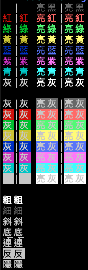

# OA's Node.js Xterm

🌈 轉吧，終端機的七彩霓虹燈


## 說明
將 Node.js 在終端機上輸出的文字給予色彩，並支援 String prototype



## 安裝

```shell
npm install @oawu/xterm
```


## 使用

引入 `require('@oawu/xterm')` 即可使用 **xterm** 功能，如下範例：

```javascript

  const Xterm = require('@oawu/xterm')
  console.log(Xterm.red('紅').toString())
  console.log('' + Xterm.red('綠')) // 使用預設 toString

```

開啟支援 String prototype

```javascript

  const Xterm = require('@oawu/xterm')
  Xterm.stringPrototype()

  console.log('紅'.red)
  console.log('紅綠'.red.bgGreen) // 可以連續設定

```

其他功能

```javascript

  const Xterm = require('@oawu/xterm')

  Xterm.blod('粗體') // 增粗也提高亮度
  Xterm.dim('細體') // 變細也減低亮度
  Xterm.underline('底線') // 加入底線
  Xterm.inverted('反轉') // 前景與背景色對調
  Xterm.italic('斜體') // 視字體與語言而有所不同效果
  
  Xterm.blink('連結') // 視終端機不同而有所不同效果
  Xterm.hidden('隱藏') // 視終端機不同而有所不同效果

```
