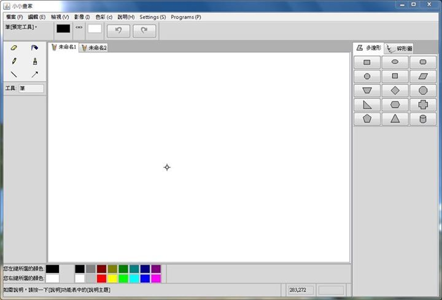

# 用 Java 實作小畫家
這是大學一年級的下學期高等程式設計的學期作業，因為實作讓我對物件導向語言的 **封裝**、**繼承**、**多型**..等特性更加熟悉！有別於上學期的 C，Java 可以利用 [GUI 介面](https://zh.wikipedia.org/wiki/Swing_(Java))實作出我理想中的作品，並且可以以封裝成 .jar 的方式與朋友分享。

### 相關參考
* [GitHub 原始碼](https://github.com/comdan66/freshman-java-painter)

`#Java` `#小畫家`