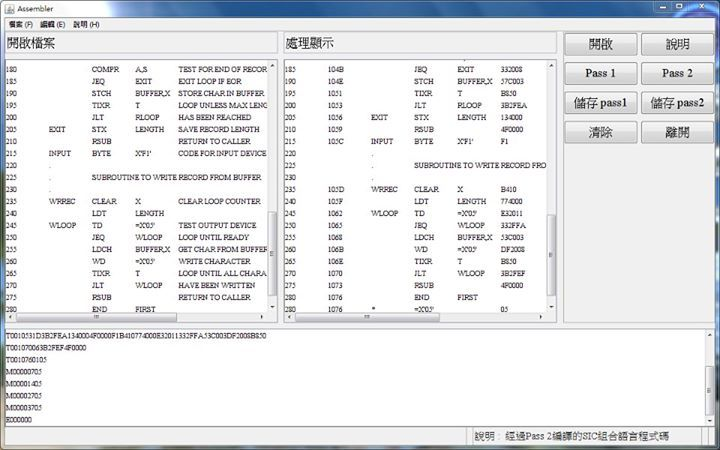

# 用 Java 實作 Assembler

這是大學二年級時在系統程式課程中所實作的 [Assembler 組譯器](https://en.wikipedia.org/wiki/Assembly_language#Assembler)，主功能是將 [SIC XE Literal](https://en.wikipedia.org/wiki/SIC/XE) 的[組合語言](https://zh.wikipedia.org/wiki/%E6%B1%87%E7%BC%96%E8%AF%AD%E8%A8%80)編譯成[機械語言](https://zh.wikipedia.org/wiki%E6%9C%BA%E5%99%A8%E8%AF%AD%E8%A8%80)，借由實作這個轉換器的同時，可以更加的了解組合語言與機械語言間的關係與原理。當時會選擇使用 [Java](https://zh.wikipedia.org/wiki/Java) 是因為 [GUI](https://zh.wikipedia.org/wiki/Swing_(Java)) 介面更容易表現出理想的操作介面，更可以讓使用者更加方便轉換組合語言。

### 相關參考
* [GitHub 原始碼](https://github.com/comdan66/sophomore-java-assembler)

`#Java` `#Assembler`