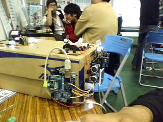
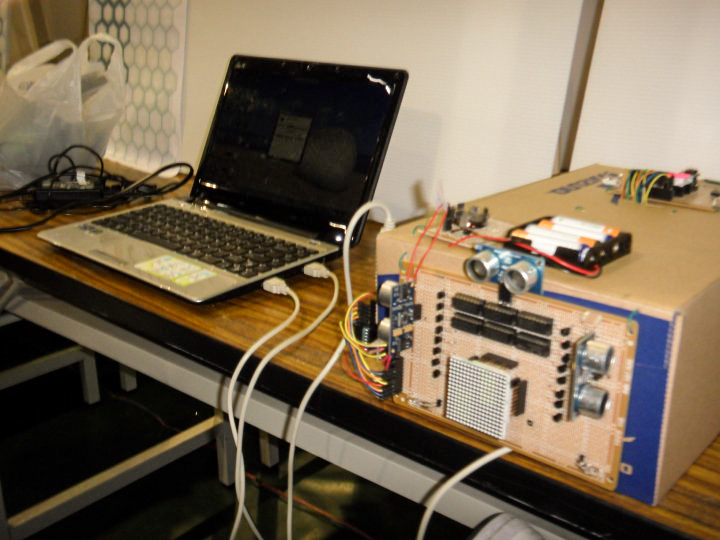
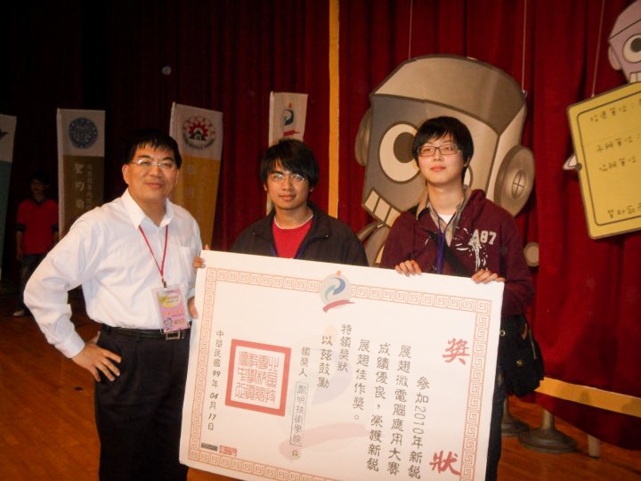

# Arduino 新銳展翅創意競賽

大三專題中使用了 [Arduino UNO](https://www.arduino.cc/en/Main/ArduinoBoardUno) 以及多項 Sensor 組合出多項功能作品，主要架構是以 Arduino 與各個裝置互相溝通，溝通的方式使用 [XBee](https://en.wikipedia.org/wiki/XBee) 無線套件。作品功能大致上是借由不同 Arduino 所收集到的資訊並彙集並且提供給駕駛者車況等安全資訊，所以算是基本版的 **智慧型腳踏車** 實作。

)

)

)

)

`#Arduino` `#XBee`