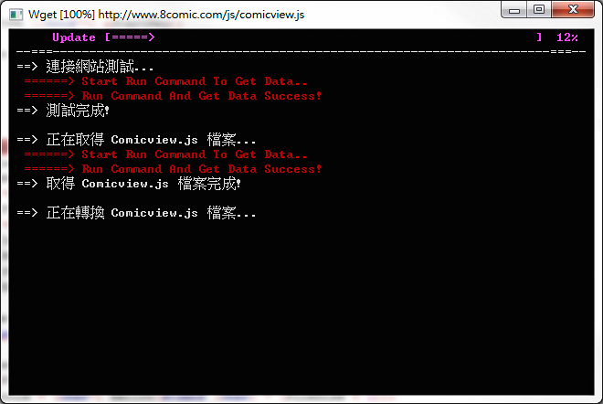
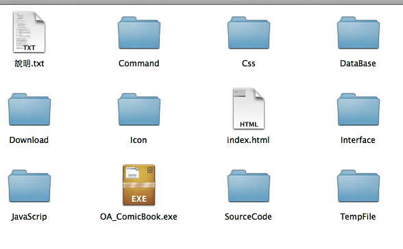

# 用C語言寫漫畫下載器

這是個使用 [C 語言](https://zh.wikipedia.org/wiki/C%E8%AF%AD%E8%A8%80) 的 Console 畫面去繪出模擬 [BBS](https://zh.wikipedia.org/zh-tw/BBS) 版型，並且利用 wget 指令將知名網站 [8comic](http://www.comicbus.com/) 上的原始碼轉譯出漫畫並下載，簡單說就是使用 C 語言製作一個[爬蟲](https://zh.wikipedia.org/wiki/%E7%B6%B2%E8%B7%AF%E8%9C%98%E8%9B%9B)，並且以 Console 的方式模擬 BBS 介面的排版，然後將爬回來的數據以 [HTML](http://www.w3schools.com/html/) 方式開啟。

作品靈感來源只是想方便看漫畫，所以動手寫了程式將網站上的圖檔可以依照自己的選擇進行下載，程式中利用了 [SQLite](https://www.sqlite.org/)、C 語言多重[指標](https://zh.wikipedia.org/zh-tw/%E6%8C%87%E6%A8%99_(%E9%9B%BB%E8%85%A6%E7%A7%91%E5%AD%B8))、網頁語言工具..等。下載後的漫畫皆會存在客戶端的資料夾裡面，搭配 [JavaScript](https://zh.wikipedia.org/zh-tw/JavaScript)、HTML 來達到瀏覽效果，所以只要開啟資料夾內的 index.html 即可方便看漫畫，有興趣也歡迎至 [GitHub](https://github.com/comdan66/c-comic-book) 下載執行檔、原始碼試試，不過此作目前已經沒在維護，若 8comic 網站有更新原始碼的話，則**不保證**可以正常下載漫畫。

其中 BBS 介面的方式是自行制定一套檔案規則，並且放置在 [Interface/](https://github.com/comdan66/c-comic-book/tree/master/Interface) 目錄下，當要產生畫面時，C語言 去讀取自訂的字串規格，並且在 Console 上格式化即可達到想要的畫面。換句話就是自行實作一個簡單的 [MVC](https://zh.wikipedia.org/zh-tw/MVC) 架構的 View。

**※** 目前此作品已經沒有再更新與維護囉！

### 相關參考
* [GitHub 原始碼](https://github.com/comdan66/c-comic-book)

`#C 語言` `#SQLite`