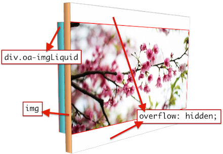
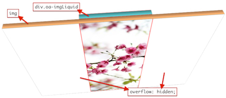

# 實作 jQuery imgLiquid 套件

imgLiquid 是一個處理前端圖片置中的 [jQuery](https://jquery.com/) Extend Function，其中參考了 [imgLiquid](https://github.com/karacas/imgLiquid)，但其架構與做法不大相同。

此作品雖然與 imgLiquid 功能一樣，但是做法不同，前者將  設定成隱藏，在取出其圖片網址後設定在該  父元素的 Style，而我的這次要實作的雖然目的相同，但做法則不一樣。

首先需要幾個先決條件：

* 父層 position 一定要是 position、absolute、fixed。
* 父層一定要有設定 width 以及 height。

做法是將指定的元素 position 設定成 absolute，在用 top、right、bottom、left 去調整位置，而此時父層再加上一項屬性 overflow: hidden; 即可做到調整位置的效果了！

其中功能也加入很多方式使用，包含了搭配[元素屬性](http://w3school.com.cn/html/html_attributes.asp)設定..等功能，若要更清楚瞭解可以置 [GitHub](https://github.com/comdan66/OA-imgLiquid#%E7%9B%AE%E9%8C%84) 查看說明。

### 相關參考
* [Live Demo](https://works.ioa.tw/OA-imgLiquid/index.html)
* [GitHub 原始碼](https://github.com/comdan66/OA-imgLiquid)

`#jQuery`