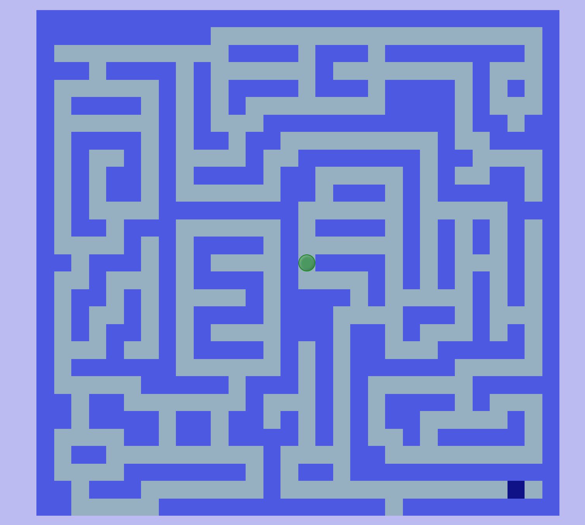
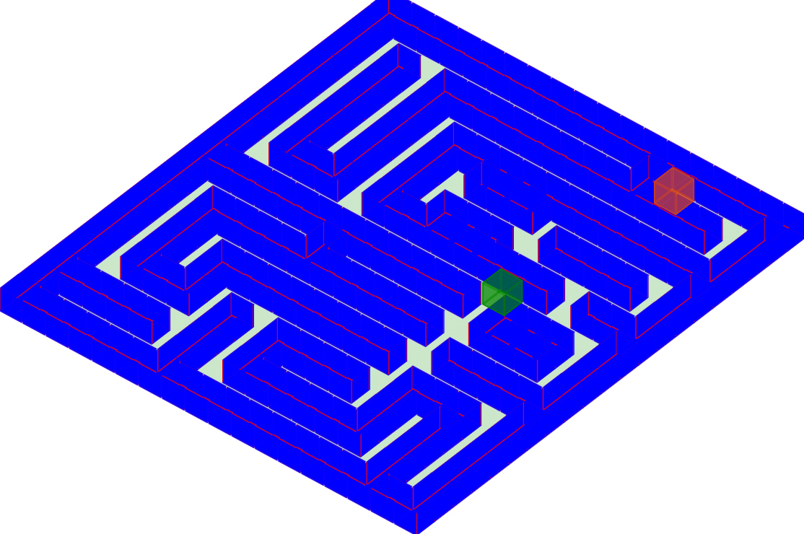

# 用 jQuery 做迷宮遊戲

此作品主要架構於 [jQuery](https://jquery.com/) 之下實作，它不是一個前端 jQuery extend function，而是 based on jQuery 的前端迷宮遊戲，並且當使用智慧型手機瀏覽時，可支援使用[重力感測器(G-sensor)](https://zh.wikipedia.org/wiki/%E5%8A%A0%E9%80%9F%E8%A6%8F)，所以可利用搖晃手機達到操作方向的簡單體感遊戲。

專案內有附一隻[地圖產生器](https://works.ioa.tw/OA-maze/create.html)，可以提供各位自行編輯迷宮地圖路線，當地圖編輯完後按下 **dump** 後，複製陣列文字，並且貼至 [res/index.js](https://works.ioa.tw/OA-maze/create.html) 內覆蓋 maze 陣列變數後，即可產生自己的地圖迷宮，由此可以得知整個地圖設計原理，是參考[老鼠走迷宮](http://openhome.cc/Gossip/AlgorithmGossip/MouseGoMaze.htm)的進階遊戲，在網頁上更可以利用 JavaScript 去監聽鍵盤 **keydown** 的按鍵以實作上、下、左、右的反應。

迷宮還有另外一項隱藏視角，就是當 [Git](https://git-scm.com/) 切換到 [3D](https://github.com/comdan66/OA-maze/tree/3D) Branch 時，即可檢視 3D 介面的迷宮模式，此項是利用 css 的旋轉(transform、rotateX、rotateY、translateZ)，將原本的每個節點元素各自新增出六個元素充當六個面，再分別調整每個元素內的各個面旋轉、位移角度。

### 相關參考
* [Live Demo](https://works.ioa.tw/OA-maze/index.html)
* [GitHub 原始碼](https://github.com/comdan66/OA-maze)

`#jQuery` `#遊戲`