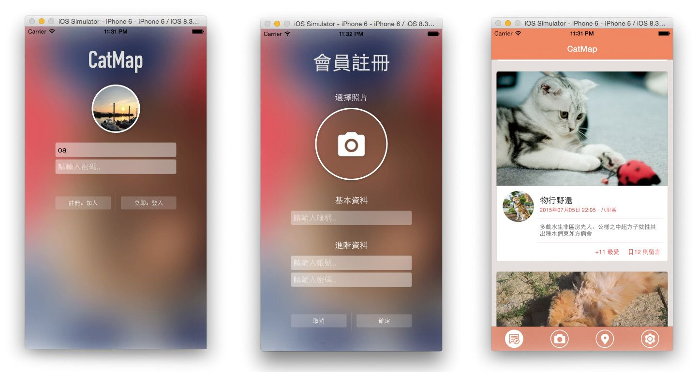
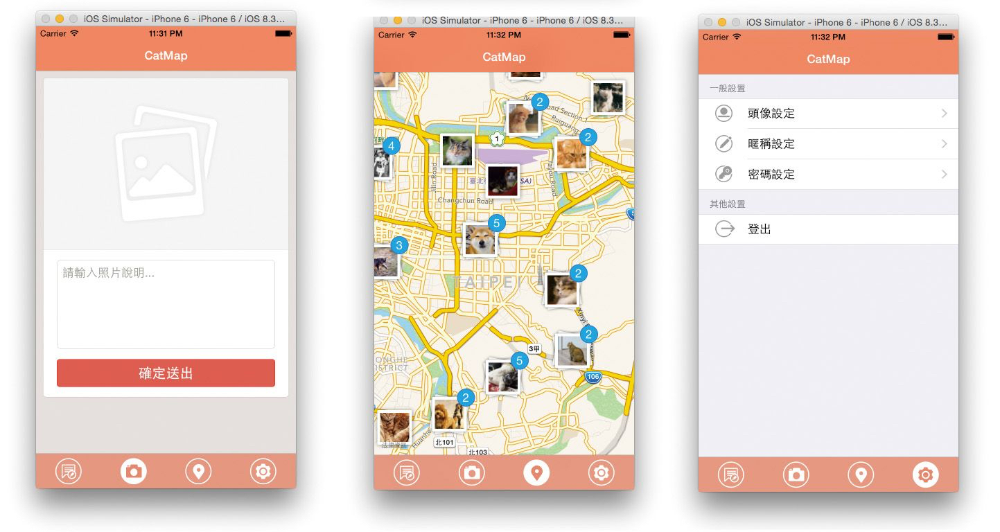
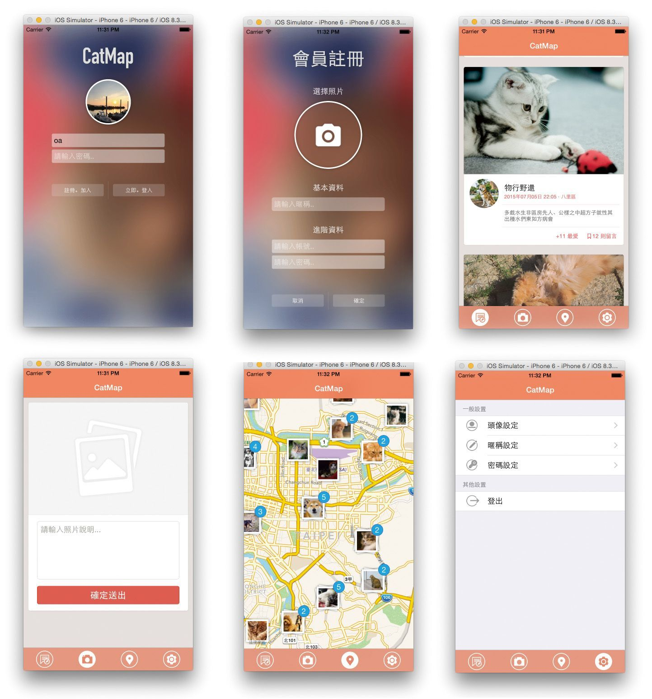

# CatMap

此作是我第一個比較完整的 iOS 的 App，主要利用基本的 iOS 元件製作照相上傳、分享、地圖功能，以下是我一些學習的筆記與心得！

<iframe allowfullscreen="" frameborder="0" src="https://www.youtube.com/embed/HTgfTjmS2UI"></iframe>

App 沒什麼主要方向，這就只是個到處模仿的小作品，一開始利用了 TableView，再經由客製化的 TableViewCell 去做出類似 [Instagram](https://www.instagram.com/)、[Facebook](https://www.facebook.com/) 的動態訊息頁，然後再利用 ImagePickerController 去做開啟相機、讀取相簿的功能，並且利用 CLLocationManagerDelegate 來取得座標以及位置資訊！

接著找到了 [REMarkerClusterer](https://github.com/romaonthego/REMarkerClusterer) 這資源，讓我做到跟 Instagram 地圖很像似的功能，然後將它稍微改造了一下，讓他可以載入圖片，至於呼叫 API 原本是使用自己寫的 http 函式庫，但是有發現 [AFNetworking](https://github.com/AFNetworking/AFNetworking) 也不錯用，所以就使用它了！還有當 Cell 在 Load 圖片時，我則是使用 [AsyncImageView](https://github.com/nicklockwood/AsyncImageView) 來讓他可以非同步的載入圖片！

開發途中，我原本是使用 `Main.storyboard` 拉版的，但是遇到了很多問題，例如 Cell 雖然可以對 xib(nib) 定義好 identifier 名稱，再用 dequeueReusableCellWithIdentifier 拉出，以免重複的 create 浪費，但是因為我的 Cell 的高度以及內容不同，所以必須定義每種 id 的 identifier，而 xib 的 identifier 卻不能動態的定義，雖然可以定義好 identifier，當 cellForRowAtIndexPath Update 其內容時，因為圖片是非同步載入，所以後會發生另一段故事..於是最後我就放棄的使用 storyboard，所以改換成用 code 來寫 UI，如此一來，便可以讓每個 Cell 搭配好資料的 ID 成為唯一的一個物件！這樣就也可以在 cellForRowAtIndexPath 不會重複的產生，這就是這次在 TableView 上的一點點心得。

因為以前寫過 C語言、Java，雖然沒有寫過 Object-C，不過我的心得是它跟 C 好像！但是多了很多有趣的東西！也幸好寫過 Java 的 GUI 介面，讓我對於介面的東西有點基礎，(Java GUI 印象是，一直在 set 顏色，add 東西)，不過這次雖然有了這點的小作品，但是還有很多東西我還沒摸到，像是推播通知、iBeacon、iClude、swift.. 等，只能一步步慢慢來了！

題外話，因為我剛好會後端、前端，所以這作品的前端、後端、API 剛好都是自己產出！同時此做要特別感謝幫我設計版型、icon 的 [Teresa Chu](https://www.facebook.com/teresa.chu.3348)。

### 相關參考
* [Youtube 影片](https://www.youtube.com/watch?&v=HTgfTjmS2UI)
* [GitHub 原始碼](https://github.com/comdan66/catmap_ios)
* [WEB GitHub 原始碼](https://github.com/comdan66/catmap_php)
* [Facebook Video Demo](https://www.facebook.com/comdan66/videos/1115490615130946/)
* [PTT MacDev](https://www.ptt.cc/bbs/MacDev/M.1436114088.A.832.html)

`#iOS` `#Google Maps` `#Instagram` `#Object-C` `#App`