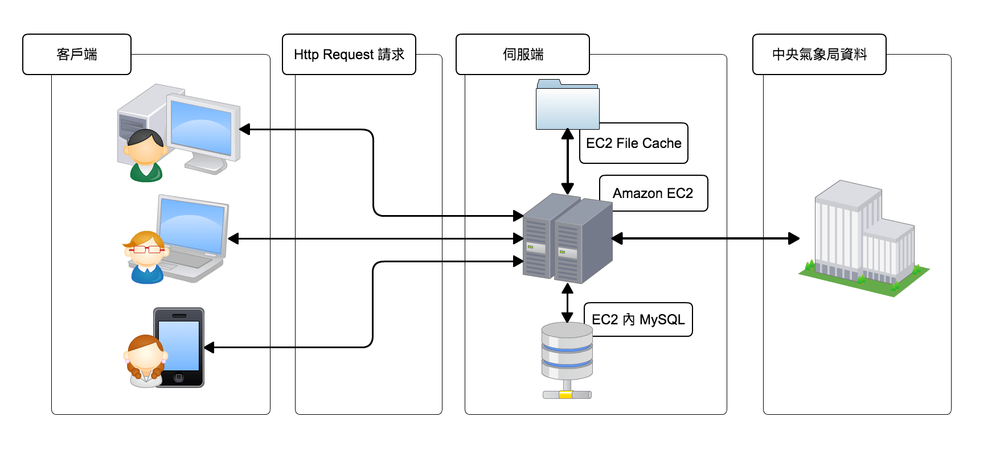
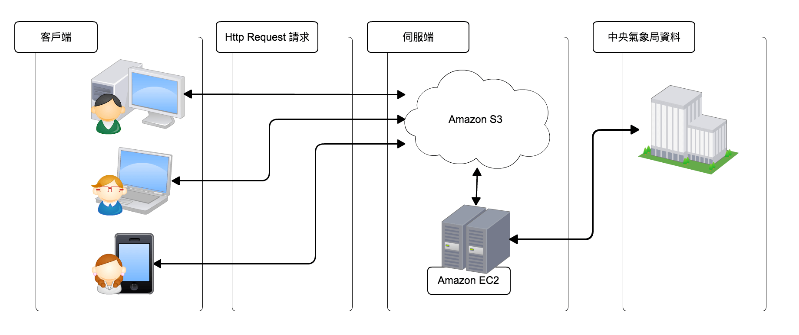
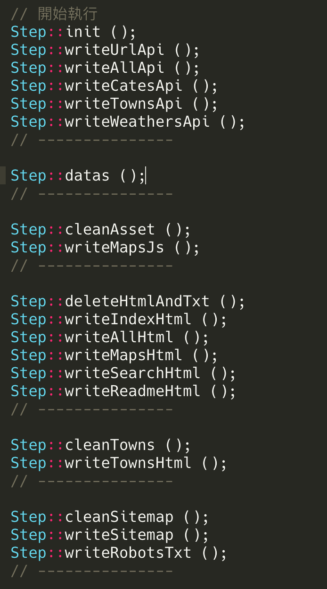
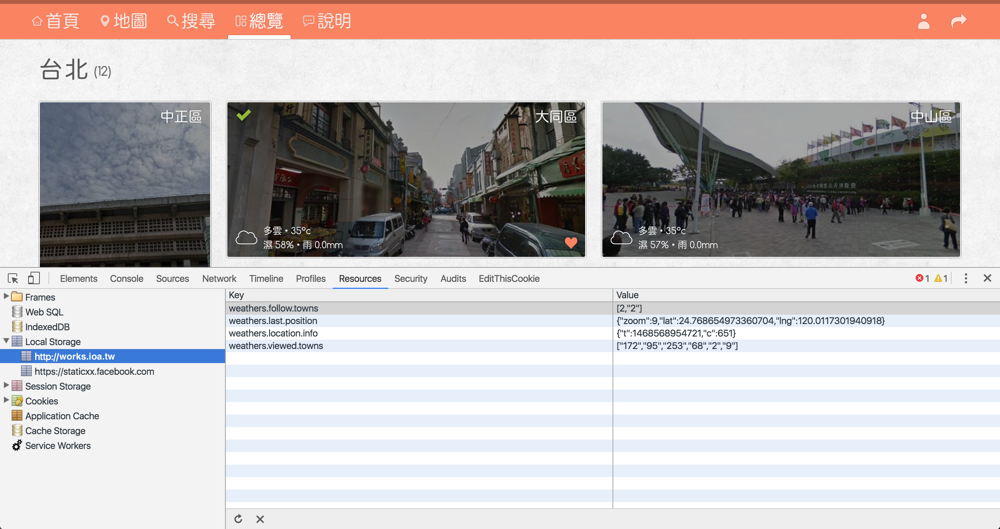
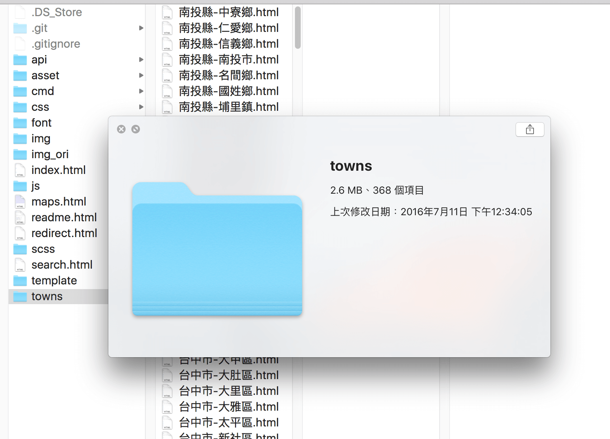

# 天氣地圖 Weather Maps

這項做主要是藉由[中央氣象局](http://www.cwb.gov.tw/V7/index.htm)的網站資料建置出來的，其中主要功能是可以藉由 [Google Maps](https://www.google.com.tw/maps) 查詢各地方的天氣預報概況，並且可以查看各個地區的每小時溫度變化，以及搭配使用 [localStorage](http://www.w3schools.com/html/html5_webstorage.asp) 來實作前端關注的功能。此作品主要利用 [PHP](https://zh.wikipedia.org/zh-tw/PHP) 取得資料，並且編譯成 [HTML](https://zh.wikipedia.org/zh-tw/HTML) 檔案上傳 [Amazon S3](https://aws.amazon.com/tw/s3/)，此架構不僅可以減少 [Amazon EC2](https://aws.amazon.com/tw/ec2/) 的負擔，更因為 HTML 檔案的關係，可以加強[SEO](https://zh.wikipedia.org/zh-tw/%E6%90%9C%E5%B0%8B%E5%BC%95%E6%93%8E%E6%9C%80%E4%BD%B3%E5%8C%96)效果。

天氣地圖 Weather Maps 其實約莫在去年這時候第一、二版完成，然後一直放在 [Amazon EC2](https://aws.amazon.com/tw/ec2/) 讓它獨立的運作，直到這幾週才有空再將他修改一下，這次修改不僅對版型做翻新，也對系統面做修改！

上一版架構基本上就是典型的後端伺服器吐出 API 處理架構，藉由一台 EC 定時地去取得最新天氣資訊，在存入資料庫然後提供 API。運行一年下來，其實無論是流量、記憶體亦或者資料庫都會佔走 EC2 一項固定的資源（因為 [Amazon RDS](https://aws.amazon.com/tw/rds/) 對我來說有點貴..，所以我的資料庫是安裝在 EC2 上的），而這項卻是固定要做的事，尤其是圖片檔案與 API 流量！為了減低 EC2 的負擔以及加強 [Search Engine Optimization(SEO)](https://zh.wikipedia.org/zh-tw/%E6%90%9C%E5%B0%8B%E5%BC%95%E6%93%8E%E6%9C%80%E4%BD%B3%E5%8C%96)，於是我開始進行對天氣地圖作品的修改。

有鑒於我近期與 [Amazon S3](https://aws.amazon.com/tw/s3/) 變得比較熟了，所以把腦筋動到了 S3 上，因為看 S3 有**安全**、**耐久**、**可高度擴展**的[雲端儲存](https://aws.amazon.com/tw/what-is-cloud-storage/)特性，索性就以 S3 為主 EC2 為輔，不用資料庫，而是將資料轉乘 Json 的格式，再用資料夾結構的放置，通通上傳至 S3 上！如此一來前端所有資源從原本的向 EC2 索取，變成改從 S3 上取得，大大地減低天氣的 Request 數量，API Request 不說，光圖片、靜態檔案就少了很多流量，同時資料庫也減輕一部份的負擔！唯一會需要後端的部分，就只剩下固定時間更新資料的後端處理部分，而這部分也只會耗費不到 15MB 的記憶體，所以負擔不算大。

後端處理的關鍵程式是 /cmd/put.php 這隻，基本上流程是 定義基本常數、取得最新的天氣資訊、寫入 API Json 檔案、產生相關的 HTML 檔案、列出 S3 上檔案、比對新舊檔案、刪除、上傳 S3、完成。其中在產生 HTML、JavaScript 時，會進行 minify 與 uglify，css 則是使用了 Compass 編譯 Scss，最後再依個別 HTML Merge css、JavaScript，並以 [MD5](https://zh.wikipedia.org/zh-tw/MD5) 內容後為檔名（以 md5 檔名取代版本號，當內容有更新時會有不同新檔名，以防止前端瀏覽器快取問題，細節可參考[此篇](http://www.infoq.com/cn/articles/front-end-engineering-and-performance-optimization-part1)），如此一來便可以加強前端傳輸效能與壓縮檔案大小！

前端部分因為會隨著天氣更新而產生新的 HTML 檔案，這部份剛好可以針對此架構加強 SEO 的調整優化，當然大家都知道的 sitemap、robots.txt 都有一定會有，但這次還加入部分的 [schema](https://schema.org/)、[Google AMP](https://www.ampproject.org/)、[JSON-LD](http://json-ld.org/) 的結構，這些步驟都是去餵搜尋引擎想吃的菜，好盡可能達到所有可能的曝光與分享！原本上一版有使用 [navigator.geolocation](https://developer.mozilla.org/zh-TW/docs/Using_geolocation) 物件取得前端 GPS 位置以增加更多的趣味性，但因為隨著 Chrome 的更新，要使用 navigator.geolocation 則必須使用 [https](https://zh.wikipedia.org/wiki/%E8%B6%85%E6%96%87%E6%9C%AC%E4%BC%A0%E8%BE%93%E5%AE%89%E5%85%A8%E5%8D%8F%E8%AE%AE) 的協定（詳情可看[此篇](https://developers.google.com/web/fundamentals/native-hardware/user-location/obtain-location)），所以這功能在 Chrome 上就無法使用，不過其他瀏覽器應該還可以用！

前端功能中有使用到 [LocalStorage](https://developer.mozilla.org/en-US/docs/Web/API/Window/localStorage) 作為暫存的機制，利用這項前端瀏覽器的功能，我將它拿來記錄使用者瀏覽過的鄉鎮，同時也可以拿來做為收藏鄉鎮的功能。在地圖上更可以藉由讀取 LocalStorage 來實作記錄上次的地圖位置，而上一段所提到的 navigator.geolocation 取得客戶端 GPS 位置，也可以利用 LocalStorage 來實作 Cache 的機制，而這些功能程式碼我都放置在 `/weather/js/public.js` 內，各位若有興趣歡迎[點開](https://github.com/comdan66/weather/blob/master/js/public.js)來看喔！

此新版的天氣地圖除了使用中央氣象局的資訊外，此次也使用[維基百科（wikipedia）](https://zh.wikipedia.org/wiki/%E7%BB%B4%E5%9F%BA%E7%99%BE%E7%A7%91)的 [API](https://www.mediawiki.org/wiki/API:Main_page) 將各個鄉鎮地方的簡介、歷史資訊下載下來，並且整理分類，再產生 HTML 的鄉鎮內頁時一併加入簡介，讓整體網站功能更加多元，在瀏覽全台各地時，可以更加的對各個地方有所認識！而各個鄉鎮的照片，則是利用 Google Maps 提供的街景服務，取得該鄉鎮的隨機街景截圖，若是取得失敗則使用 Google Maps 的截圖。

程式裡面會使用到上傳 S3 的功能，所以在執行時特別設計成 Cli 執行，配合下參數的方式，所以可以上傳至不同的 S3 Bucket。部署至 S3 的方式是進入專案 `/cmd/` 目錄內，下指令 `php put.php -b {Bucket Name} -a {Access Key} -s {Secret Key}` 即可按照步驟做更新、上傳的流程，-b 代表要上傳的 S3 Bucket 名稱，-a 是 Access Key，-s 是 Secret Key，若是不想上傳的話則有 代表 upload 的 -u 參數可決定是否上傳，若是不想上傳則加入 -u 0 的參數即可，而 -m 則代表 minify，-d 為是否更新天氣；-u、-m、-d 的預設值皆為 1。

另外在 cmd 目錄內還有兩隻 php 檔案，分別是 init.php、clean.php，因為專案內有很多資料夾或者檔案是被 Git Ignore 的，所以需要 init.php 來幫你建立這些檔案、目錄，一樣進入專案 `/cmd/` 目錄內，下指令 `php init.php` 後即可產生所需的目錄與檔案！而 clean.php 是用來清除被 Git Ignore 的目錄與檔案，執行方式與 init.php 相同喔！

最後！既然做成 S3 架構也有了 API 服務，既然取之於網路，那就一樣分享於網路，所幸我就連 apiDoc 一起建立，如此一來大家就可以一起使用我的資源，在我還沒有關閉我的服務之前，大家都可以使用喔！

### 相關參考
* [Live Demo](https://works.ioa.tw/weather/index.html)
* [GitHub 原始碼](https://github.com/comdan66/weather)
* [PTT Soft_Job](https://www.ptt.cc/bbs/Soft_Job/M.1438158895.A.071.html)
* [PTT Soft_Job 2](https://www.ptt.cc/bbs/Soft_Job/M.1468801854.A.43B.html)
* [Facebook Front-End Developers Taiwan](https://www.facebook.com/groups/f2e.tw/permalink/865165516854148/)
* [中央氣象局](http://www.cwb.gov.tw/)

`#jQuery` `#PHP` `#Google Maps` `#中央氣象局` `#開放資料` `#Weather`