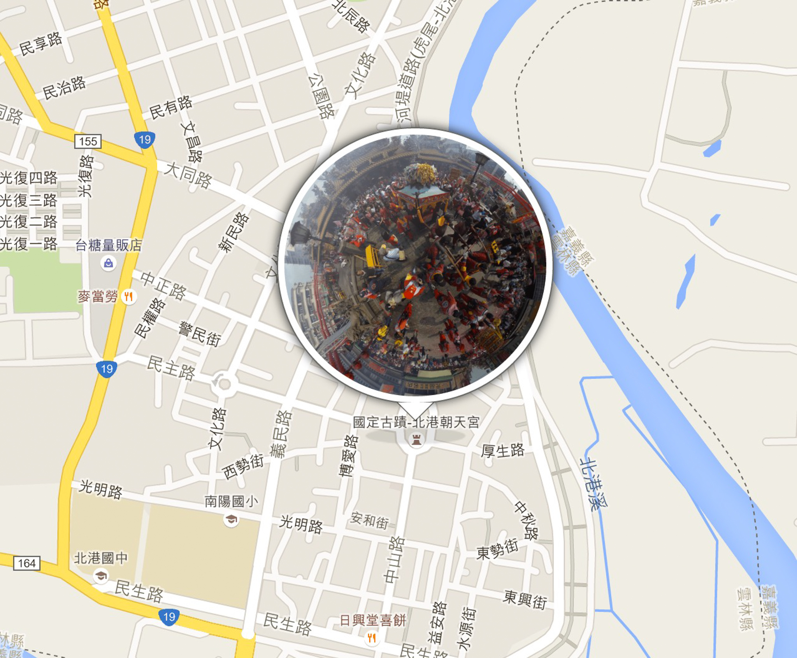
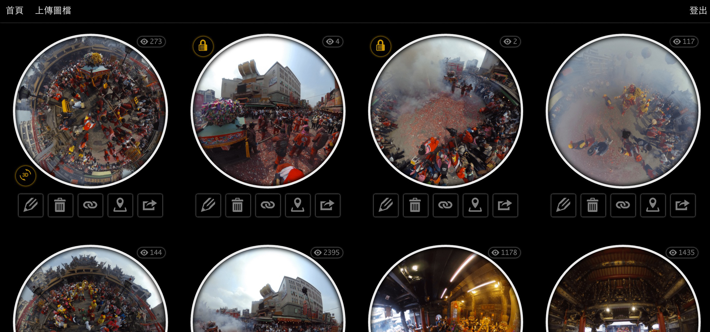

# 全景相簿 Theta S 360

這是一項特別的作品，由於近幾年全景攝影器材的進步，所以全景影片、全景照片漸漸的流行起來，而最近剛好也入購了 **RICOH Theta S** 全景攝影機，所以我便實作了一下 **360度全景相簿**，這作品我特意分成兩個專案，分別是純前端、純後端的角度切入，所以在 GitHub 上會有兩包 code，以下會大略的說明！

由於 RICOH Theta S 360 全景相機具備兩鏡頭，所以可以產出一張由兩顆鏡頭組成的 360 度的相片，照片是以水平呈現，所以瀏覽起來效果不佳。目前據我所知 RICOH Theta S 官網也有提供上傳瀏覽 [360 度相片播放器](https://theta360.com/s/ky0a4C1uh1JWl1Q56C8NZm3OO) 的功能，但當時官網的播放器是使用 [Flash](https://get.adobe.com/tw/flashplayer/) 來呈現的(目前好像改成使用 [Canvas](http://www.w3schools.com/html/html5_canvas.asp))，身為前端工程師的我，當然立馬想使用 [JavaScript](https://zh.wikipedia.org/zh-tw/JavaScript) 去實作 360 度全景相片播放器！

### 前端
既然要在網頁前端呈現球狀的方式，那就利用一些 library 實作，專案內我參考了 [theta-viewer.js](https://github.com/shokai/theta-viewer.js)，細看 theta-viewer.js 的內容可以發現裡面有著三個主要物件，分別是 **async.js**、**three.js**、**OrbitControls.js**，而我只是將它進一步的使用與改造而已，例如: 可以取得轉向後的座標存進資料庫.. 等。還有一項功能較為特殊，主要是利用 JavaScript 的 [document.execCommand](https://developer.mozilla.org/en-US/docs/Web/API/Document/execCommand) 來執行觸發剪貼簿的功能，用 JavaScript 直接將複製的網址存入剪貼簿內，如此一來就不用再按滑鼠右鍵。

### 後端
其框架使用個人的 framework [OACI](https://github.com/comdan66/oaci)，也就是 OA's CodeIgniter 實作，功能主要就是 **登入**、**上傳**、**縮圖**，比較特別的是因為 360 圖檔較大，所以這次也使用 [AWS S3](https://aws.amazon.com/tw/s3/) 作為儲存空間！登入(目前尚未開放註冊)後，即可使用上傳功能將 360 度相片上傳，網頁是 RWD 設計，所以在上傳 360 度相片的流程上也不會是問題。登入後還可瀏覽尚未公開的 360 度相片，雖然未公開，但使用者可以將網址分享給朋友，由於網址 token 使用 [MD5](https://zh.wikipedia.org/wiki/MD5) 編碼過，所以只有知道網址的人才可以瀏覽。Theta S 本身有 GPS 內建定位功能，所以在上傳時候可以使用 php 去讀取 exif 的經緯度資料，並一起新增於資料庫內，前端輸出再搭配 Google Maps 即可做出此相簿地圖的功能。

### 壓縮圖檔

主要是因為檔案大怕前端傳輸太久，所以這次加入 [TinyPNG](https://tinypng.com/) 作為壓縮圖片的方式，以減少圖片大小，提升傳輸速度以及成本，原本用 [https://compressor.io/](https://compressor.io/) 但是處理時間花太久了，所以就先不慘用。

這作品我故意分成兩個架構實作，在 GitHub 上分別是 **360**、**ThetaS** 兩包專案，基本上 [360](https://github.com/comdan66/360) 是一包前後端寫在一起的專案，而 [ThetaS](https://works.ioa.tw/ThetaS/index.html) 則是純前端的架構，ThetaS 藉由 360 專案提供的 api 所實作的網站，而 360 則是架設在 AWS EC2 上面，ThetaS 則是架構在 [GitHub.io](https://pages.github.com/) 的服務上，會這樣拆開的原因主要是因為想練習前後端分離的架構模式，另一方面則是藉由 GitHub.io 的服務減低 AWS EC2 的負擔。

※ 因系統維護關係，所以目前已暫時先將後端 Demo 網址關閉囉，請大家先參考 GitHub 的原始碼吧！

### 相關參考
* [Live Demo](https://works.ioa.tw/ThetaS/index.html)
* [GitHub 原始碼](https://github.com/comdan66/ThetaS)
* [PTT Soft_Job](https://www.ptt.cc/bbs/Soft_Job/M.1450408446.A.009.html)
* [Facebook Front-End Developers Taiwan](https://www.facebook.com/groups/f2e.tw/permalink/919907694713263/)
* [shokai/theta-viewer.js](https://github.com/shokai/theta-viewer.js)

`#JavaScript` `#Theta S 360` `#PHP` `#Compressor` `Google Maps` `GPS`