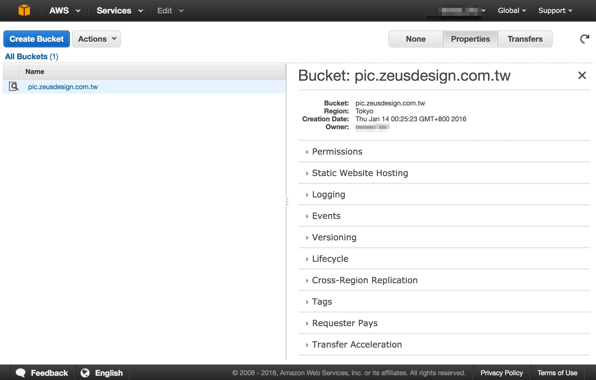
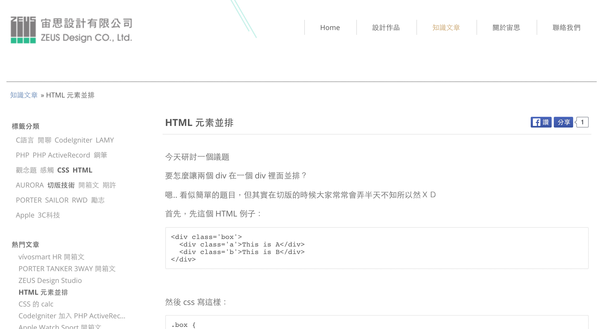
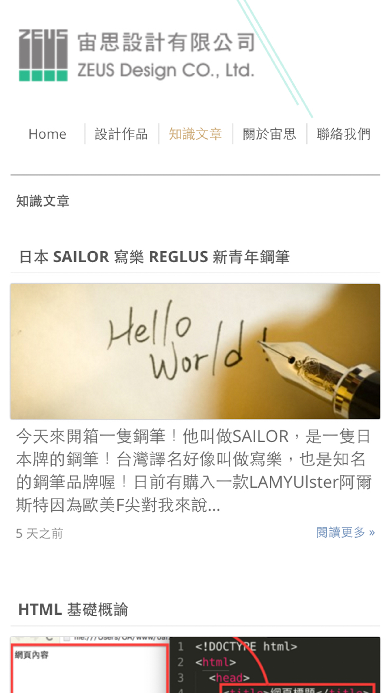
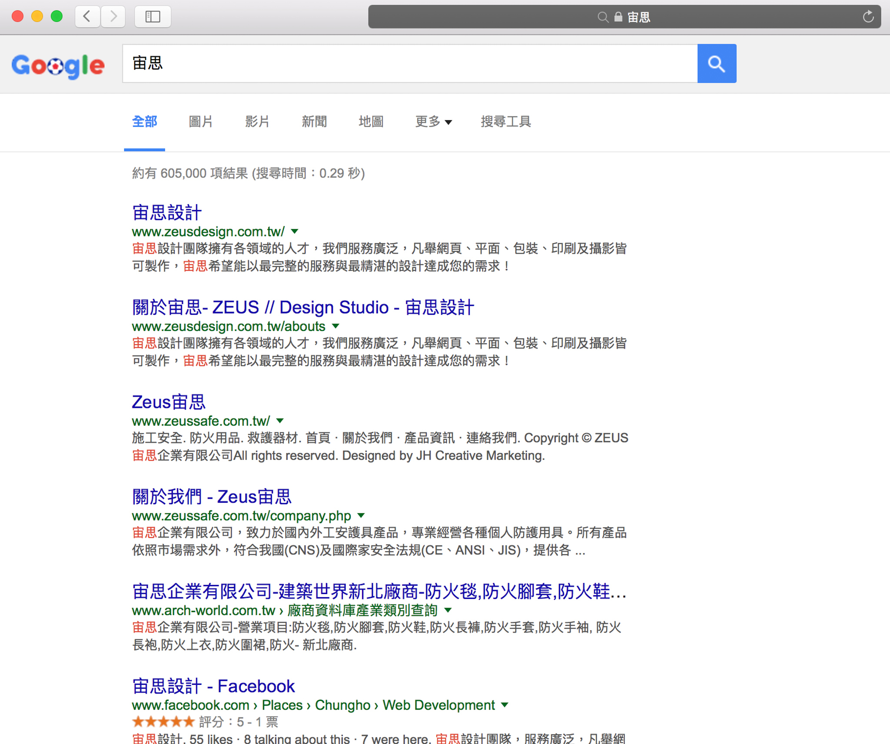

# 宙思設計

宙思設計團隊，是一家服務廣泛，凡舉網頁、平面、包裝、印刷及攝影皆可製作的設計公司。也是我長期配合的接案公司，我多數都是承接宙思的前端切版、JavaScript 功能、後端 php 上稿、套版、系統架設的部分，而宙思設計主要著力於“設計”的產出，如果各位有相關需求其實可以與其洽詢！

關於[宙思設計](https://www.zeusdesign.com.tw/)官網的架設開發經驗，其實可以分成兩個時期的改變，第一期宙思官網是在 2015年 1月 31日 實作，當時是架設在[遠振資訊](https://host.com.tw/)的主機代管服務，後端 php 架構框架則是使用 [CodeIgniter](https://codeigniter.org.tw/) [v2.1.4](https://codeigniter.org.tw/downloads/file/CodeIgniter_2.1.4)，但跟團隊討論後在 2016年 1月 11日開始我們將系統移植上 [AWS Ec2](https://aws.amazon.com/tw/ec2/) 上，主要是考慮到日後官網作品展示區會有大量的圖片上傳的需求，這同時也意味著圖片流量將會是一項重點，所以才進階考量到使用 [AWS S3](https://aws.amazon.com/tw/s3/pricing/) 的服務！

而後台上稿系統也重新的設計，主要沿用了北港迎媽祖的網站後台 Layout，前台各頁面的版型也重新架構，後端框架改使用 OACI [version 4.0](https://github.com/comdan66/oaci/tree/version/4.0)，在前端刻板上不僅可以配合測試環境，也能在上 production 時可以有不同的效能控制，由於 OACI 上已經是搭配使用 [Compass](http://compass-style.org/)，所以在管理版型亦是輕鬆許多。後台是使用 Facebook 登入以減少人員忘記密碼等問題，架設速度上快速許多，而在後台上也有人員管理系統，以方便團隊內的人員管理！

宙思設計在第二期的網站規會上更加入了[文章功能](https://www.zeusdesign.com.tw/articles)，主要是未來會分享多樣的資訊文章，而文章多會以原創為主，而類型則無固定範圍拘束，從資訊開箱文到網站架設心得、網頁知識文章都會有，目的則以分享為前提概念，希望能讓顧客在發案同時也能對業界內相關知識可以進一步了解！

宙思官網版型上則沿用第一期的設計框架，但是加強了[響應式網頁設計（RWD）](http://www.ibest.tw/page01.php)的相容性，以提高 [Google SEO](http://www.ibest.tw/page04.php)、手機閱讀率..等，再藉由[宙思粉絲頁](https://www.facebook.com/ZeusDesignStudio/)的管理，來達到更有效的分享設計相關文章與知識，二期還有另一項重點就是如何加強 [SEO](https://zh.wikipedia.org/zh-tw/%E6%90%9C%E5%B0%8B%E5%BC%95%E6%93%8E%E6%9C%80%E4%BD%B3%E5%8C%96)，首先符合基本的 HTML 格式的規範，定期檢視 [Google Analytics](https://www.google.com/intl/zh-TW/analytics/) 外，也在 [Google](https://www.google.com/webmasters/tools/home?hl=zh-TW)、[Bing](http://www.bing.com/toolbox/webmaster)、[Yahoo Search Console](https://developer.yahoo.com/yql/console/) 上加入網站，以檢視每一個階段的搜索成效。

### 相關參考
* [Live Demo](https://www.zeusdesign.com.tw/)
* [GitHub 相關資源](https://github.com/comdan66?utf8mb4=✓&tab=repositories&q=zeus&type;=&language;=)
* [Facebook 粉絲頁](https://www.facebook.com/ZeusDesignStudio/)

`#PHP` `#RWD`