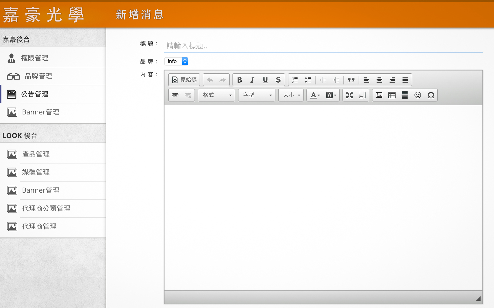

# 嘉豪光學

這是一個前、後端技術的外包案實作，其網站名稱為[嘉豪光學](http://www.hogaoptical.com.tw/)，嘉豪光學有限公司為多國外知名品牌之總代理。於2007成立至今，憑著經營團隊專業的知識領域和熱誠的服務態度，產品銷售已涵蓋全台眼鏡商圈。

專案為[宙思設計](https://www.zeusdesign.com.tw/)的網站專案，專案除了設計與聯絡外，從**前端刻板**、**後端資料庫**、**系統架設**皆是獨立完成。網站框架是使用 OACI [version 4.1](https://github.com/comdan66/oaci/tree/version/4.1) 語言則是 [PHP](https://zh.wikipedia.org/zh-tw/PHP)，而前端刻板則是搭配 OACI 的框架使用 [Compass](http://compass-style.org/) 加強前端管理。

網站性質主要已公告資訊為主，所以功能面不外乎 Banner 輪播、列表呈現、表單功能，而這部分的 JavaScript 也是獨立完成。而後台上稿則是沿用[宙思設計](../2016.01.11 | FullStack-2016-ZEUS-Design-Studio)官網後台 Layout 並新增所需功能而完成。

### 相關參考
* [Live Demo](http://www.hogaoptical.com.tw/)
* [GitHub 原始碼](https://github.com/comdan66/hoga)

`#接案` `#PHP` `#JavaScript`