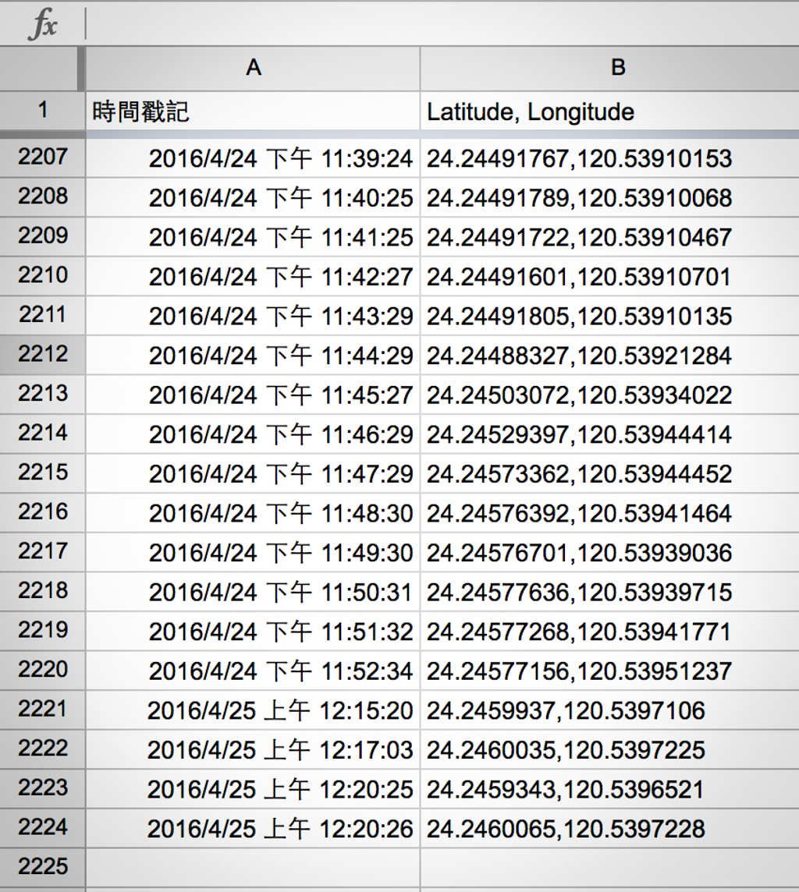

# 2016 大庄媽 GPS 系統

大庄媽組南下北港進香的活動今年也特別的加入了 GPS 定位的功能，而這次協同開發的夥伴是大庄媽交流協會的[楊協達](https://www.facebook.com/zachtoshiya)先生，但其實架構與白沙屯南下進香的 GPS系統略有所不同！

這個專案我主要協助製作 HTML、JavaScript、CSS 的撰寫，其中包含了版型、[Google Maps JavaScript API](https://developers.google.com/maps/documentation/javascript/?hl=zh-tw) 的串接，專案這次使用 Google 文件 的 [Google Sheets JavaScript API](https://www.google.com.tw/intl/zh-TW/docs/about/) 當作路徑的儲存的空間，如此一來流量就不會是問題（關於用 Google 試算表當 API 的方法可以參考[此篇](../2016.09.06 | GoogleSheets-API)）。

而 GPS 訊號端則是使用 楊協達 先生所撰寫的 Android App 來取得每個點的位置，而 App 再使用 Sheets API POST 上去記錄每個點，如此一來 Google 文件上就可以紀錄著所有行經路線。接著前端 JavaScript 在使用 Sheets JavaScript API 去將文件上的資料以 Json 格式取下來，並且做陣列處理。

此方法的好處就是可以不用架設資料庫，並且可以減少 [AJAX](https://zh.wikipedia.org/wiki/AJAX) 的 Request 量的衝擊，活動結束後更可以直接從 Google 文件上面取得活動路線紀錄！

### 相關參考
* [Live Demo](http://www.haotien.org.tw/GPS/HaotienGPS.html)
* [GitHub 原始碼](https://github.com/comdan66/haotien)

`#Google Maps` `#GPS` `#大庄媽` `#媽祖`