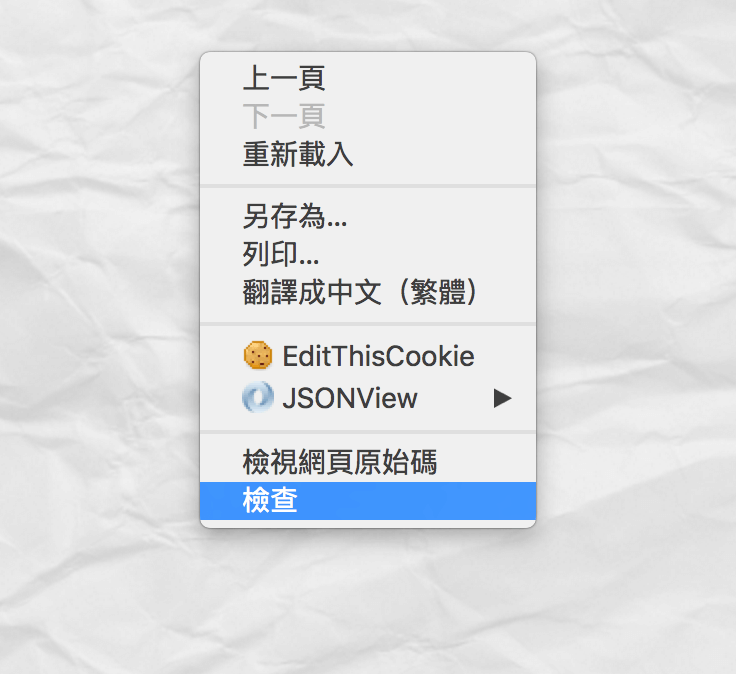
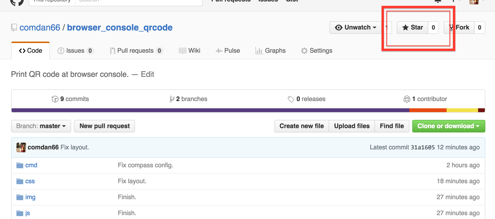

# 瀏覽器 Console 上畫 QR Code

來用瀏覽器除錯器畫一個屬於個人的彩蛋吧！使用瀏覽器 [Console.log](https://developer.chrome.com/devtools/docs/console) 的功能，再利用 [CSS](http://www.w3schools.com/css/) 語法調整樣式，製作有趣的個人彩蛋，本次使用 [QRCode](https://zh.wikipedia.org/zh-tw/QR%E7%A2%BC) 當作實作範例，大家也可以改成自己的喲！Painting QR Code on the browser Console.

這是個無聊靈機一動的小作！大家應該都有打開 Facebook 網頁的 Console 介面吧，這個是我自己實作的，所以分享一下！沒錯，就是來畫 Console，利用 console.log 印出字串，再利用 css 修飾一下，QR Code 的黑、白點則是使用 [JavaScript](https://zh.wikipedia.org/zh-tw/JavaScript) 二維陣列來表示！有興趣的話可以參考一下喲！要用的話，幫我按個 [GitHub](https://github.com/comdan66/browser_console_qrcode) **星星**後就拿去用吧！

### 步驟說明

* 首先，請按 **滑鼠右鍵**，選擇 **檢視** 再選擇 **Console** 吧。
* Mac Chrome 電腦鍵盤快捷鍵 `Cmd + Option + j` 打開。
* Windows、Linux Chrome 電腦鍵盤快捷鍵 `Ctrl + Shift + j` 打開。
* 關鍵[程式碼](https://github.com/comdan66/browser_console_qrcode/blob/master/js/browser_console_qrcode.js)在 `js/browser_console_qrcode.js` 內，程式碼有簡易註解，請各位大大服用。
* 主要先利用 **二維陣列** 表示 QR Code，以 1 代表黑點、0 代表白點，再轉換成要印出的字串。
* 接著利用 JavaScript [eval](http://www.w3schools.com/jsref/jsref_eval.asp) 將組合出的 console.log 字串執行。
* GitHub 在[這裡](https://github.com/comdan66/browser_console_qrcode)，[Demo](https://works.ioa.tw/browser_console_qrcode/index.html) 的話看這裡，可以的話幫我按一下 **GitHub 星星** 吧。
* 主要利用 Console.log 的方式印出，其中使用基本 css 語法修飾。
* 會使用 text-shadow 主要是要掩飾換行的 **行距空白**，line-height 不能設太小，所以利用 text-shadow 掩飾空白處。
* 因為 Safari 的 Console 對於空白的處理寬度不同，所以也需要對白點做 CSS 設定。
* 若各位大大覺得有趣或不錯的話，請幫我在 [GitHub](https://github.com/comdan66/browser_console_qrcode) 上按個星星喜歡吧。
* 相關參考：[Colors in JavaScript console - stackoverflow](http://stackoverflow.com/questions/7505623/colors-in-javascript-console)

### 相關參考
* [Live Demo](https://works.ioa.tw/browser_console_qrcode/index.html)
* [GitHub 原始碼](https://github.com/comdan66/browser_console_qrcode)
* [PTT Soft_Job](https://www.ptt.cc/bbs/Soft_Job/M.1465179541.A.7AE.html)
* [Facebook Front-End Developers Taiwan](https://www.facebook.com/groups/f2e.tw/permalink/1008440282526670/)
* [Facebook JavaScript.tw](https://www.facebook.com/groups/javascript.tw/permalink/786607411440599)

`#Google Chrome` `#JavaScript`