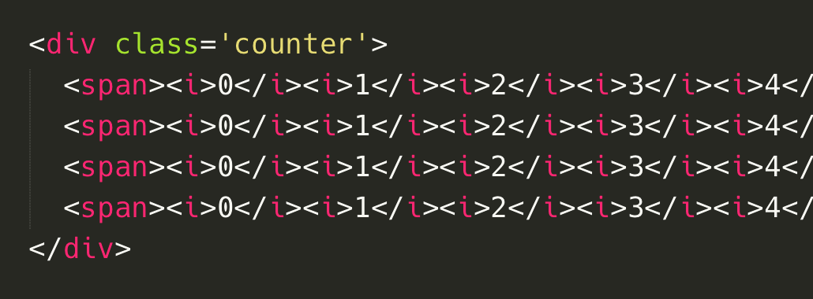
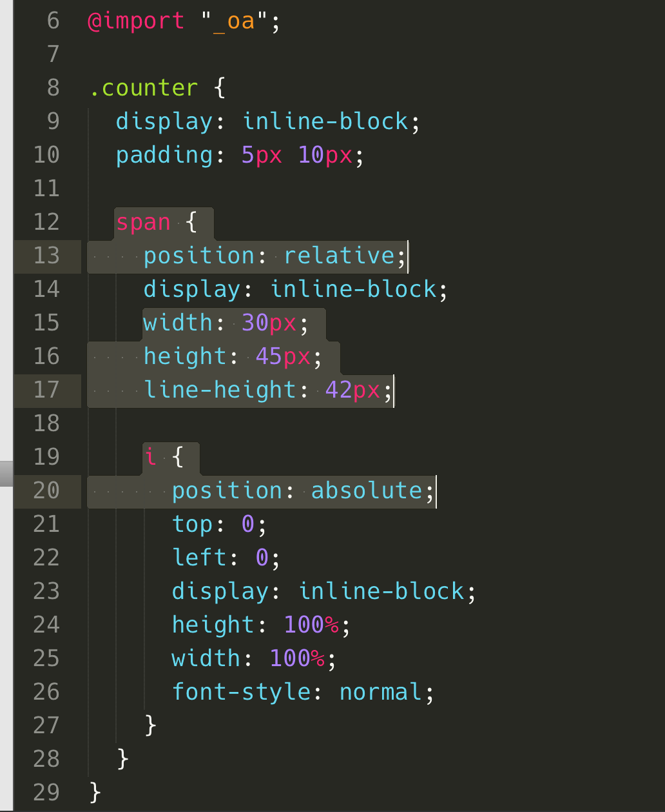
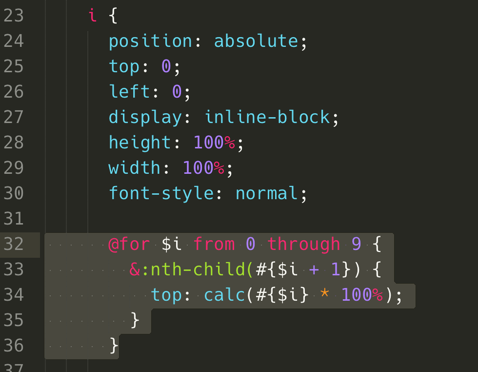
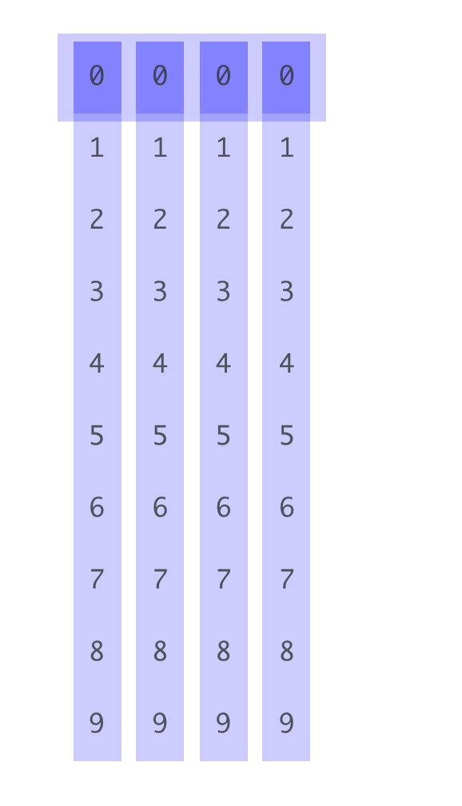
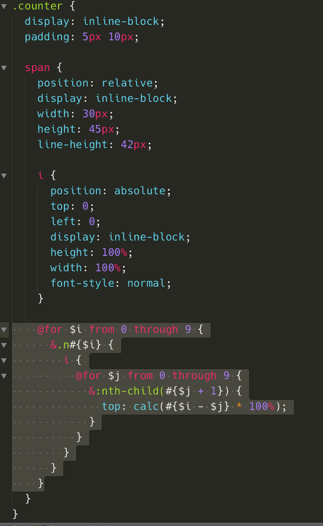
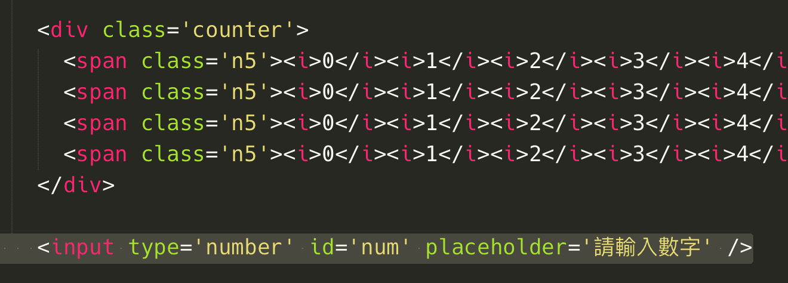
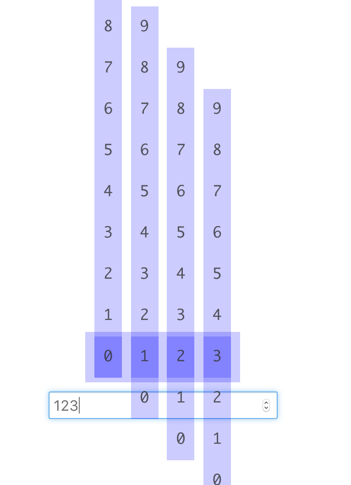
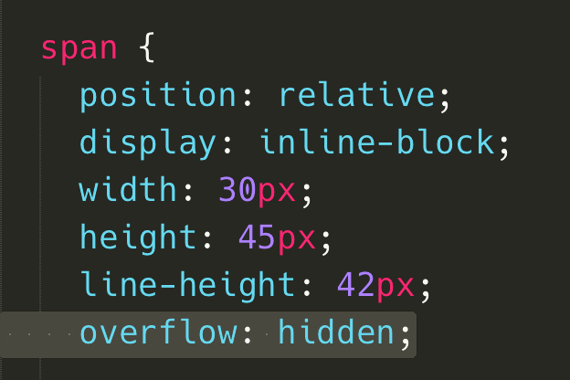
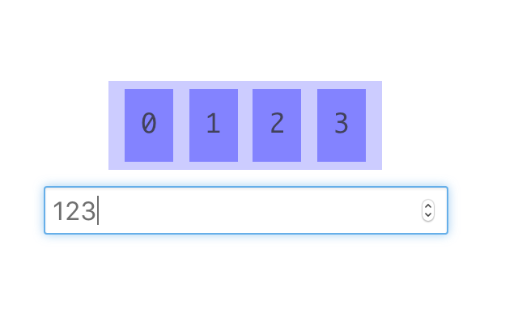

# 數字翻轉計數器

使用簡單的 [JavaScript](https://zh.wikipedia.org/wiki/JavaScript) 與 [SCSS](http://sass-lang.com/) 實作**數字翻轉計數器**，藉由設定每個計數器元素的 class 來達成不同數字的顯示，分別以 n0~n9 的 class 來設定子元素 top 的位置。GitHub 內的關鍵 css 與 JavaScript 分別在[這裡](https://github.com/comdan66/number_flipping_counter/blob/master/scss/counter.scss)和[這裡](https://github.com/comdan66/number_flipping_counter/blob/master/js/counter.js)，以下依照步驟配合圖片講解一下！

首先建立要用的 HTML 結構，基本上就是 span 代表一個位數，裡面的 i 代表 10 個數字。

設定 scss(css)，將 span 給予 `position: relative;` 的屬性，然後針對子元素 i 設定 `position: absolute;`，此時看到瀏覽器畫面 span 內的 i 都疊在一起了。

利用 scss 的 `for 迴圈`，針對 `nth-child` 設定 `top` 的位置。瀏覽器使用開發者檢視，可以發現每個 i 都因為 for 迴圈加上使用 calc，所以有不同的設定值。

接著改變一下 HTML，將每個 span 加上 n5 的 class，並且修改 scss，將原本的 for 迴圈移除，改在 span 設定，使用雙層迴圈，分別針對 n0~n9 去設定 i 的不同位置。開啟瀏覽器，可以發現 i 被移到指定的 5。

使用 JavaScript 輔助，使用簡單的數學運算(/、%、pow)，切割出各個位數，並且利用 jQuery 的 **eq** 來取得指定的 span。

加上個 input，並且修改一下 JavaScript，讓使用者輸入數字時改變計數器。

最後在 span 上加入 `overflow: hidden;`，如此就可以將不再位置內的 i 隱藏囉！同時 i 加上 transition 優化 top 移動的效果！

### 相關參考
* [Live Demo](https://works.ioa.tw/number_flipping_counter/index.html)
* [GitHub 原始碼](https://github.com/comdan66/number_flipping_counter/)
* [PTT Soft_Job](https://www.ptt.cc/bbs/Soft_Job/M.1465779607.A.89F.html)
* [Facebook Front-End Developers Taiwan](https://www.facebook.com/groups/f2e.tw/permalink/1012215045482527/)
* [Facebook JavaScript.tw](https://www.facebook.com/groups/javascript.tw/permalink/790143711086969)

`#jQuery`