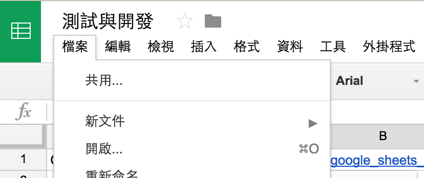
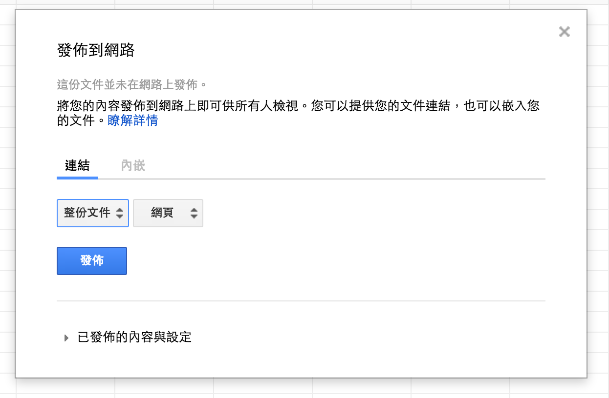
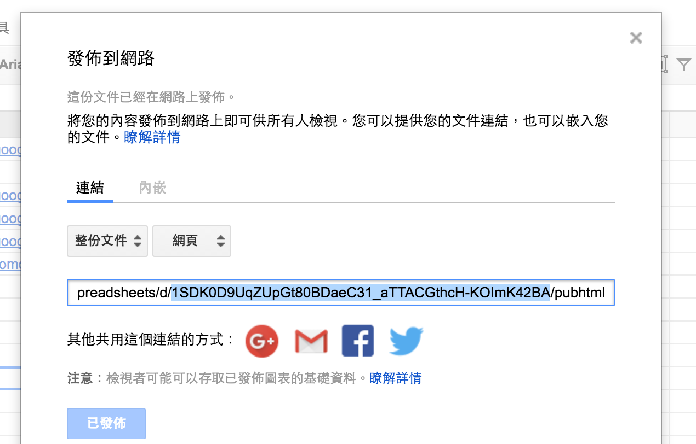
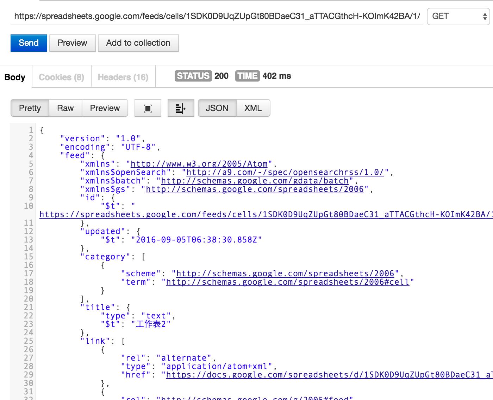

# Google 試算表當資料庫並取得 API

在 Google 的雲端硬碟服務中，[試算表](https://apps.google.com/intx/zh-tw/products/sheets/) 是我喜愛的樣服務之一，而在這個 Google 當道的世代相信大家也都有使用過吧！用起來就跟 [Microsoft Office](https://products.office.com/zh-tw/home) 中的 [Excel](https://support.office.com/zh-tw/excel) 相似，都是表格系統的文件處理，而 Google 試算表其實不只提供了 Excel 的表格功能試算外，其實也提供了多項服務，像是與[問卷表單](https://apps.google.com/intx/zh-TW/products/forms/)結合，亦或者可以使用 [API](https://zh.wikipedia.org/wiki/%E5%BA%94%E7%94%A8%E7%A8%8B%E5%BA%8F%E6%8E%A5%E5%8F%A3) 取得文件內容.. 等功能。

其實要把 Google 試算表變成 API 來使用並不困難，只要做幾個設定，就可以將文件分享到網路上，甚至可以針對不同的工作表做讀取喔！以下以截圖舉例說明如何將試算表分享至網路。

首先建立好試算表後，選取左上角的**檔案**，然後接著選擇**發佈到網路**，此時會跳出讓你選擇發佈的類型，你可以針對是否要整份文件亦或者哪個工作表做發佈，若不知道怎麼設定的話，就直接選**整份文件**、**網頁**，然後**發佈**吧！

完成發佈後，會得到一串網址，基本上我們最需要的是檔案的 key，而 key 值就在那串網址之中，以下圖為例就是 `1SDK0D9UqZUpGt80BDaeC31_aTTACGthcH-KOImK42BA`，這串字串很重要，要取得文件內容都得靠它！

接著我們舉例說明如何使用，基本網址樣式有兩種(參考[此篇](https://developers.google.com/gdata/samples/spreadsheet_sample))，分別如下：

* https://spreadsheets.google.com/feeds/cells/`{key}`/`{sheet index}`/public/values
* https://spreadsheets.google.com/feeds/list/`{key}`/`{sheet index}`/public/values

`{key}` 就是帶入剛剛提到的 key 值，而 {sheet index} 就是想取得哪一張工作表的序，若是第一張帶入 1，第二張則是 2，以此類推。另外再回傳格式的部分，預設值是 xml，若是想使用 json 的話，可以加入 `?alt=json` 的參數喔！

下圖是針對[此張試算表](https://docs.google.com/spreadsheets/d/1SDK0D9UqZUpGt80BDaeC31_aTTACGthcH-KOImK42BA/edit?usp=sharing)使用 [Postman](https://chrome.google.com/webstore/detail/postman/fhbjgbiflinjbdggehcddcbncdddomop) 試著模擬呼叫第一張工作表的回傳結果，而結果會在回傳值得 `feed.entry` 內，格式分別就是 cells 與 list 的不同差異，下列是使用 cells 的回傳結果，其 API 網址為：[https://spreadsheets.google.com/feeds/cells/1SDK0D9UqZUpGt80BDaeC31_aTTACGthcH-KOImK42BA/1/public/values?alt=json](https://spreadsheets.google.com/feeds/cells/1SDK0D9UqZUpGt80BDaeC31_aTTACGthcH-KOImK42BA/1/public/values?alt=json)

### 相關參考
* [Simple example of retrieving JSON feeds from Spreadsheets Data API..](https://developers.google.com/gdata/samples/spreadsheet_sample)
* [拉普菲斯: jQuery | 利用 Google Spreadsheet 作資料庫](http://www.kamira.co.vu/2012/11/jquery-google-spreadsheet.html)
* [利用 Google 問卷(試算表)當小型資料庫..](http://www.wfublog.com/2011/11/google-spreadsheet-as-micro-database-1.html)

`#Google sheets` `#API`