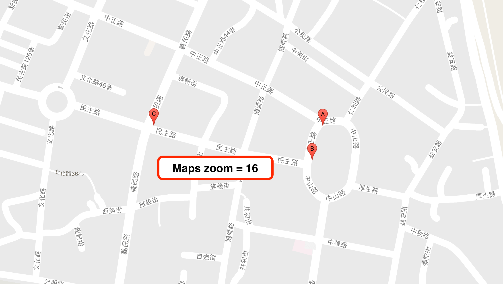
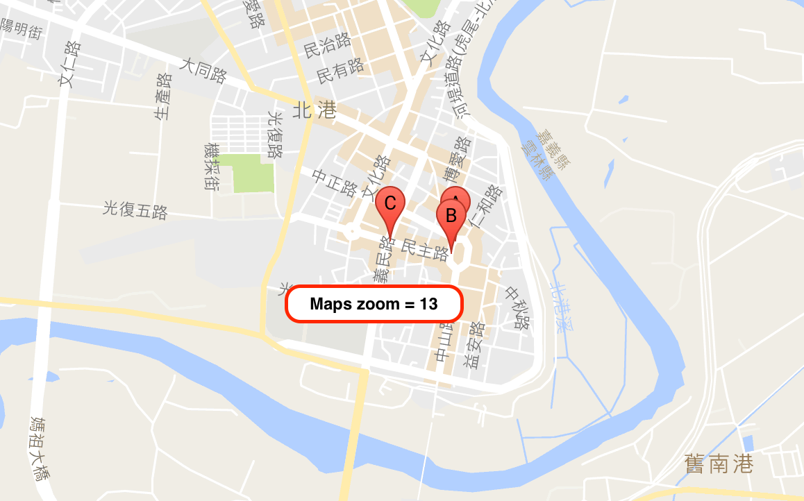
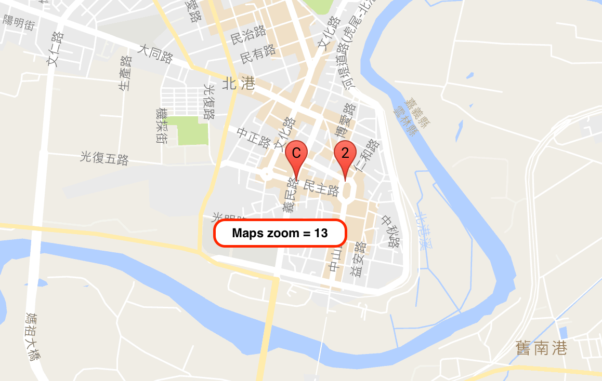

# Google Maps 標記叢集 Marker Clustering

各位 [Google 地圖](https://developers.google.com/maps/documentation/javascript/tutorial?hl=zh-tw) 玩家都應該有過當 [Marker](https://developers.google.com/maps/documentation/javascript/markers?hl=zh-tw) 太多時，視角一拉遠後全部 Marker 擠在一起的困擾吧！沒錯 [OA's Marker Clustering](https://github.com/comdan66/OA-markerClustering) 就是要來處理這個困擾！網路上也有很多關於 Marker Clustering 的 Library，但想要比較能夠掌握概況以及視需求去做調整功能，所以刻了一套可以自訂 Marker Clustering 的地圖工具。

或許你/妳會問，市面上也有很多關於 Marker Clustering 的 Library，那又何必自己時做一套呢！？原因很簡單，因為自己做的比較能夠掌握概況，視需求去做調整，不用一大包的 code，到底怎麼跑的都摸不透，並且加以利用做出自己想要的功能！

如果試著 Google 關於 [Marker Clustering](https://developers.google.com/maps/documentation/javascript/marker-clustering) 的文章都會找到 Marker Clustering 此篇，而官網上也都推崇[這套](https://github.com/googlemaps/js-marker-clusterer) Library，這套我也開發過，甚至改過其功能，但是最後我還是自己刻了屬於自己的 [Marker Clustering](https://works.ioa.tw/OA-markerClustering/index.html) 來制定當不同的 集合 Marker 時可以使用不同呈現方式！以下就是一些功能介紹、演算方法說明。

### 概略方法

[OA's Marker Clustering](https://works.ioa.tw/OA-markerClustering/index.html) 主要規則就是利用 Google Maps 在不同的放大視角(以下以 zoom 代稱)時產生 **集合 Marker**，而這些 Marker 用來代表著是多數 Marker 集合。如下圖 1 是 zoom 為 16 時的狀況圖，地圖上分別有 A、B 以及 C 三個點，而圖 2 代表在 zoom 為 13 時，因為地圖視角拉遠了，所以造成 A 與 B 互相太靠近，所以必須隱藏 B 只顯示 A，所以作法如圖 3，產生一個 集合 Marker 放置在 A 的位置，並且記錄著數量為 2。

這次的 [OA's Marker Clustering](https://works.ioa.tw/OA-markerClustering/index.html) 中，我拆出兩種 Type，分別是 **moveRun**、**runAll**，其兩者在地圖上的呈現結果差不多，但方法是不一樣的。前者 moveRun 是當地圖移動完後(idle Listener)，先取得地圖的範圍座標 [Bounds](https://developers.google.com/maps/documentation/javascript/reference)，在塞選(filter)出地圖範圍內的座標點，再依照這些座標點去製作各個 集合 Marker。而後者的 runAll 型態則是當一開始新增玩所有點之後，立即運算出當地圖在各個 zoom 分別的 集合 Marker，當地圖 zoom 大小改變時，則可以立即得找出該 zoom 下的 集合 Marker 顯示。

Type moveRun 當地圖移動時，會重新針對範圍內做計算再合併出 集合 Marker，所以會移除舊的在上新的，整體初始速度較快，但當地圖移動時會有閃娑狀況，反之 runAll 因為開始先算出所有不同 zoom 時要顯示的結果，所以當地圖移動(平滑非放大)時，因為不用移除舊的，所以不會有閃爍狀況發生，但初始速度較慢。

### 相關參考
* [Live Demo](https://works.ioa.tw/OA-markerClustering/index.html)
* [GitHub 原始碼](https://github.com/comdan66/OA-markerClustering/)
* [PTT Soft_Job](https://www.ptt.cc/bbs/Soft_Job/M.1475629747.A.CC8.html)
* [Facebook Front-End Developers Taiwan](https://www.facebook.com/groups/f2e.tw/permalink/1089454517758579/)
* [Facebook JavaScript.tw](https://www.facebook.com/groups/javascript.tw/permalink/875068025927870)

`#Google Maps` `#Marker Clustering` `#JavaScript`