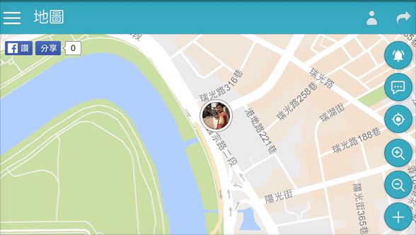

# 聊天地圖 LiveMaps

LiveMaps 是一個即時地圖聊天室，讓你在世界上任何位置都可以發出自己的感想動態。每個人都可以在地圖分享著她在世界各地、城市角落的心情寫照，網站藉由 [Google](https://www.google.com.tw/) 所提供的 [Firebase](https://firebase.google.com/) 的 [Realtime Database](https://firebase.google.com/docs/database/) 以及 [Google Maps JavaScript API](https://developers.google.com/maps/documentation/javascript/?hl=zh-tw) 免費服務實作。

聊天地圖也是一個純前端技術的網站，仰賴 Firebase 的 Realtime 的特性，並且用於 Google Maps 上，讓使用者的定位可以即時分享，同時間也可以發佈動態；現階段只是初樣的 Prototype，之後會加入 **個人聊天室**、**上傳照片**、**Mobile App** 等功能！

基本的 Google Maps JavaScript API 的應用這邊就不多介紹了，這次的練習主要著重在 Firebase 的應用，藉由 Hosting 來取得 Https 的協定，然後在建立起專案，並且利用 Realtime Database 來實作即時性的功能。

Firebase 的 Hosting 可以將自己的 [Domain](https://zh.wikipedia.org/wiki/%E5%9F%9F%E5%90%8D) 用 CNAME、A 記錄指向過來，使得專案擁有自己客製化的 Domain/Sub Domain 並且是 Https 的協定，而 Hosting 功能在 Firebase 的操作上並不會太困難，只要依照其所顯示的步驟驗證完網域所有權後即可完成。Realtime Database 是項 Firebase 儲存資料的服務，他是以 [JSON](http://www.json.org/) 的方式，用 key-value 方式儲存，用過 [NoSQL](http://tx.liberal.ntu.edu.tw/InfoMgt/Jx/IS_IM/NoSQL.htm) 的朋友或許會比較適應這樣的 Database；因為儲存格式是 JSON 的關係，所以在一開始的設計就不能以[關聯式資料庫](https://zh.wikipedia.org/wiki/%E9%97%9C%E8%81%AF%E5%BC%8F%E8%B3%87%E6%96%99%E5%BA%AB%E7%AE%A1%E7%90%86%E7%B3%BB%E7%B5%B1)的思維角度下去設計囉。

CRUD 的基本功能撰寫這邊也不做介紹，基本上[官網](https://firebase.google.com/docs/samples/?hl=zh-TW)都有範例以及說明囉，其中包含了 iOS、Android、JavaScript 的支援，所以更可以製作成 Mobile App，而下一階段我也將考量使用 iOS 來實作一次 LiveMaps。官方資源也不僅於 Sample，在官方 [GitHub](https://github.com/firebase/) 也可以看到多樣的 Library，其中常見的 [firebaseui-web](https://github.com/firebase/firebaseui-web)、[GEO](https://github.com/firebase/?utf8mb4=%E2%9C%93&query=geo).. 等，服務都是由官方維護的，所以在家接功能上會更加方便。

以網頁版來說，登入系統可以由 [firebaseui-web](https://github.com/firebase/firebaseui-web) 來串接，在地圖上更可以用 [geofire-js](https://github.com/firebase/geofire-js) 來實作，geofire 就有豐富的經緯度範圍運算，可以快速的撈出範圍內的點，不過對於 Database 的 JSON 格式架構就要符合其規範，第一版的 LiveMaps 就是使用 geofire 實作，但是因為功能需求，所以暫時先捨棄；而 firebaseui 提供了各種不同的 OAuth 登入，可以配合 Authentication 製作登入系統，不過在第二版製作時也暫時拿掉，主要是因為想加快登入時間問題，所以暫時只使用 [Facebook](https://www.facebook.com/) 的 SDK 實作 OAuth 登入。

網頁的定位方式，是採用 [navigator.geolocation](https://developer.mozilla.org/zh-TW/docs/Using_geolocation) 的 [watchPosition](https://developer.mozilla.org/zh-TW/docs/Web/API/Geolocation/watchPosition) 取得使用者瀏覽器裝置位置，因為 Firebase 提供了 Https 的服務，故在 [Chrome](https://www.google.com.tw/chrome/browser/desktop/) 瀏覽器上就可以取得使用者位置，而且使用了 watchPosition 並且搭配使用 enableHighAccuracy，所以取的的位置會較為精準，但也可能會有誤差值，故使用上可能會有使用者發生位置不正確的狀況，待下一版本解決。

### 相關參考
* [Live Demo](https://livemaps.ioa.tw/)
* [GitHub 原始碼](https://github.com/comdan66/livemaps)
* [PTT Soft_Job](https://www.ptt.cc/bbs/Soft_Job/M.1476670339.A.9A0.html)
* [Facebook Front-End Developers Taiwan](https://www.facebook.com/groups/f2e.tw/permalink/1099222856781745/)
* [Facebook JavaScript.tw](https://www.facebook.com/groups/javascript.tw/permalink/883474571753882)
* [Facebook 分享集 1](https://www.facebook.com/shares/view?id=883474571753882)
* [Facebook 分享集 2](https://www.facebook.com/comdan66/posts/1437654949581176)
* [三天開發出來的「聊天地圖」 - INSIDE 硬塞的網路趨勢觀察](http://www.inside.com.tw/2016/10/17/livemaps)
* [台灣工程師新創意　讓你在Google Maps上聊天 -- 上報 / 焦點](http://www.upmedia.mg/news_info.php?SerialNo=5892)
* [三天就上線的「聊天地圖」,才發現原來身邊有這麼多人 - 愛逛街](http://iguang.tw/u/4380572/article/701767.html)
* [交友軟體再進化？！即時「聊天地圖」讓你直接在Google Maps上聊天：偷窺路人動態超好玩！ - 優仕網-共產檔](http://share.youthwant.com.tw/DC2091516.html)
* [網友花三天開發出來的「聊天地圖」...這大概會成為一種新型態的社群互動模式啊 - 哈拉閒聊版 - wetalk - lets talk!](https://www.wetalk.tw/thread-54756-1-1.html)
* [交友軟體再進化？！即時「聊天地圖」讓你直接在Google Maps上聊天：偷窺路人動態超好玩！ - 夯話題 - 卡提諾論壇 - LiveMaps,聊天,地圖](http://ck101.com/thread-3675762-1-1.html)
* [卡提諾論壇｜CK101.COM - 動態時報](https://www.facebook.com/ck101fans/posts/1244982832233152)
* [遠見雜誌 - 前進的動力：不抓寶，改抓路人動態？台灣人推出 Google Map 版的「聊天地圖」](http://www.gvm.com.tw/webonly_content_11773.html)
* [台灣工程師開發「聊天地圖」：偷窺路人動態好玩，但不小心就變廢文集散地 XD | TechOrange](https://buzzorange.com/techorange/2016/10/18/livemaps/)

`#Firebase` `#jQuery` `#Google Maps`