# EC2 被鎖住不能使用 SSH 登入 怎麼辦？

不小心弄錯設定，造成 root 權限的 ubuntu 無法 SSH 登入了，怎辦？有辦法搶救嗎？

## 緣起

為了限制 AWS EC2 上某個 user 僅能使用 **sftp** 在自己的 **家目錄** 內運作，於是我更改 Server 的 `sshd_config`，加入了對該 **user** 的 `ChrootDirectory`、`ForceCommand` 與 `AllowTcpForwarding` 設定。

但手殘卻不小心把 `Match User` 註解了..

如此一來會造成所有 User 皆只能使用 sftp 連上 Server，並且根目錄僅能在自己的 **家目錄** 內，而且 **不能往上層移動** 😢

## 處理過程

以下是我試圖搶救的過程，不是一個最佳的方式，如要了解最適合的方法可以直接看下方結論～

首先 root 權限的 ubuntu 因為 `sshd_config` 的設定值關係所以無法 SSH 上 server

每當使用 SSH 連線時，就會有錯誤訊息：`This service allows sftp connections only.`

所以 SSH 這條路算是封死了..

那試著 `sftp` 上去看能不能修改與更新 `sshd_config`，然後 **重啟** 上系統自動 `ssh reload`

但是由於 **不能往上層移動** 的限制，自然的也就無法變更到 `sshd_config` 😫

萬念俱灰之下還嘗試了將 Server build 出 `image`，想藉由 image launch 新的 EC2 instance

結果當然失敗，因為既然是 image..，所以設定值一模一樣，SSH 上這台新的 instance 也是一樣的錯誤訊息 `This service allows sftp connections only.`

所以 image 方式也是失敗..

## 備份資料

既然無法進去 Server，那換個角度，至少要想辦法備份資料吧？

雖然程式碼都有上 git，但是很多 config 都是被 gitignore 的，如果遺失勢必麻煩..

此時我想起 AWS EC2 的服務是拆成

1. 運算
2. 儲存

所以收費時有三個收費項目

1. 運算
2. 儲存
3. 流量

那代表儲存是獨立切開的，而且資料是儲存在 EC2 的硬碟上的，也就是 **Volume**，那就把腦筋動到 Volume 上吧！

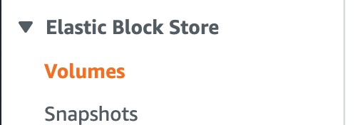

### 複製 Volume

以我這台主要的 EC2 `i-xxx` 的機器來說，所搭配的硬碟是 `vol-xxx`，如下圖 **1** 代表的就是發生問題的 EC2 instance，而標示 **3** 則是這台 EC2 所掛載的 Volume `vol-xxx`

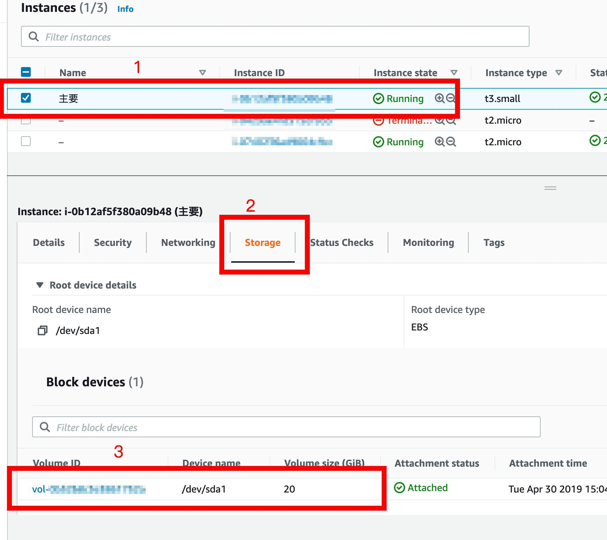

點擊標示 3 的 `vol-xxx` ID 後會跳至 Volumes 頁面，檢視其細節，如下圖可以得知當初我並未對硬碟座加密，所以看來是有機會的可以讀出內容

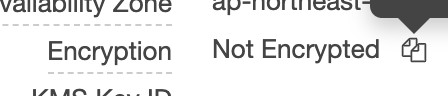

方法就是將此 `vol-xxx` 的 volume clone 一份出來，並且開啟另一台 EC2 instance `i-ooo` 然後掛載上去！

首先對這個 `vol-xxx` 右鍵選擇 `Create Snapshot`，建立一份此 Volume 的 **快照**

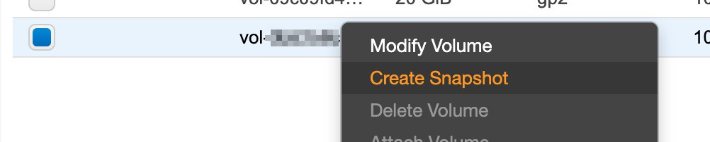

然後點擊去 Snapshots 頁面上看所產生的 Volume Snapshot

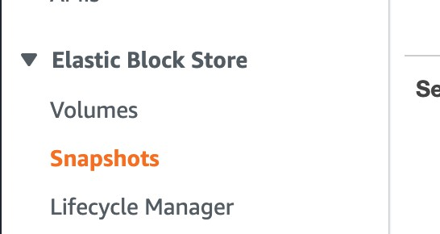

如下圖就是 `vol-xxx` 所產生的快照 `snap-xxx`

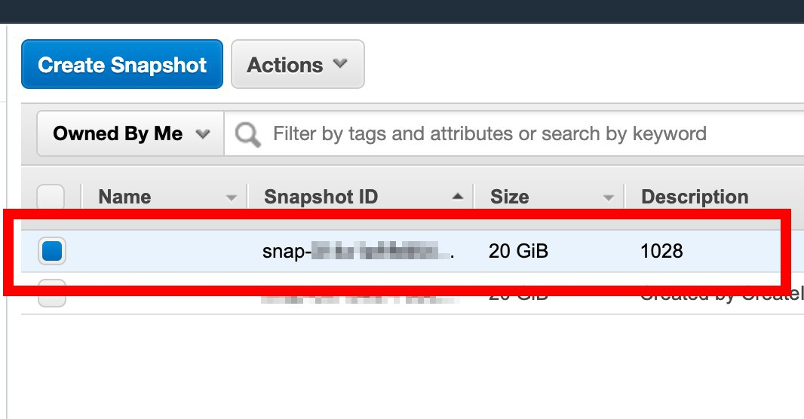

然後對著 `snap-xxx` 右鍵選擇 `Create Volume`，建立一份與原本一樣的 Volume

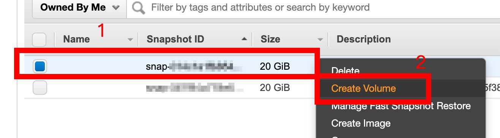

回到 Volumes 頁面，可以看到多出一顆新的 Volume，如下圖的綠框 `vol-ooo`

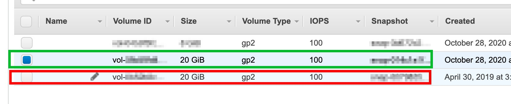

以上流程就是 Volume1 -> Snapshot -> Volume2，所以 Volume1 內容 == Volume2 內容

### 掛載 Volume 至新的 EC2

接著開一台新的 EC2 instance `i-ooo`，方法可以參考 [此篇](../../004 | AWS/003 | EC2-Ubuntu)

如下圖，開好後在 Instances 頁面看到多出一台全新的 EC2 實例，紅框為原本的 EC2 instance `i-xxx`，綠框為新的 EC2 instance `i-ooo`

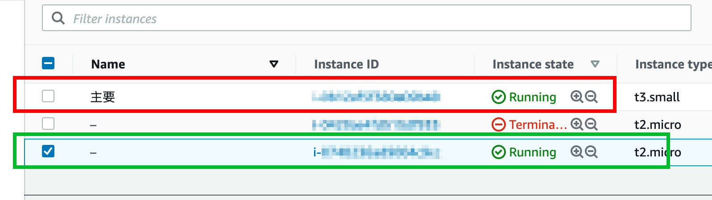

當然新的 EC2 一開始會有一顆預載的 8G 硬碟，所以回到 Volumes 頁面看，也會看到多出來的那顆硬碟

如下圖紅色為原本舊 EC2 instance `i-xxx` 的 volume `vol-xxx`，綠色是 clone 出來的 volume `vol-ooo`，藍色就是新開啟的 EC2 instance `i-ooo` 所使用的預設的 volume `vol-aaa`

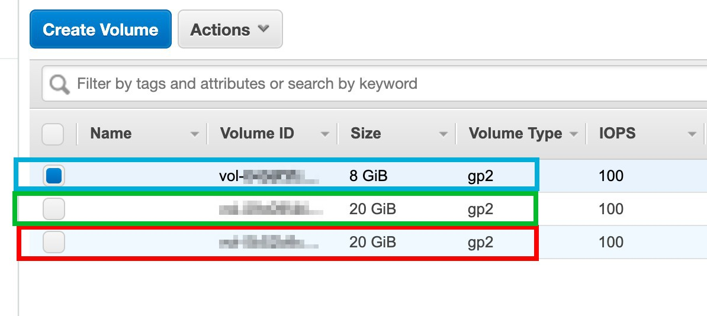

接著掛載 `vol-ooo` 到剛剛開啟的 `i-ooo` instance 上，直接點選 `vol-ooo` 右鍵選擇 `Attach Volume`

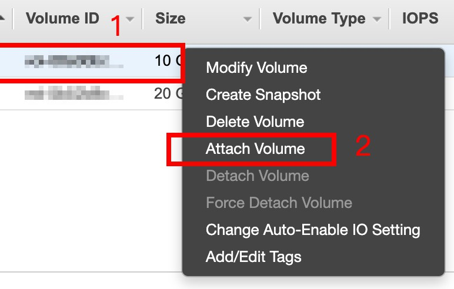

將 `vol-ooo` 掛載到 `i-ooo` instance 上，並且要注意一下 Device 此硬碟的編號（綠框）`sdf`，掛載好之後回到 Instances 頁面上，將 `i-ooo` 的 EC2 instance 做 **Reboot**

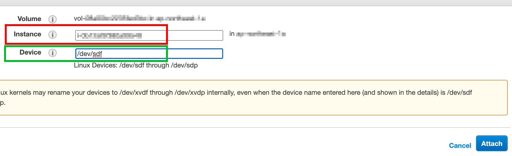

### 讀取掛載的 Volume

馬上使用 SSH 到 `i-ooo` 的 EC2 instance 上，並且切換身份至 root，所以輸入指令 `sudo -s`

切換好身份後，輸入指令 `lsblk` 列出此機器上有多少顆硬碟

紅框代表預載的 8G volume `vol-aaa`，而綠框則舊是那刻 20G 的 `vol-ooo` volume

`xvda` 代表磁碟 `xvda1` 則是第一個磁區，而 `xvdf` 則就是 `vol-ooo` 那顆磁碟，而 `xvdf1` 就是他裡面的第一個磁區

`xvdf` 與在掛載時 Device 所標示的 `sdf` 尾數應該會是一樣的 `f`，所以掛載多顆硬碟時要注意一下才不會認錯顆

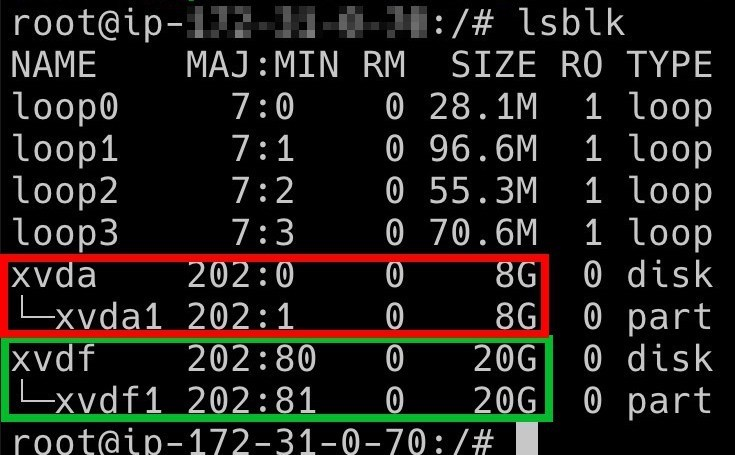

接著依然採用 root 身份，在 `/` **根目錄** 下建立一個 `test` 目錄

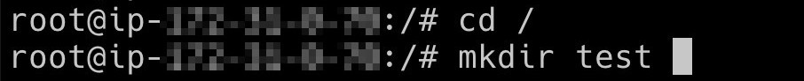

建立好 `/test` 目錄後，就要設定將 `xvdf1` 磁區連結到 `/test` 目錄，所以使用指令 `mount /dev/xvdf1 /test`

接著再用指令 `lsblk` 列出此機器上有多少顆硬碟

如下圖可以看到 `xvda1` 磁區 mount 到 `/` 根目錄，而 `xvdaf` 磁區 mount 到 `/test` 目錄，那就代表完成了

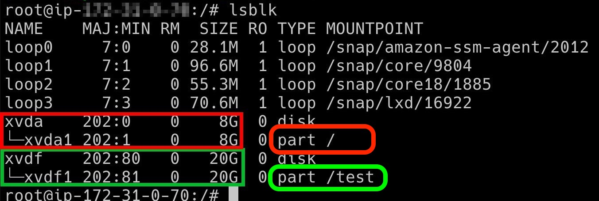

太好了！直接進入 `/test` 目錄吧！

列出 `/test` 目錄內的內容，完全的可以讀出資料就代表完成了！！！！😂

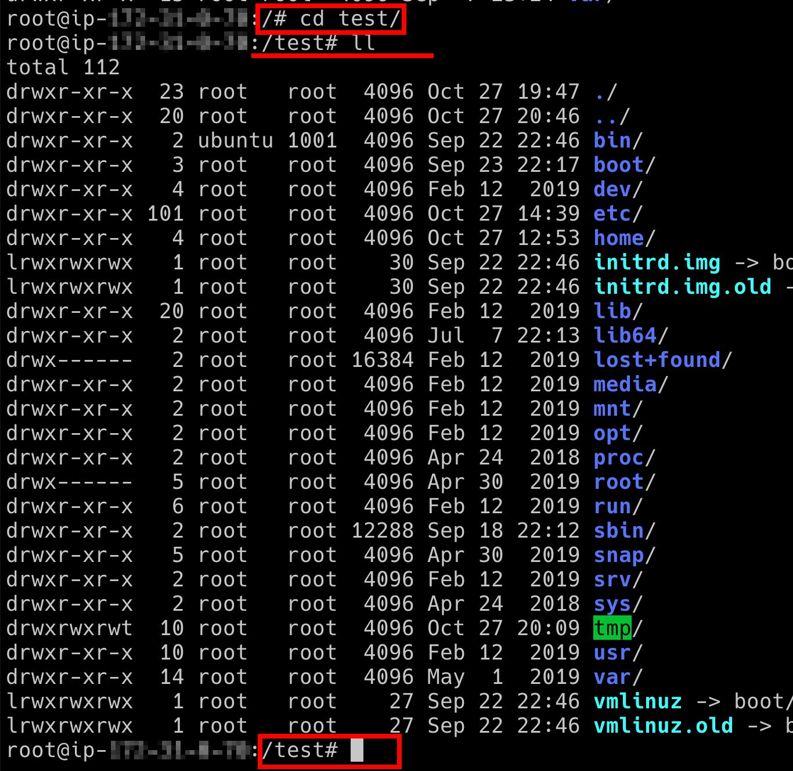

## 結論

上述的過程是我自己的處理經驗流程，但是事後經由我自己的不斷再次嘗試，其實有更好的處理方式，方法總結如下：

1. 關閉舊的 EC2 instance `i-xxx`
2. 將舊的 Volume `vol-xxx` **Detach**(卸下)
3. Launch 一台新的 EC2 instance `i-ooo`
4. 將卸下的 Volume `vol-xxx` **Attach**(掛載)到新的 EC2 instance `i-ooo`，並 **Reboot**(重啟) `i-ooo`
5. SSH 上新的 EC2 instance `i-ooo` 上，直接使用 **sudo** 權限 **mount** `vol-xxx` 的磁區到 `/test` 目錄
6. 使用 **sudo** 權限修正 `/test/etc/ssh/sshd_config` 儲存
7. **Stop**(關閉) EC2 instance `i-ooo`
8. 將 Volume `vol-xxx` 從 EC2 instance `i-ooo` 上 **Detach**(卸下)
9. 將Volume `vol-xxx` **Attach**(掛載)到原本的 EC2 instance `i-xxx`，並 **Reboot**(重啟) `i-ooo`
10. 就可以成功的 SSH 上原本的 EC2 instance `i-xxx`

以上是濃縮再濃縮、提鍊再提煉的處理步驟了，雖然前面走了很多冤旺路，但是也獲得了很多寶貴的技術知識 😳

### 相關參考
* [使 Amazon EBS 磁碟區可供在 Linux 上使用 - Amazon Elastic Compute Cloud](https://docs.aws.amazon.com/zh_tw/AWSEC2/latest/UserGuide/ebs-using-volumes.html)
* [Locked myself out of Amazon EC2 SSH - This service allows sftp connections only](https://unix.stackexchange.com/questions/143925/locked-myself-out-of-amazon-ec2-ssh-this-service-allows-sftp-connections-only)
* [This service allows sftp connections only - pu20065226 - 博客园](https://www.cnblogs.com/pu20065226/p/10962906.html)
