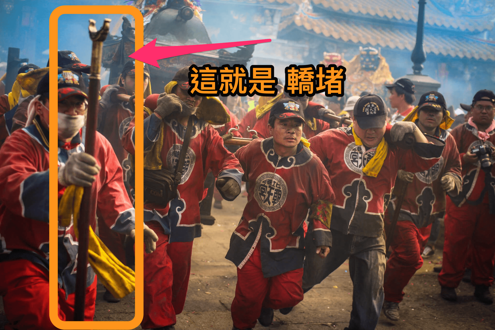
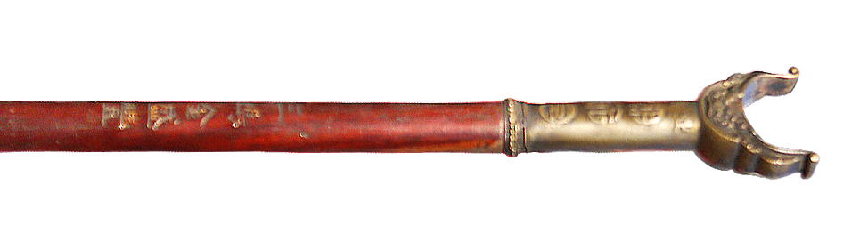

# Y字型轎堵的由來

你知道媽祖神轎之轎堵如何來的嗎？

這就要說起以前(至少離今已三十年以上)，因為年輕人大多跑去扛虎爺、太子爺、土地公、小西天，互相拼吃炮的數量，導致笨重的媽祖神轎必須依賴老班的，當然是力不從心，加上那時傳統陣頭多，人力相當分散，扛媽祖的人員更是稀少。記得除三媽不應允轎班會加裝輪胎用推的，以及六媽偶有用扛的外，其餘各媽祖神轎都是用推的。

所以當三媽及六媽的爐主非常可憐，除了要提神籃外，還得一起扛神轎，並須輪流掌轎，晚上出廟時，更經常發生人手不過扛轎，義消還得加入支援。在此情形下，當時三媽會中年輕一點的委員(這些人現在已五、六十歲)就參考蜈蚣陣之木棍及吊曬衣服用之支柱，設計了現在轎堵的前身，以便短暫休息或吃炮時做為臨時支撐，節省體力，而朝天宮則在近幾年換新神轎時才一併統一製作。

### 相關參考
* [北港新站 - 黑以桑提供](http://www.peikang.idv.tw)
* [吳政賢 攝影集](https://www.facebook.com/comdan66)

`#北港` `#朝天宮` `#神轎`
