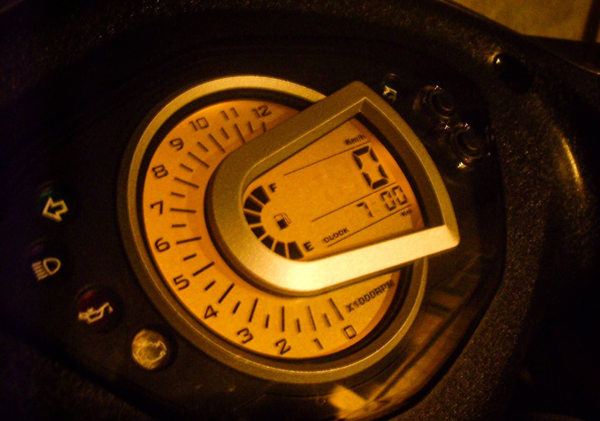

# SYM GT 125 噴射 前碟煞版

話說已經找了一陣子要買的車車，最後考慮了價錢、外觀、C/P值..等，所以選擇了這台 [SYM](http://www.sym.com.tw/) 的 GT125 五期噴射前碟煞版！

因為第一次買車，所以什麼都不熟，於是就只能拜 Google 大神了，在爬了好幾天的 [PTT biker 版](https://www.ptt.cc/bbs/biker/index.html)、[小老婆](http://forum.jorsindo.com/)、跟 [Mobile 01](http://www.mobile01.com/topiclist.php?f=660) 後多多少少學會了一點點東西了！

昨天去車行先拿些證件去辦過戶、強制險之類的，而這家車行 我也是爬了超久看到超多人推薦的白店我才去的！首先一開始就要面臨的問題是要選哪個顏色！？白、灰、籃，最後 我選擇了 **灰**/**黑** 色！所以，今天去把她娶進門了！！

之前看過有人把貼紙拆掉，但我覺得這樣感覺好像沒穿衣服，所以我應該會保持原樣吧！會選擇 SYM GT125 其實也還有考量到因為以前都是給別人載的，所以我很知道座在後面人的感覺，於是飛旋踏板是我一項非常重要的功能！

一切都打理好後，重點來啦，我阿母千交代萬交代一定要做的事！沒錯啦，天底下的父母都希望子女平安！所以他特別交代我記得將我們[北港朝天宮](http://www.matsu.org.tw/)的香火戴上去！

現在還是訓車期，所以說就還只能按部就班的騎，可能是新車或者是說第一次騎 GT125 吧，油門還不是控制的很好，不過，慢慢來吧！以上就是我簡短的開箱文，以後心得會慢慢補上！

### 相關參考
* [SYM(250cc以下) - [開箱] SYM GT 125 噴射 前碟煞版!! - 機車討論區 - Mobile01](http://www.mobile01.com/topicdetail.php?f=660&t=1918824)