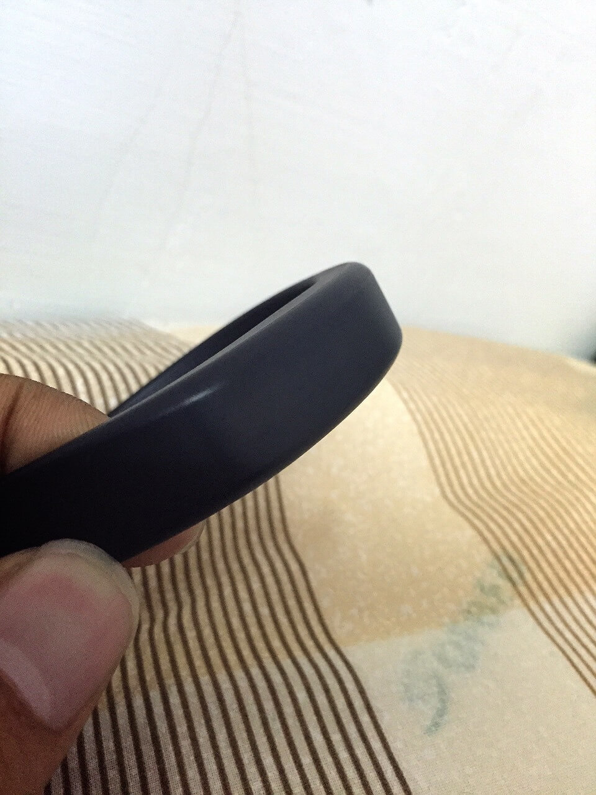
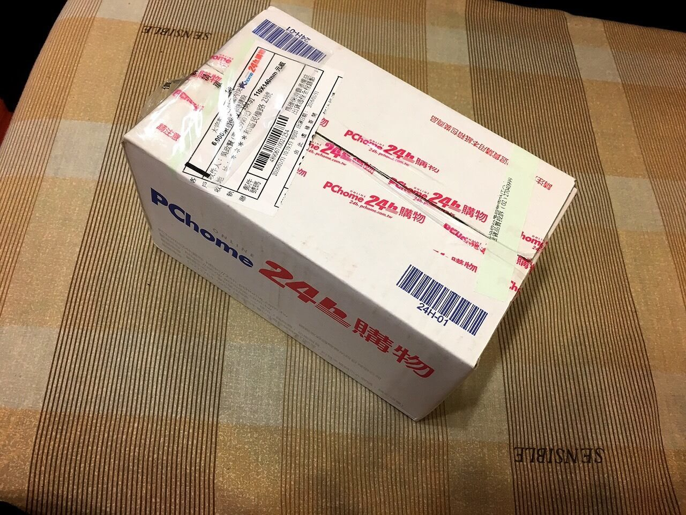
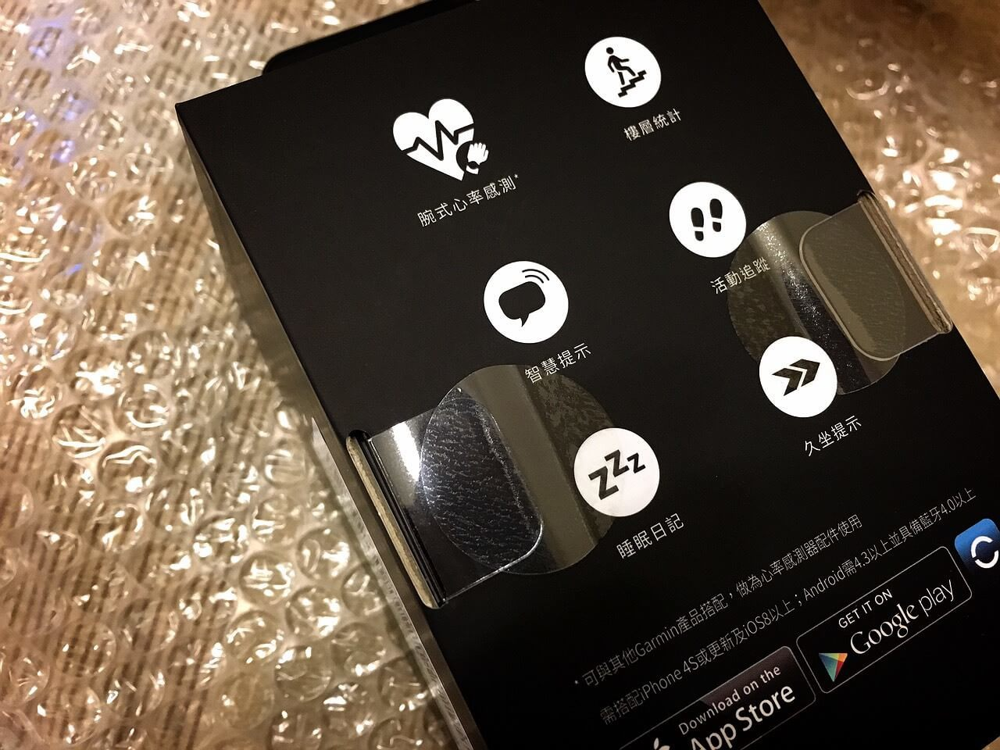
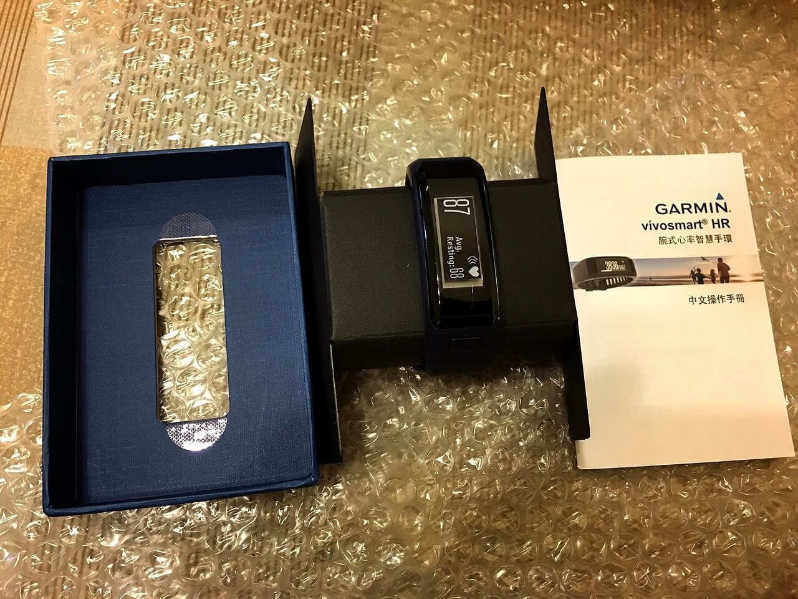
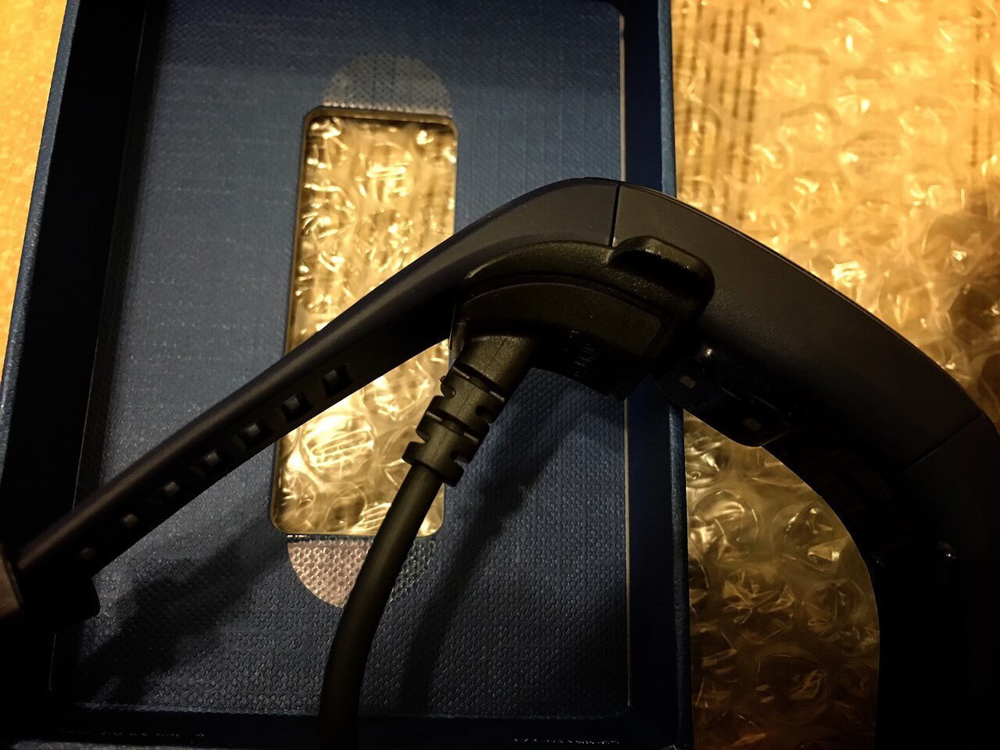

# vívosmart HR

話說最近又看上了一款運動手環！說到運動手環，去年買的 [vívosmart](http://www.garmin.com.tw/minisite/vivo/vivosmart/) 算是這台 [vívosmart HR](http://www.garmin.com.tw/minisite/vivo/vivosmart-hr/) 的前身！去年就打算買可以記錄心率的穿戴裝置，但那時坊間有紀錄心率功能的穿戴裝置只有快上萬的運動型手錶才有，要不然就是需要配戴[心率帶](http://tw.running.biji.co/index.php?q=news&amp;act=info&amp;id=4935)才能紀錄心率，然而唯一有符合我要求的就是 [Apple Watch](http://www.apple.com/tw/watch/)。

雖然價格不會是第一考量，但是 Apple Watch 的蓄電量真的是悲劇，所以去年就先買了 vívosmart 使用啦！不過依據去年使用 [Garmin](http://www.garmin.com.tw/)的 vívosmart 下來，整體心得算是還不錯喔！

怎麼說呢？

去年三月買的 vívosmart 在年底時，LED 發生明暗不清的故障狀況(=口=a)，因為還在保固期，所以就將產品寄回公司後，Garmin 不囉唆的立馬直接回來寄一個新的！這一點著實還蠻令人滿意的 ：）

好啦，不多說廢話！直接進入今天主題啦！前些日子得知 Garmin 在去年底有推出這款 vívosmart HR，而 **Hr** 這兩個字的意思應該就是 Heart 的意思吧(猜)！就在昨晚天人交戰了一晚之後，今天一早還是決定了！

結論就是 [PChome 24H](http://24h.pchome.com.tw/) 真的是很邪惡耶！！！

當然，立馬拿起小刀子小心翼翼的拆開它！其實當看到包裝時有意外到，當下真覺得 Garmin 真的的好偏心！為啥 vívosmart HR 的包裝比 vívosmart 還要漂亮，令人有種 Garmin 就是先故意出第一代普通功能的 vívosmart 第二年再推出 vívosmart HR，再撈一次消費者的摳摳的感覺(T___T)，這次的 vívosmart HR 一共推出三種顏色，分別是 **黑**、**藍**、**紫** 三種顏色而這次就先不買黑色了，直覺認為這次藍色好看太多啦！

不過打開看到 USB 傳輸線之後，其實有點冷掉，因為上一代的傳輸線是用"夾子"的方式來固定充電，非常牢固！而 vívosmart HR 卻不是，他僅用簡單的凹凸處扣接著，這點真的很怕哪天用久了會磨損、磨平，然後接觸不良。

接著就是試用囉！照著說明書一步步的啟動，會看到後面的感應燈已經亮起，相對的整個心也跟著亮起！當然，第一件事就是測量一下"洞姿洞姿"的心跳聲囉！

首先，先靜止的坐好，我先用手機 APP [Instant Heart Rate](https://itunes.apple.com/tw/app/instant-heart-rate-heart-rate/id409625068?mt=8) 測量我手指的感應出來的心率！接著就是看一下我手腕上的 vívosmart HR 嗯！其實只有差一下捏！之後接著測了好幾次，整體上算是蠻準確的，雖然還是會有誤差個一兩下，但我還算滿意！

以上主要是針對 vívosmart HR 的簡單開箱與心率測試，其實 vívosmart HR 還有很多新功能，例如：計算爬樓梯.. 等！如果各位有興趣可以到[官網](http://www.garmin.com.tw/minisite/vivo/vivosmart-hr/)看看，小心！別越看越火喔.. XD

### 相關參考
* [vívosmart HR 開箱文 - ZEUS // Design Studio](https://www.zeusdesign.com.tw/article/2-vívosmart HR 開箱文.html)