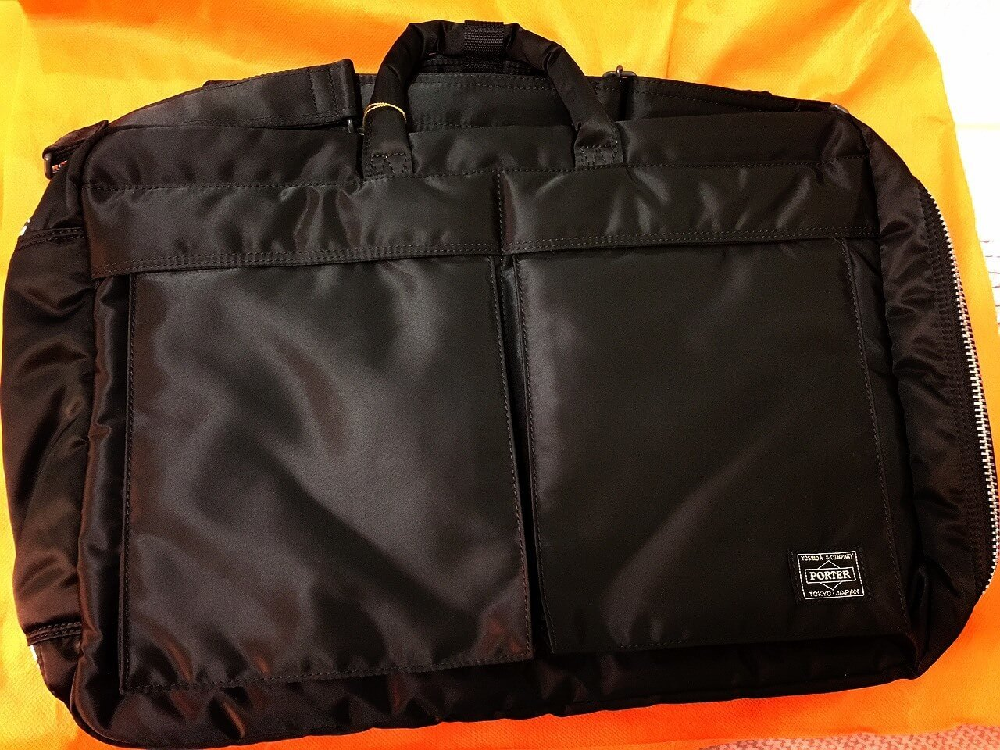
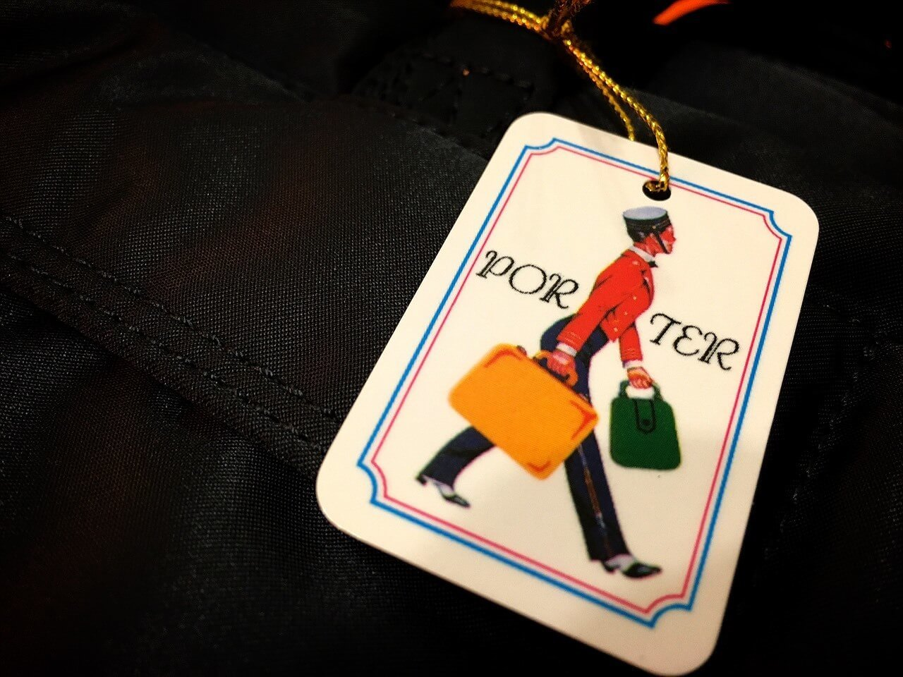
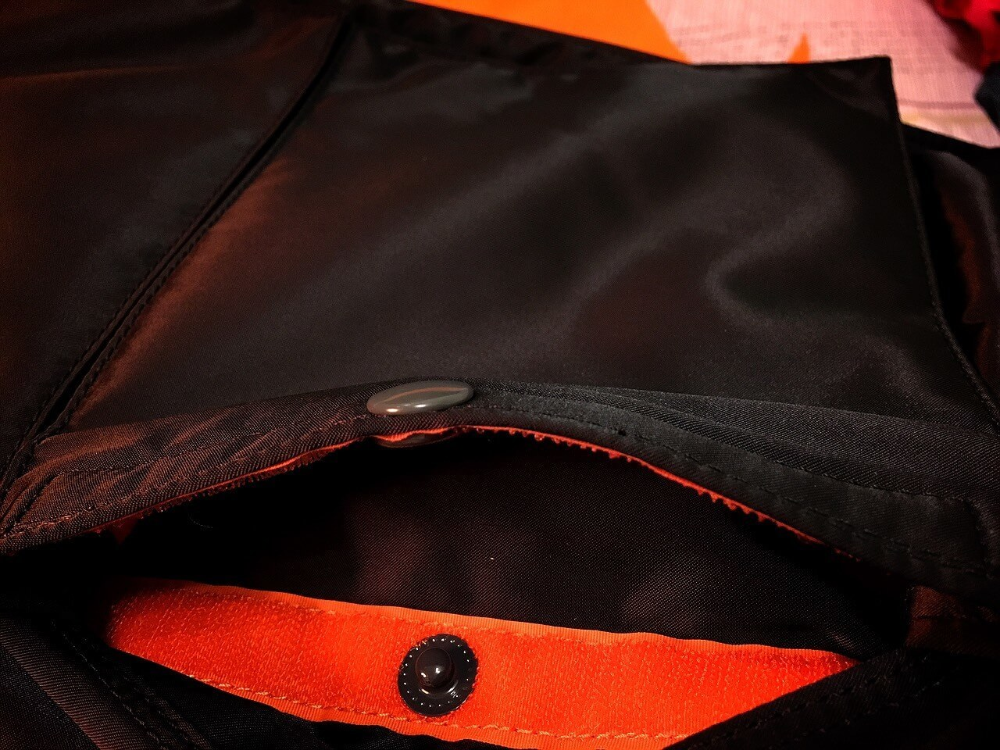
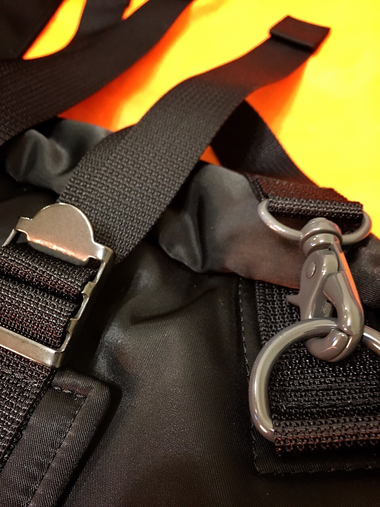
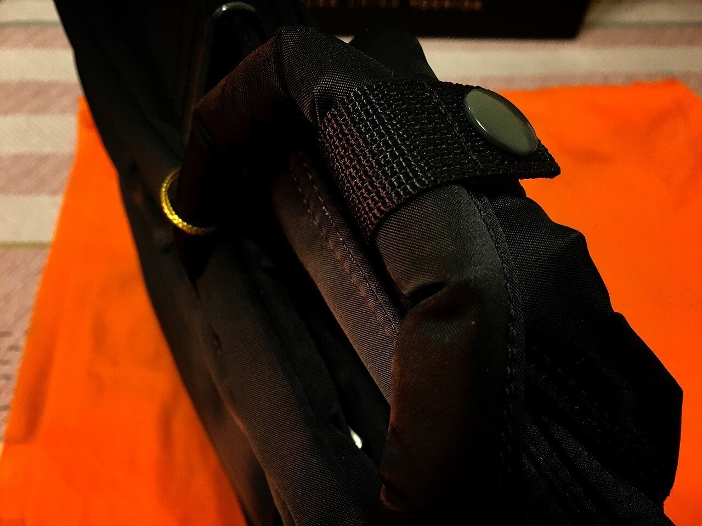
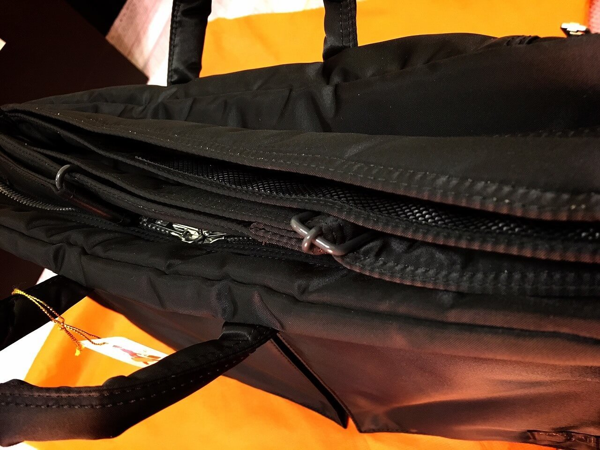
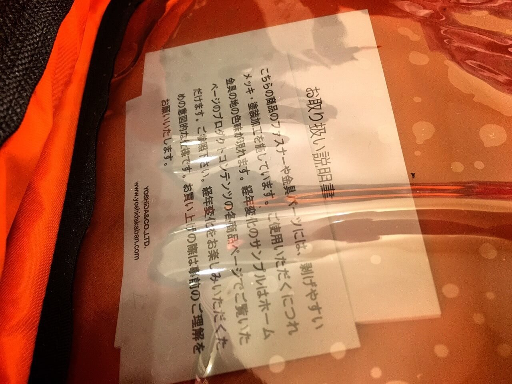
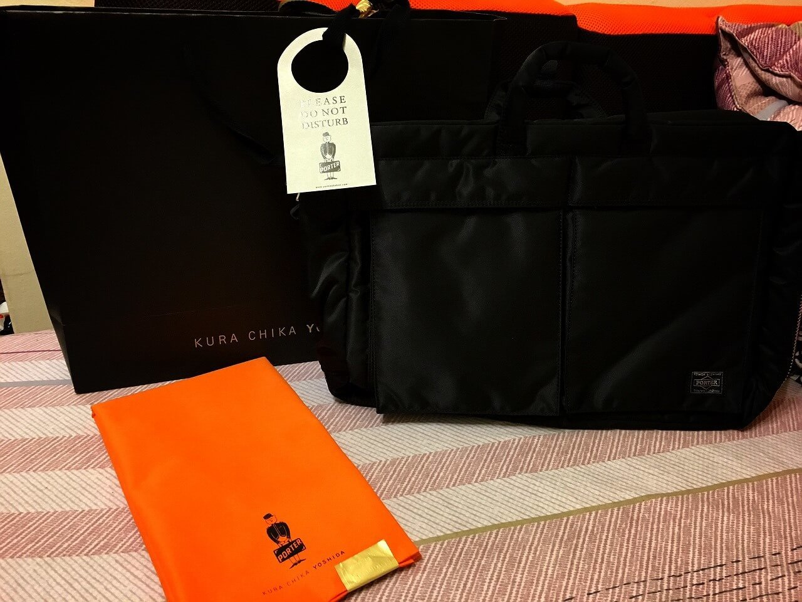

# PORTER TANKER 3WAY

今天開箱 PORTER 的 TANKER 3WAY 公事包！話說前些日子剛從日本回來的我，買了個小小 PORTER 包包，以滿足了一直想要擁有個 PORTER 的夢，但是發現老闆泰瑞總是邪惡的背著他的多功能小綠包在我面前晃，所以令我也動起了想買的念頭.. (摔

趁著農曆年，泰瑞的姊姊去日本東京時，拖她代購了這個 3way 包包，只是沒想到前天就回國了，所以昨天就拿到了！廢話不多說，立馬來開箱吧！剛拿到包包時，包裝竟然比當初我們在京都買的包裝更加精美，這點讓泰瑞氣得跳腳，直說憑什麼東京的就比京都的包裝美！

好啦！接下來就是撕開它！拿出它！看看它！其實回憶起當初在京都買的，的確好像沒有如此精美包裝(疑？)，怪不得泰瑞老闆會這麼一直念著『吼！憑什麼東京買的包裝就比較美！』

會買這個包的原因是，平常上班我需要背著我的 [MacBook Pro With Retina 13"](http://www.apple.com/tw/macbook-pro/) 上下班，同時需要帶著錢包、手機、電線、3DS(誤)..等，原本的小 PORTER 裝不下這麼多雜物，所以就必須要多帶一個電腦包出門，所幸小 PORTER 就留著出門旅遊再背，而以後上班就帶這個大 Porter 囉！

這包包是剛好拿去年去京都遊玩所剩的日幣請泰瑞的姊姊代買的，印象中我是拿三萬日圓，據說還有找錢啦，不過就當作代購費吧！而有興趣的人也可以到日本的 [Amazon](http://www.amazon.co.jp/%E3%83%9D%E3%83%BC%E3%82%BF%E3%83%BC-PORTER-%E3%83%96%E3%83%AA%E3%83%BC%E3%83%95%E3%82%B1%E3%83%BC%E3%82%B9-%E3%83%93%E3%82%B8%E3%83%8D%E3%82%B9%E3%83%90%E3%83%83%E3%82%B0%EF%BC%88b4%E5%AF%BE%E5%BF%9C%EF%BC%89-622-09308/dp/B008DNGETW) 看看喲！不過我剛剛查了一下這三用包，其實好像有三種版本，要購買前請爬文、詳細閱讀完前人的開箱文章喲！

**結論！**有了這個三用包.. 我終於可以不用再帶兩個包包出門了(丌＿＿丌)，**最後！**一定要來個疊疊樂合照呀！

### 相關參考
* [PORTER TANKER 3WAY 開箱文 - ZEUS // Design Studio](https://www.zeusdesign.com.tw/article/8-PORTER TANKER 3WAY 開箱文.html)