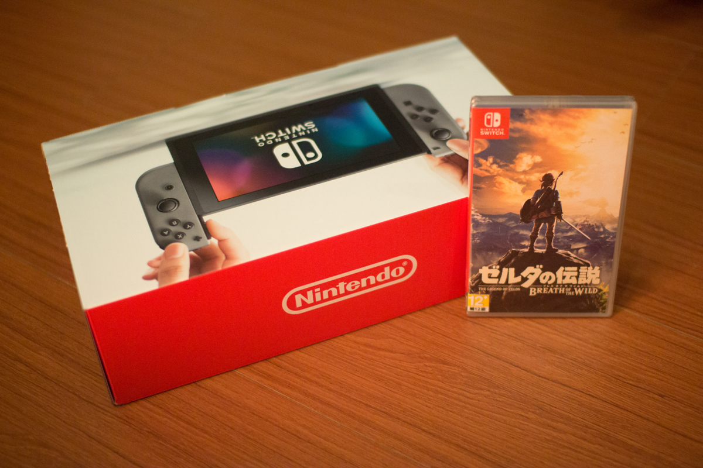
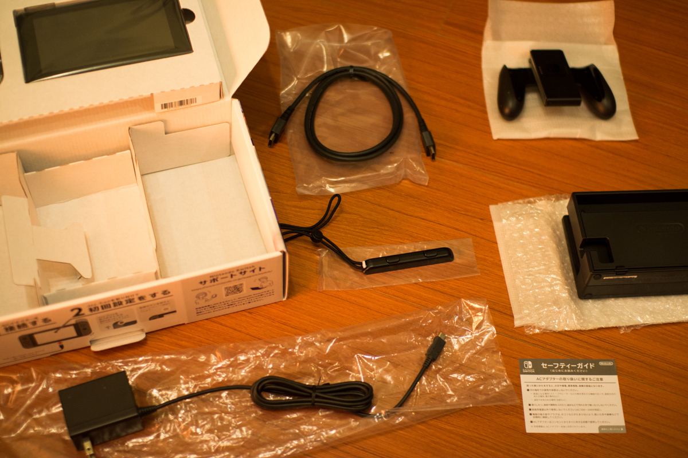
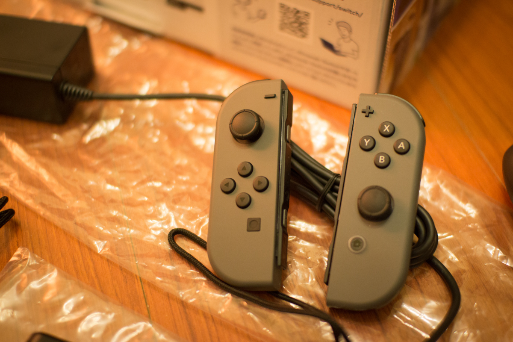
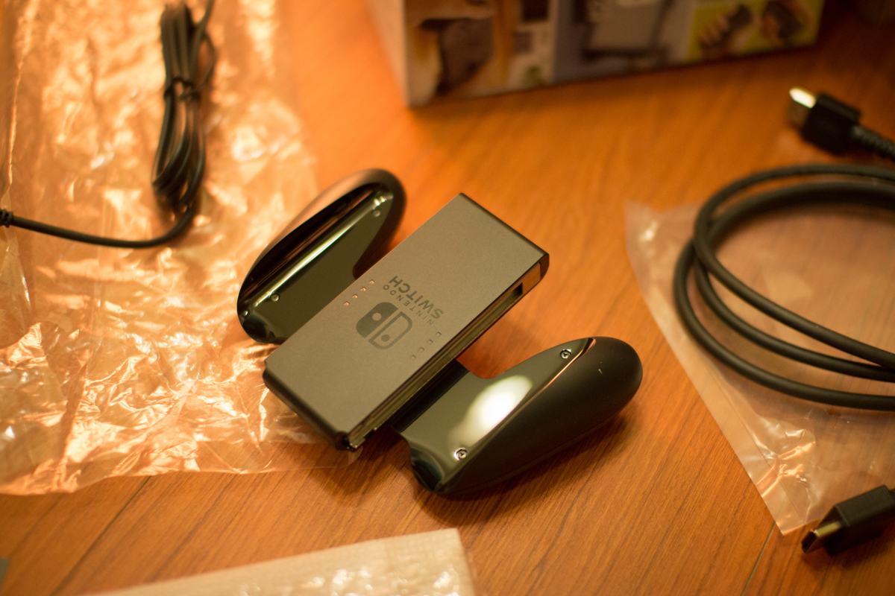
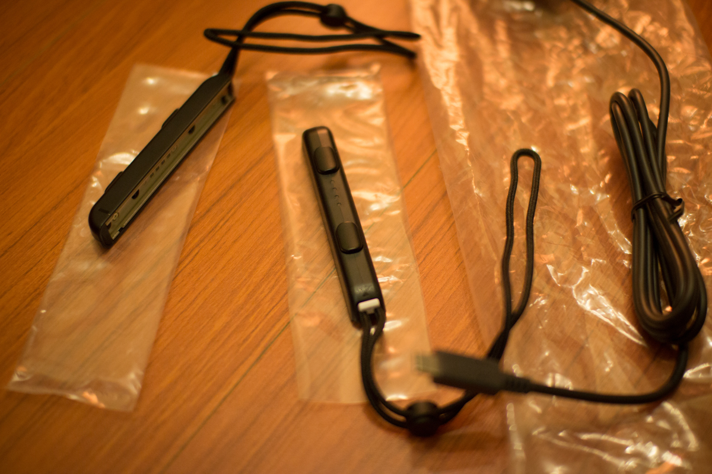
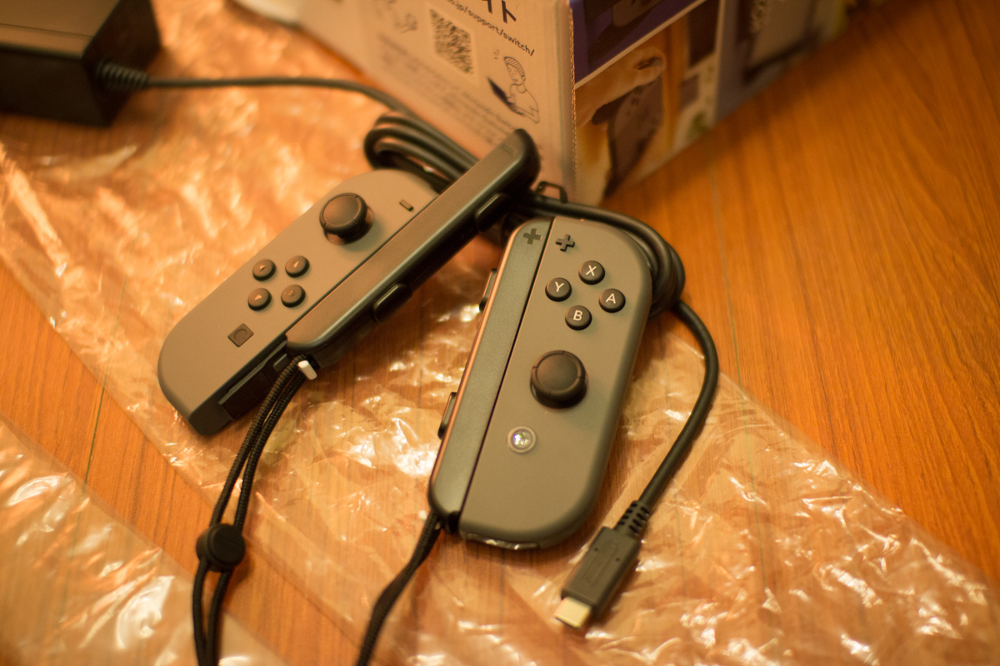
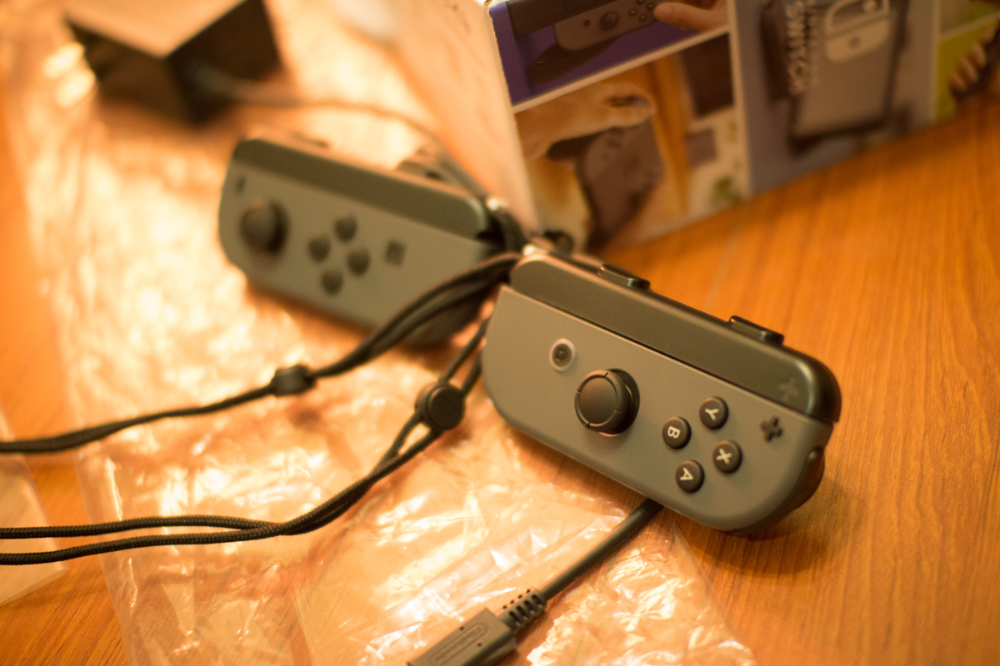
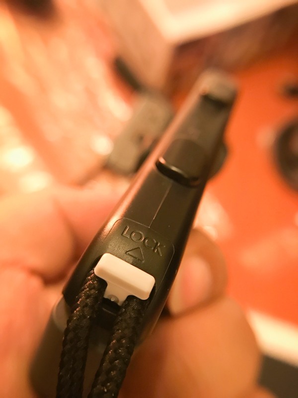

# Nintendo Switch

今天要開箱的不是電腦也不是一般 3C 器材，而次去年大家廣泛討論的 [Nintendo](http://www.nintendo.tw/) 次世代主機 [Nintendo Switch](http://www.nintendo.com/switch/)！這款主機相信大家多多少少有在 [Youtube](https://www.youtube.com/watch?v=f5uik5fgIaI) 上面看到介紹影片，之所以這麼出名我覺得主要是兩個要點，1. 桌機、手持都可以玩 2. 舔卡的行銷風潮，以下就來開箱 Nintendo Switch 啦！

 
Nintendo Switch 有看影片介紹的人都會知道，他的 [Joy-Con](http://www.techbang.com/posts/48793-nintendos-switch-joy-con-handles-parsing-a-variety-of-dynamic-induction-and-hd-motion-pattern-matching-technology) 可以有著各種不同方式使用，搭配 **6.2吋** 的液晶螢幕就可變成掌上型主機，若是在家裡可以放在 **底座** 使用 HDMI 外接到螢幕或電視上，這樣就瞬間變成桌上型主機囉！我想這對任何一個有玩過電玩的朋友都會覺得酷吧！這次 Nintendo Switch 主打三種模式，分別是在家裡的 **TV 模式**、外出的 **掌上型模式**、以及在外面分享的 **桌上模式**，而且主機最多可以 8 台主機一起連線玩遊戲喔！

上週五吃完晚餐，因為外頭下著大雨也不知道要到哪裡逛，於是就蛇～到很久沒逛的地下街走走。由於近兩週都方長忙碌與壓力頗大，於是走著走著，就想說如果等等到了電玩區，有看到 Switch 的話一定要買！！！
 
語畢我心想.. 靠，一定會有的啊！
 
從中山地下街走到台北地下街，終於來到電玩區域了.. 看一看，每一家店都沒有展示機耶，我想應該都是沒有賣吧..原本打算就此打住離開，誰知道一個轉身剛好來了一個女店員，我隨口問有無 Switch 呀！？沒想到那位女僕裝扮的店員居然笑笑地回答：**有喔**

天呀！天人交戰呀！不過價格有點偏高，於是又走了一小段，結果隔壁另一家也有！！！！ 而且比較便宜.. 反正都是水貨所以就直接挑便宜的下手了！

 
回到家後當然立馬來開箱！因為下著大雨，店員還給了一個大塑膠包著！而當然不可能只買主機，一定也要買一個卡帶回家玩玩囉！據我的瞭解有出了幾款遊戲，而我知道的有 [1、2 Switch](http://www.nintendo.com/games/detail/1-2-switch) 跟[薩爾達傳說 - 荒野之息](http://www.nintendo.com/games/detail/the-legend-of-zelda-breath-of-the-wild-switch)。

兩款性質不同，1、2 Switch 比較適合朋友一起的 Party Game，而這次的薩爾達據說 非 常 厲 害！而且此款遊戲評分頗高，於是二話不說，買了！

 
開箱第一眼看到的是主機、兩個手把，這次 Nintendo Switch 有兩種款式可以挑選，一款的 Joy-Con 是灰色的，而另一款則是 紅、藍色的 Joy-Con (電光藍、電光紅)，這個就我個人偏好，所以就選擇灰色囉 ^^

 
將第一層提起後，下層就是配件了，配件共有六大項目，分別是：AC變壓器、底座、Joy-Con 握把、Joy-Con 腕帶、HDMI™連接線、日文說明書。

 
**Joy-Con** 是這次 Switch 的重點，可以跟主機有著多樣的搭配，而且本身上面有著各種不同的感測器，例如 G-Sensor 可以拿來玩體感遊戲，上面也有動感 IR 照相機，會讀取照相機捕捉的物件形狀、動作和距離。例如可辨識剪頭布的手勢。

 
**Joy-Con 握把** 則是讓你可以將 Joy-Con 接上去之後變成手持的握把！手握起來其實感覺不差，而我玩了一整晚的感覺也沒什麼不適的狀況！

 
**Joy-Con 腕帶** 則是讓我發生了一點小意外，就是我 裝 反 了！！！沒想到他的防呆機制這麼的不優，我直覺的裝上去往內推時，推到一半，才驚覺我裝反了.. 而且拔不回來！！！！仔細看之後發覺原本我以為他會是相通的，但原來其實都是有順序的，而我把腕帶逆著街上後的結果就是拔不出來！！不過在研究了半天之後發現有個小地方寫著 Lock 的字樣.. = =

而針對 “裝反” 的問題，上網 Google 了一下，才發現不只我裝錯，原來很多人都有一樣的問題，讓我覺得難道這是老任的一個教學步驟，讓大家之後會注意容易裝反的問題嗎ＸＤ

 
**AC 變壓器** 的連接端是使用 USB-C 也就是 Type-C 的連接孔，所以再接的時候可以更輕鬆的不用擔心正反面問題囉！

 
**底座** 非常輕巧！感覺只有塑膠殼的重量，而中間可以看到就是 USB-C 的連接孔，而底下四個角則有防滑的塑膠墊，背後則是配線的連接盒，連接打開後可以看到三個孔，分別是 電源、USB、HDML 的連接。

 
講了這麼多配件，接著來講主機吧！主機的 6.2吋螢幕其實拿在手上用手持的模式玩其實蠻大的比起我之前的 3DS 來說，不只螢幕大了不少，畫質姑且不跟 PS 掌上系列比較，但是也不差到哪去。而且也有觸碰！背後有著 Switch 的圖示，上發則有個排氣孔！這點讓我有點小驚訝，沒想到會有排氣孔！！

 
雖然我沒有很愛排氣孔，但是想想嵌入是系統要跑這麼大的軟體，需要這樣的散熱系統也不為過啦！而且幾天玩下來，發現其實沒有到很燙，而散熱的排氣孔似乎也沒影響到遊戲，其實不注意都不會發現那邊有排氣孔。而上排也有音源輸出孔、卡夾插槽、開關、音量鍵喔！

主機背後有個貼心的小扳手，打開後就可以立在桌面，變成桌上模式！即便出門在外也可以利用兩個 Joy-Con 變成螢幕玩雙人遊戲喔！不過據說這個板手非常脆弱，一不小心可能會折斷.. 所以害我不大敢使用它 哈哈，立架板手打開後可以看到 SD 卡插槽，這邊使用的是 microSD 規格的卡片。

 
主機街上底座後，原本我設想也會有 “喀擦” 的一聲，沒想到只是像 USB  接上去的感覺，不過想想，是也沒錯，就是 USB-C 的連接啊！不過另外我比較擔心的是.. 這樣拔插主機螢幕肯定會刮花的，看來要找一天來去貼螢幕保護貼了！

不過我必須說個人感覺 Nintendo Switch 比較算是電視遊戲主機，因為還是接上大螢幕玩比較有趣！或許是我目前只玩過薩爾達傳說，而薩爾達傳說比較重視視角，所以在主機螢幕上的確比較不適合。之後若有其他遊戲或許會有不同的感受吧！

 
講完主機，接著來稍微提一下 薩爾達傳說，據說這款搭配在這次 Nintendo Switch 的 **薩爾達傳說-荒野之息** 是一項代表大作！而大家也都說這款遊戲很好玩，於是就一起入夠囉！

 
卡夾包裝盒其實跟主機差不多一樣大小，而其實打開後會發現.. 恩？就這樣？大大的包裝盒內就只有一塊遊戲卡夾，而這塊卡夾約莫一塊 SD 記憶卡一般。

這次大家都說可以試著舔舔看遊戲卡夾，因為聽說會 非 常 苦，原因是任天堂怕小朋友誤食卡夾，所以在上面塗了一層[苯甲地那銨](https://zh.wikipedia.org/wiki/%E8%8B%AF%E7%94%B2%E5%9C%B0%E9%82%A3%E9%93%B5)的化學物質，不過這件事卻意外的(故意的？)引發大家的注意，成為另一種行銷吧ＸＤ

 
開機後出現紅色 Switch 字樣，而一開始就是初始化主機，選擇語系、時間、網路、人物，當然的，沒有中文選項(泣)，不過我意外的發現，他還可以連線至手機，當小朋友玩多久爸媽會知道的功能耶，好像也可以定時關機，我只能說幸好以前 GameBoy 沒這功能ＸＤ

 
遊戲目前不多，個人最期待的就是 瑪利歐賽車 8 豪華版、漆彈大作戰 2、超級瑪利歐 奧德賽、ARMS 神臂，這幾款目前關注中！不過最主要還是期待神奇寶貝，也就是精靈寶可夢的 Nintendo Switch 遊戲啦！

整體來個小總結吧，應該是我之前很少玩其他遊戲主機吧，當我拿到這款 Nintendo Switch 遊戲主機時的第一心得是 「**輕**」，配件也是非常的輕巧，這對我來說相當意外，輕到讓我覺得失去了重量質感，不過玩了三天下來仔細摸完後，發現其實真的不錯，假日去咖啡廳時也可以帶著他出門，過年回家時也可以跟家人玩玩 PartyGame 的遊戲，整體來說我個人覺得滿意，至少他是完成了我小時候的夢想主機，**一個可以帶出門與在家連電視玩的主機**！

### 相關參考
* [Nintendo Switch 開箱文 - ZEUS // Design Studio](https://www.zeusdesign.com.tw/article/29-Nintendo Switch 開箱文.html)
* [Nintendo Switch™ - Official site – Nintendo gaming system](http://www.nintendo.com/switch/)
* [Nintendo Switch｜任天堂(香港)有限公司](http://www.nintendo.com.hk/hardware/switch/)
* [1-2-Switch for Nintendo Switch - Nintendo Game Details](http://www.nintendo.com/games/detail/1-2-switch)