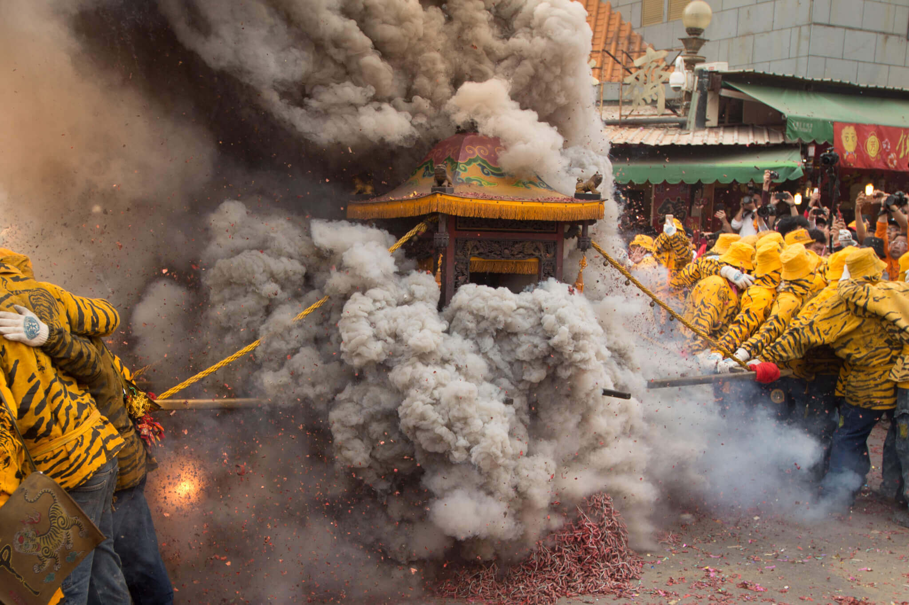

# 炸轎的由來

北港炸炮聞名全台，有著「台灣三大炮」的美名，但其實追朔起為何北港鞭炮對於北港人重要性的起因，以下是網友提供的幾項原因，分享給各位！

* 要追溯最早的緣由，可能要提及日據時代，日本人禁止三月十九日舉行遶境，但在多方交涉下，日本人因考量媽祖的靈驗及深怕引起民怨之暴動，致當時總督特准全台唯一的遶境活動，不過必須在規定時間內結束，先民為符合要求，致將沿路商家燃放之鞭炮集中一次點燃，可謂炸轎之先軀，那時的鞭炮可是道地的花矸炮，爆裂可會挾帶玻璃開花，殺傷力相當驚人。
* 民國七十年代初期，將軍發生多次踢蹄現象而禁止犁轎，但買炮來放的人怎麼辦？故有人提議以整堆炸轎的入廟方式處理。
* 因為早期犁轎常會發生轎班受不了鞭炮煙霧，犁進之後即入廟，不再犁出，再加上後來金垂髫、金福綏及小西天改由人力推車式，鞭炮剩太多，所以民國七十年代中期先演變成犁轎踩炮與入廟前之整堆炸轎的混合式。但隨著政府掃黑及道上之倫理瓦解，做大哥的不太敢帶太多小弟出來招搖，而犁轎踩炮又必須很多人力放鞭炮，致再演變成僅整堆炸轎的入廟方式。

### 相關參考
* [北港新站 - 黑以桑提供](http://www.peikang.idv.tw)
* [吳政賢 攝影集](https://www.facebook.com/comdan66)
