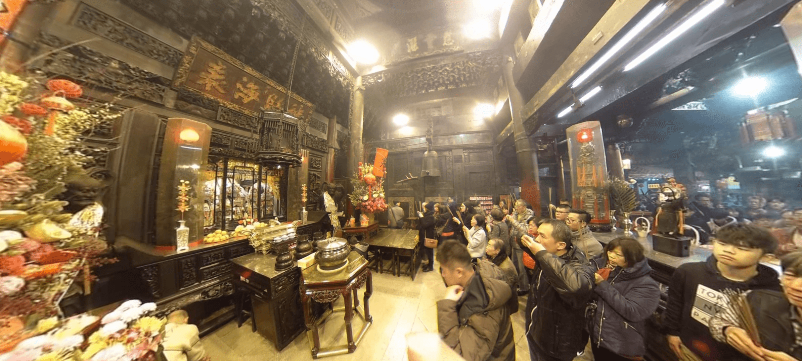

# 北港媽祖的信仰在於正念

曾有老一輩傳述歷代住持和尚的開示，北港媽祖的信仰在於學習媽祖慈悲入世的菩薩道精神。

信徒本身應培養「深信因果」、「緣起性空」、「眾生平等，皆可轉凡成聖」及「禮佛、念佛」等正念與習慣，不然縱使畢其一生為媽祖遶境貢獻心力、財力與時間，也只是修福報，俟遇到不如意的事或是無常來敲門時，可能會反過來感慨媽祖為什麼沒有幫我，沒有救我一下，頓失依靠而生起嗔心怨心。這種案例，曾經聽過數起。

### 相關參考
* [北港新站 - 黑以桑提供](http://www.peikang.idv.tw)
* [吳政賢 攝影集](https://www.facebook.com/comdan66)
