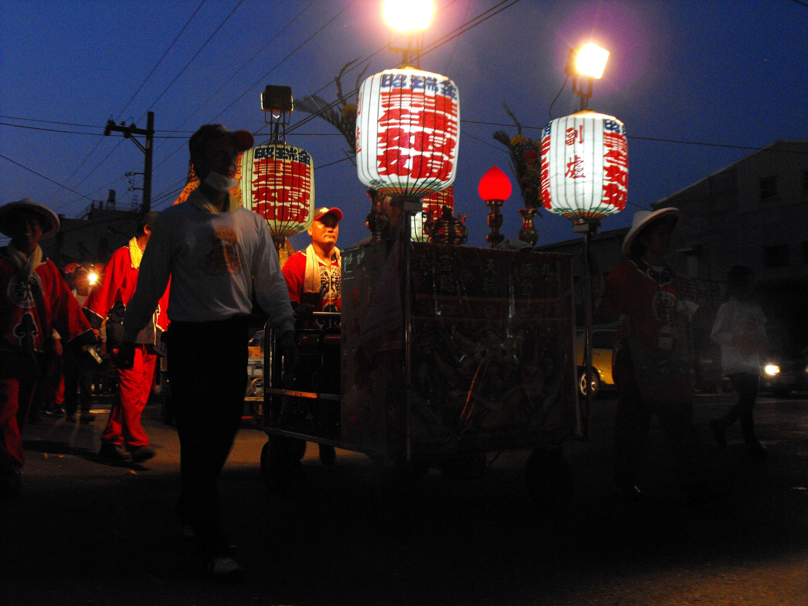
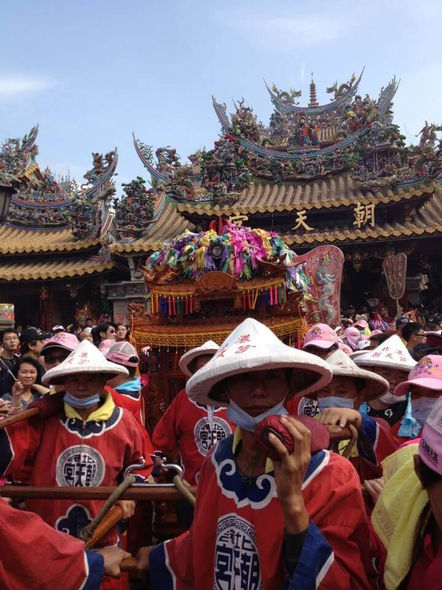

# 金瑞昭 註生娘娘

金瑞昭註生娘娘轎班會成立於民國八十年，並於 2001年首次參加媽祖遶境活動。

註生娘娘配祀婆姐輔佐掌管生育之事，註生娘娘和保佑婦女順產的臨水夫人陳靖姑性質相似，都是守護婦女的守護神。一般配祀36位婆姐或12位婆姐，但朝天宮只配祀2位。金瑞昭註生娘娘轎班會過爐日，農曆九月十二日。

### 相關參考
* [從笨港到北港](http://www.cuy.ylc.edu.tw/~cuy14/eBook/ch3-4.htm)
* [吳政賢 攝影集](https://www.facebook.com/comdan66)
