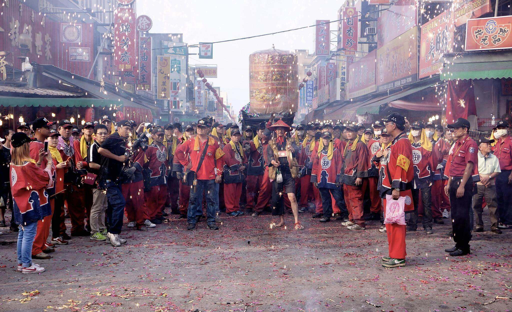

# 四媽 金安瀾 轎班會

「四媽金安瀾轎班會」成立於民國元年，至今已有九十一年歷史。會員人數眾多，其中以蔡、陳、楊、吳、許五大姓居多，參加會員不限於北港人，會員中選出9至11名組織委員會，再從其中選出會長，四年一任，連選得連任，會中幹部、顧問為會長所聘，有些顧問為外地人。

本會規定參加的會員必須親自出來抬轎，不可只出錢不出力。儘管如此，會員仍年年增加。由於會員多，擲得爐主的機會很低，因之香爐又分副爐與遶境爐。至於吃會時間則為農曆四月二十日。

### 相關參考
* [從笨港到北港](http://www.cuy.ylc.edu.tw/~cuy14/eBook/ch3-4.htm)
* [蔡金勝 攝影集](https://www.facebook.com/profile.php?id=1531070458)
* [吳政賢 攝影集](https://www.facebook.com/comdan66)
