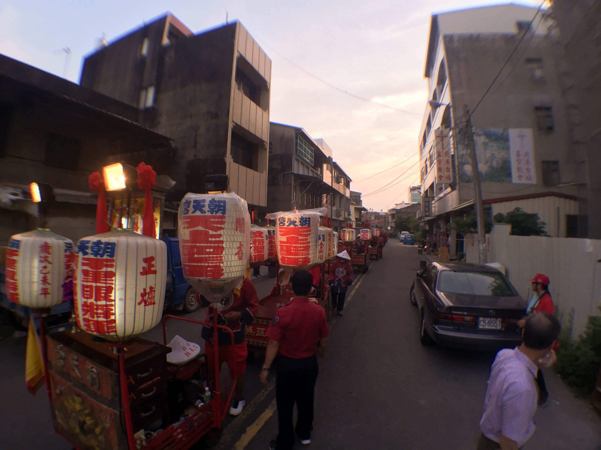

# 路關牌 爐主燈

**路關牌**通常位於整個繞境隊伍的最前端，牌上面會有繞境的完整路線及說明，而陣頭隊伍皆需依據路關牌上的路關出巡，其造型為長方形木框鑲上玻璃製作而成。

根據民國五十四年文獻的記載，當時的路關牌是以竹和玻璃紙作成，上面繪有虎頭，牌上並未寫明遶境路程，內裝置有花朵，與普通路關迥異。現在的路關牌則置於手推車上，由人員推著行進，牌子內貼路關，前置香案，兩旁各置一支鼓仔燈。

**爐主燈**又稱**大燈**通常隊伍前頭會有近數十個大燈，每兩個大燈成一對，每一對則代表著一個參加出巡的團體，其燈上會書寫著各行會團體的古老名稱（燈號）及其奉祀的主神。但此陣頭僅限於神明會及郊、舖戶的大燈，一般文武陣頭的大燈並沒有排在其中（通常會掛置在自己陣前）。以往每個大燈都需要一個人拿，現今為了節省成本，製作推車，每輛車上可插六支大燈，省錢又省人力。

簡單的說，「燈號」就是指團體的稱號，參加媽祖遶境的舖會燈號！

列舉部分如下，以供參考：

* 金豐順（菜舖）
* 金海順（魚舖）
* 金隆順（紙箔舖）
* 金珍順（青果舖）
* 誠心順（點心舖）
* 金清珍（餅舖）
* 金長順（麵線舖）
* 元本善（藥郊）
* 金福順（檳榔舖）
* 金寶順（米舖）
* 金安順（西藥商）
* 金百順（百貨郊）
* 駐鞍莊（旅社、餐廳業）
* 金珍順（豆干舖）
* 海山珍（醬油舖）
* 金慶順（布郊）
* 金興順（雜貨店）
* 金毫順（電器商）
* 金義順（屠戶）
* 金通順（汽車運輸舖）

### 相關參考
* [從笨港到北港](http://www.cuy.ylc.edu.tw/~cuy14/eBook/ch3-4.htm)
* [黃偉強 攝影集](https://www.facebook.com/profile.php?id=100000165189715)
* [吳政賢 攝影集](https://www.facebook.com/comdan66)

`#北港` `#陣頭`