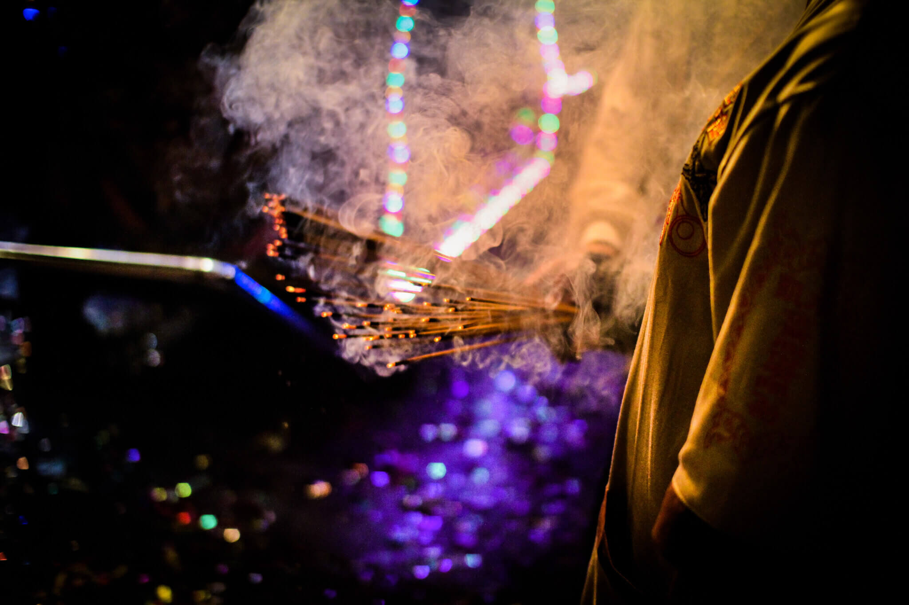

# 震威團

北港迎媽祖廟會除了有開路鼓當隊伍先鋒外，其實還有哨角隊 震威團，北港震威團的聲音柔和不失威武雄壯，可謂全台哨角之最。震威團成立於康熙三十三年（1694），與朝天宮創立於同一時間。在媽祖出巡時會以吹哨角、敲馬頭鑼為鑾駕做為前導。相傳馬頭鑼聲和哨角聲具有避邪、去陰、淨化之靈效。

哨角是在古代軍隊中用的號角，帝王出巡鑾駕的儀隊前都有哨兵吹哨角、敲馬頭鑼，示警沿途百姓迴避讓路、肅靜恭迎，后妃出門也是如此。後來這樣的規制也襲用於受封的天妃、千歲、天后等神明出巡，宋代起，媽祖即獲皇帝誥封夫人、天妃、天后以及天上聖母，並賜春秋二祭以謝神恩，信徒乃於媽祖出巡時比照古代帝王、后妃出巡的鑾駕。

北港哨角能吹出五個音，鹿港天后宮哨角或大甲鎮瀾宮的哨角，吹出來的只有高、低兩音。震威團吹出的五個音，相當西樂中的DO、MI、SO、高音的DO、及低音的SO；前三音各吹八拍，第四音高音的DO吹十二拍以示雄威，第五音低音的SO吹六拍後收音。哨角吹奏的方法和吹喇叭不同，要靠特製吹嘴與嘴唇的接觸與吹氣來變音，運氣要用丹田力量，有一定的訣竅，非常難學。

馬頭鑼的敲法，在帝制時期有帝王公卿之分，在地方因官階高低有別，迎神賽會也因神明位階而有所不同，媽祖因受封為天后，因此採用帝后的規制。即先敲九下，再連四下，敲完鑼後吹哨角，如此反覆運用；一般王爺則敲七下連四下，再吹哨角五聲。哨角是於馬頭鑼打完後接著吹，因此指揮的是馬頭鑼。

哨角是以黃銅鑄造，長四台尺八寸，為便於攜帶，以兩節伸縮，縮起來為兩台尺四寸。以前震威團使用的銅製哨角是光緒十年購自大陸泉州，既笨重，有些吹嘴甚至已損害。當時朝天宮以為台灣光復後可與大陸通航，計畫再到泉州購買哨角，不料卻山河變色，無法成行。現在所用哨角是魏幼謙手工打造，他不只是吹五音哨角的第一好手，製造的哨角更是無人能出其右。 　因傳說哨角是由黃帝冊封，故震威團奉軒轅聖帝（黃帝）為祖師。

### 相關參考
* [從笨港到北港](http://www.cuy.ylc.edu.tw/~cuy14/eBook/ch3-4.htm)
* [陳秉祥 攝影集](https://www.facebook.com/profile.php?id=100000217740800)
* [吳政賢 攝影集](https://www.facebook.com/comdan66)

`#北港` `#朝天宮` `#陣頭` `#哨角`