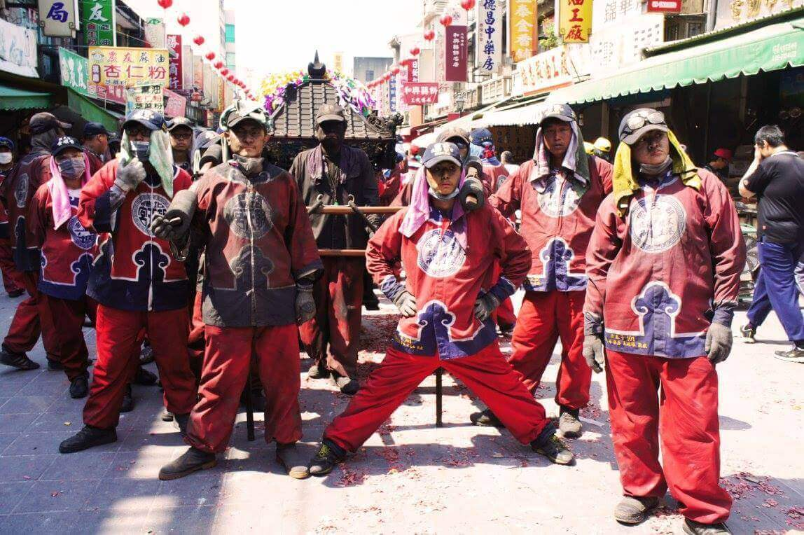
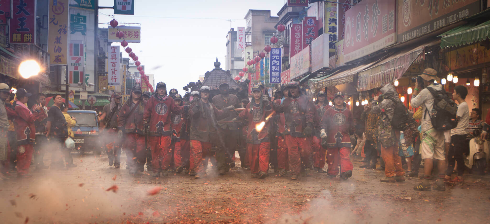

# 金福綏 土地公會

北港朝天宮除媽祖神轎、虎爺轎會喫炮以外，還有一頂神轎也不遑多讓，那就是 **金福綏** 土地公會；其實在這頂神轎上不只有土地公喔，大家常常忽略的另外一位 境主公，顧名思義，就是笨港境主，境主公為掌管廟境信仰範圍的土地神明，職責類似城隍、土地公。金福綏土地公會成立於公元1925年。創始人為**楊清祺**、**蔡錦榮**、**蔡再生**，會員大部份為北港地區的**生意人。**

早年金福綏原有八家將的組織，由蔡再生擔任教練，以前參加媽祖遶境皆有八家將隨行，土地公殿亦配祀文武判官，八家將現在已解散。

金福綏會於農曆八月十五日福德正神誕辰時，在土地公殿前有供應信徒祈求平安龜的習俗。本會過爐日，笨港境主是農曆二月二日，福德正神原在十二月十六日，民國五十七年起改在農曆五月十七日土地公殿的重修、安座紀念日舉行。

每年遶境轎班會都來自於各地的信徒回來參與，但大家彼此看似熟識卻叫不出對方名字，這是為什麼？詢問轎班會，他們回答說 :「我們彼此都不太認識，大家都是來自各個地方，但我們都認識土地公」，這句話真的好感動，看到轎班會進廟時，真的非常雞皮疙瘩又有些不捨以及感動，大夥兒一年一度回來為媽祖、土地公服務，三天兩夜沒睡覺，只求做到圓滿，這就是北港廟會的純真美之一。

### 相關參考
* [從笨港到北港](http://www.cuy.ylc.edu.tw/~cuy14/eBook/ch3-4.htm)
* [王君萍 攝影集](https://www.facebook.com/profile.php?id=100001877936304)
* [吳政賢 攝影集](https://www.facebook.com/comdan66)

`#北港` `#朝天宮` `#陣頭` `#神轎`
