# 2015年 淡水清水祖師

今年一樣在淡水做記錄，分成幾個大主題！

1. 清水祖師
2. 清昭誠
3. 鍾馗

其實淡水廟會也是一年又一年的小小改變，回想大一時(7年前)，當時候的淡水大拜拜陣頭性質有蠻多的不同了，以前蠻常看到全身是血的乩童，近年來就很少見，而清昭誠也越來越有在地的特色了！

天氣雖然熱，但是淡水人的熱情不滅呀！

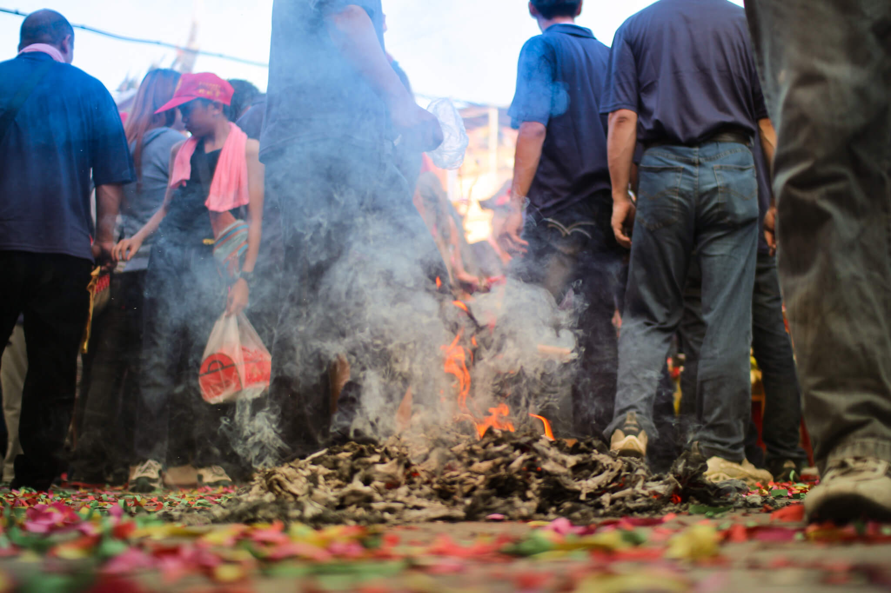
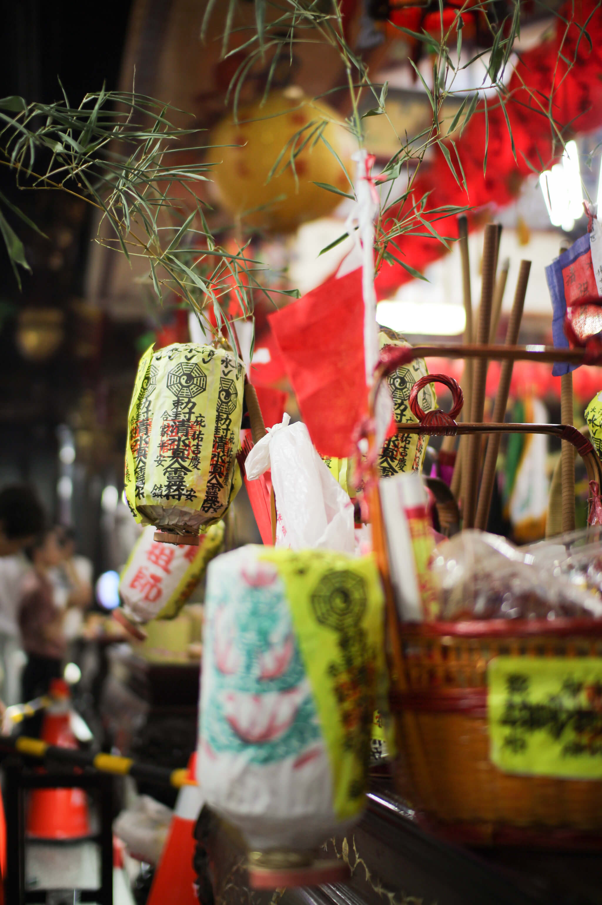

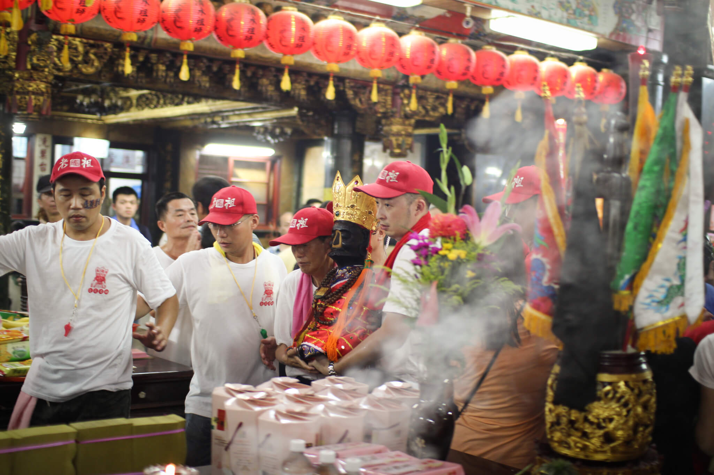
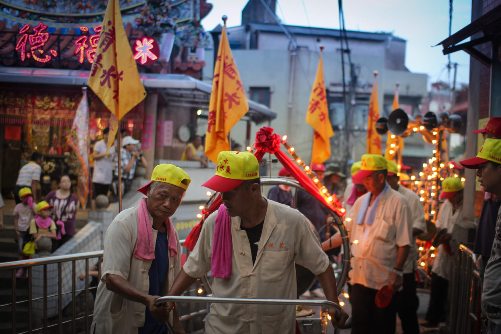
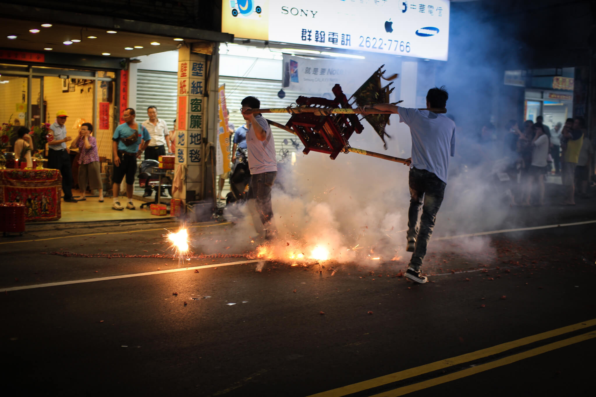

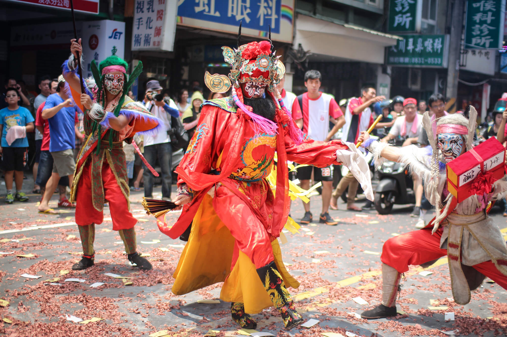

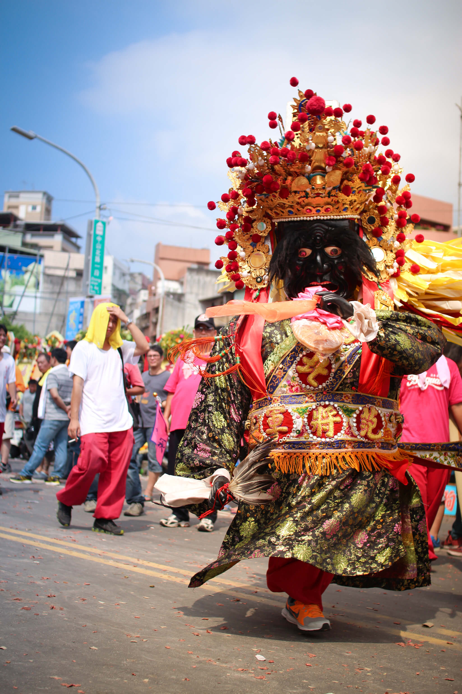
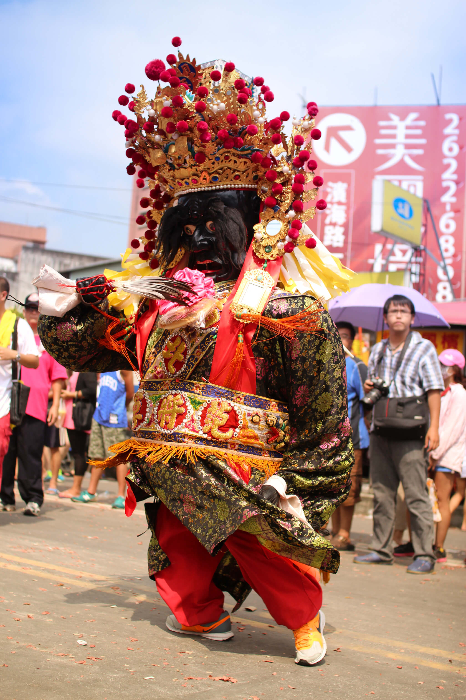
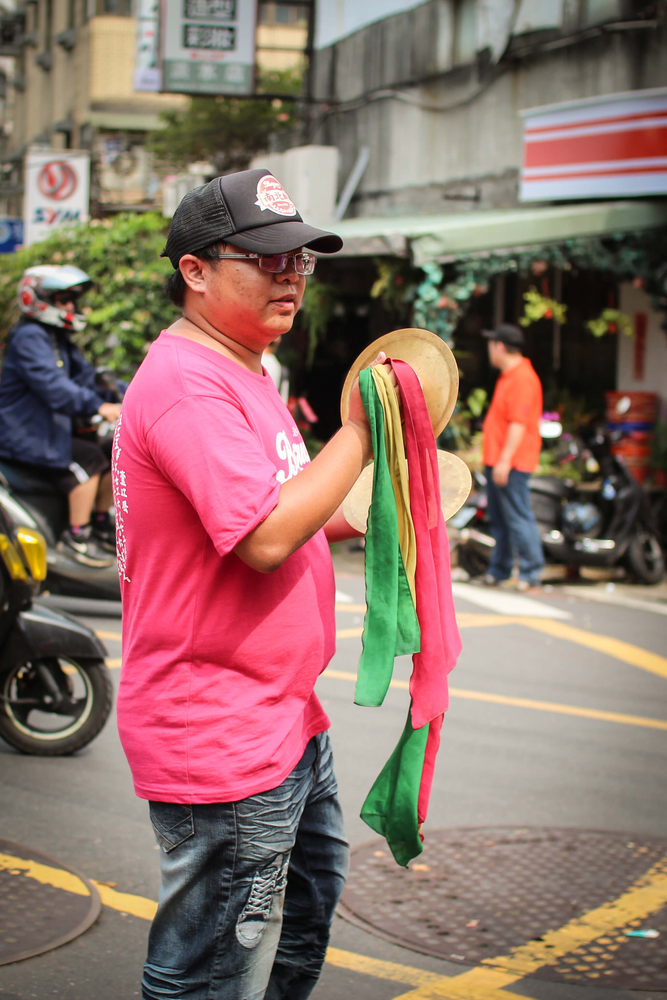

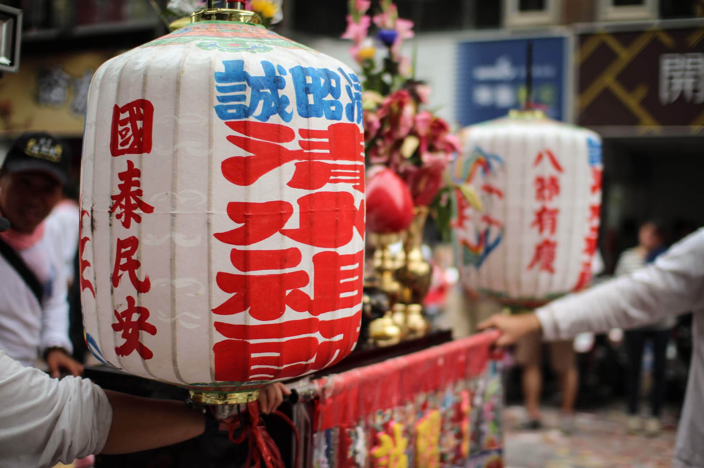

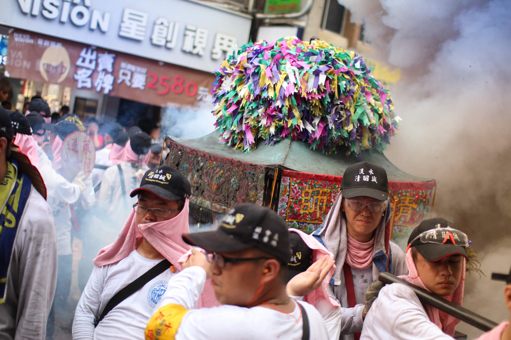
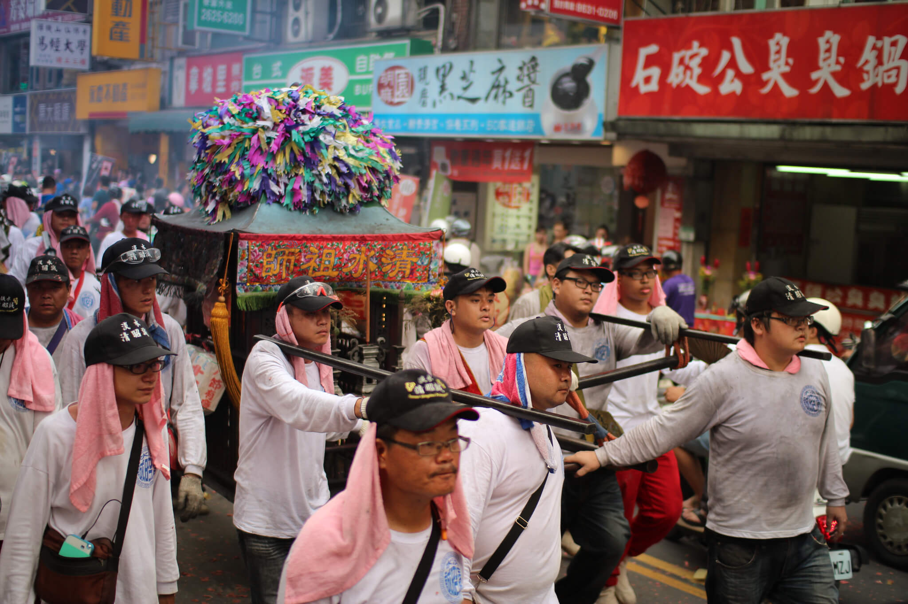
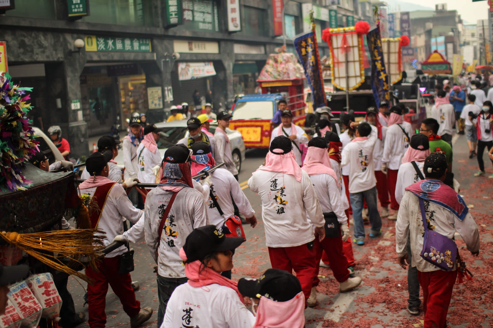

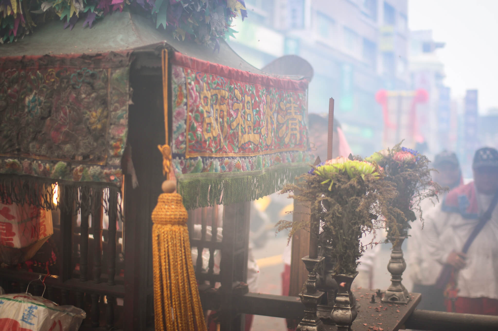

`#淡水` `#清水祖師`
   
   
   