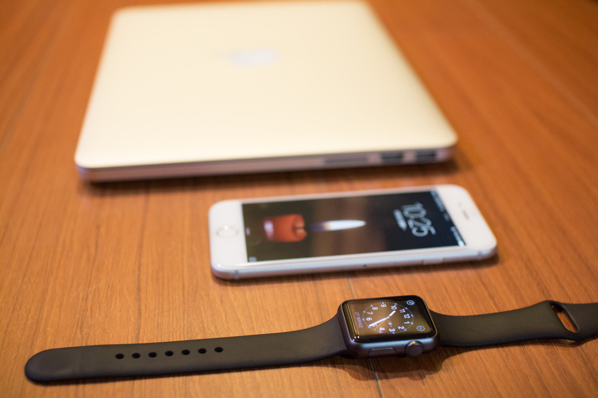

# Apple Watch Sport

今天要來介紹一下 [Apple Watch](http://www.apple.com/tw/watch/)，不過這次的版本是 **Sport 運動版**！因為最近手機的電信合約剛好即將到期，又加上據說**不限速吃到飽即將漲價**..想當然爾所以的就趁著月底前，立馬去申辦了續約吃到飽，以及低價購入 Apple Watch Sport！

不過因為月底了，再加上 Apple Watch 的價錢不低，所以很多據點直營店都沒有現貨，所以我就從北港、永和、中和的電信直營店都去詢問，結果居然沒有貨！加上續約方案只剩 2天了，所以逼著我直奔台北市，到了台北車站的店面，一個詢問之下.. 嗯！有貨（興奮）：Ｄ

當然立馬選擇白色，不過幾經波折後最後選了黑色 38mm 啦！其實很多人建議我選 42mm，但是個人不愛這麼大的手錶，於是這部分我仍然堅持 38mm，畢竟有差幾千塊捏！其實一開始打算續 Apple Watch 正常版，但是當我聽到續約價錢後，就立馬又改回了 Sport..，不過這次搭配電信 30個月下來，這款 Apple Watch Sport 38mm 居然不到 2千元，這麼想想，反正就是嚐鮮跟潮，其實還算划算啦！

拿到貨，立馬來試玩囉！其實錶帶雖然不是他們最好的款式，而且是 Sport 版，但是質感不算差！其實上網細細查詢，可以知道一般版、運動版，有蠻多地方有差別的，主要都會在硬體的部分。光螢幕，一般版是使用藍寶石玻璃！！！！！（殘念

因為這次因為非常臨時，所以沒有特別去爬文做功課，打開盒裝之後才發現，Apple Watch 的充電方法是用感應式的（大驚），我原以為跟市面上的手環一樣是需要銜接的，所以充電方式這一點倒是讓我驚訝！內盒裝的配備有 白豆腐、充電線、說明書、以及長錶帶！沒錯，沒想到還有貼心的配了一個長錶帶！因為預設的錶帶對我來說剛好扣到最後一孔，實在有點吃力，幸好有長錶帶！

其實不久前曾經有寫過一篇 [vívosmart HR 的開箱文](../2016.02.01 | vivosmart-HR/)，vívosmart HR 在整體使用了這 3個月下來，我給他很高的分數。可以測心跳、步數..i監測，算是 CP 值不錯的穿戴手環喔！有興趣的可以參考 [vívosmart HR 開箱文](../2016.02.01 | vivosmart-HR/) 這篇文章。

在設定 Apple 連線過程中，我一直卡在掃描 Apple Watch 這一個步驟一直沒反應，使用數字配對也失敗..不過身為資訊宅宅，直覺告訴我，iPhone 重開試試看..，沒想到重開完，立馬手機一掃立馬成功！因為之前都是配戴 vívosmart HR，一樣都是有心跳感測裝置，所以手錶後面的那塊凸起物倒是適應的很ＯＫ

整體習慣上，算是滿意啦（花了錢，能不滿意嗎ＸＤ），不過這幾天使用下來，的確有很多地方是需要改善一下的！當然容易沒電是一個點，還有當 App 造成手錶遲鈍時，卻沒有一個方法可以釋放記憶體..（還是說我沒找到方法..），然後還有就是，當手腕往上抬時，其實很容易按到主螢幕按鈕而觸發 Siri 也是一項問題。

如此一來，繼 MacBook、iPad、iPhone 4s 後，又納入了 Apple Watch，我身旁都是蘋果了！不過據說好像接下來 6月發表會可能會出現新一代 Apple Watch，其實蠻期待新款的（疑？），若是有重大更新的話，屆時再來發表一篇開箱文吧！

### 相關參考
* [Apple Watch Sport 開箱文 - ZEUS // Design Studio](https://www.zeusdesign.com.tw/article/9-Apple Watch Sport 開箱文.html)

`#開箱` `#Apple` `#Watch` `#穿戴` `#手錶`
