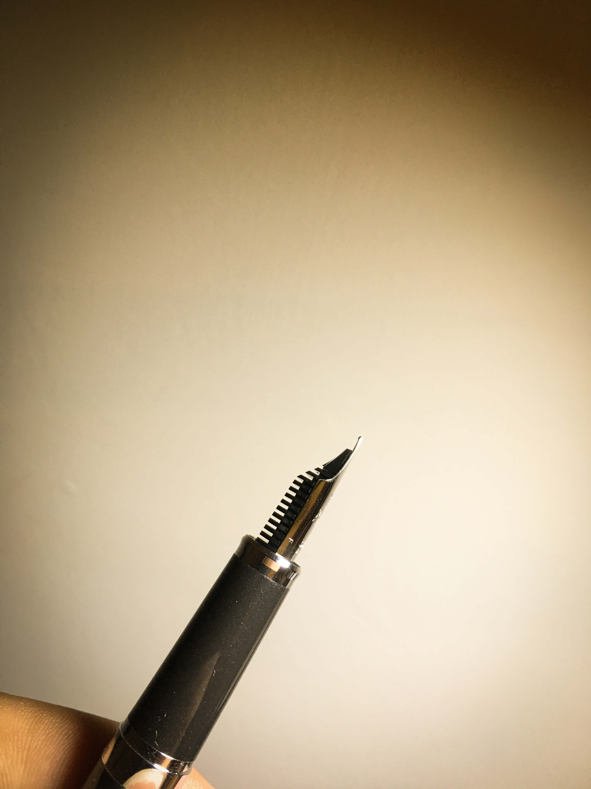

# SAILOR REGLUS 鋼筆

今天來開箱一隻鋼筆！他叫做 [SAILOR](http://www.sailor.co.jp/)，是一隻日本牌的鋼筆！台灣譯名好像叫做寫樂，也是知名的鋼筆品牌喔！日前有購入一款 [LAMY Ulster 阿爾斯特](http://global.rakuten.com/zh-tw/store/bunguya/item/lamy15/) 因為歐美 F 尖對我來說還是太粗，再加上這幾天看鋼筆看的都火出來了！所以上午的 Code 寫完後立馬出發！

 
朋友日前推薦了一家文具店 - [小品雅集](http://www.tylee.tw/)，這是一家可以試寫的文具專賣店，裡面有各式各樣的筆可試寫，而同時也有很多專業的服務人員會幫你介紹！剛踏進去時，就看到很多專業的筆收藏家在一起討論著，也有很多人坐著聊天，幸好來之前就有先爬文，不然完全不知道該怎麼看！

這次的目標是「**細**」，所以直接向櫃檯服務人員詢問後就開始試筆！試筆就是一直寫寫寫，剛開始太緊張，我只是一直不斷地寫著自己的名字.. 所以就不知不覺居然簽了好幾次名..

 
寫到最後歸納出幾隻不錯的筆。同時此時，就要抉擇筆身！到底要哪一種筆身、樣式好呢？原本來之前，我偏愛透明、有科技感的筆感造型像是[三文堂](https://www.facebook.com/twsbi.tw/)，抑或者金屬材質的筆桿，但再試寫幾次之後，考量預算以及目的等綜合運算完後，最後選擇 SAILOR 寫樂 REGLUS 新青年鋼筆！

寫了將近數十隻的筆，這隻順暢、手感都蠻不錯的，接下來就是顏色的選擇，開始是用藍色試寫的，詢問之下才知道有黑、紅、白的款式，其中黑色的款式有隱隱的閃亮白點，再加上店員推薦，以及泰瑞強勢認為黑色好，所以就決定是它啦！

 
今天來此還有其他目的，就是要買墨水以及我那支舊款 LAMY 的吸墨器！之前購入 LAMY 時，可能第一次買吧，沒注意到要有吸墨器這件事，於是就晾在一旁一陣子..小品雅集內的地下室有著各式各樣的墨水，裡面有有很多專業人員、色卡，在這邊可以詢問到很多關於墨水、紙、筆尖..等知識！這次我要買的墨水主要以黑、濃為主打，但也因為第一次買墨水，所以就以便宜一點當練習！所以選擇了[義大利 AURORA 鋼筆墨水](http://www.tylee.tw/index.php?route=product/product&amp;product_id=3327)

整個下來對於小品雅集的感覺其實不差，只是下次來之前我應該會做更多功課！因為進去時，瞬間覺得.. 自己字太醜，回家後當然要開箱呀，身為工程宅宅，一定要以“Hello World！”開啟新的旅程囉！嘻嘻，以上，是這次 日本 SAILOR 寫樂 REGLUS 新青年鋼筆 的簡單開箱文，有興趣的歡迎討論喲：）

### 相關參考
* [日本 SAILOR 寫樂 REGLUS 新青年鋼筆 - ZEUS // Design Studio](https://www.zeusdesign.com.tw/article/11-日本 SAILOR 寫樂 REGLUS 新青年鋼筆.html)

`#開箱` `#鋼筆` `#SAILOR` `#寫樂`
