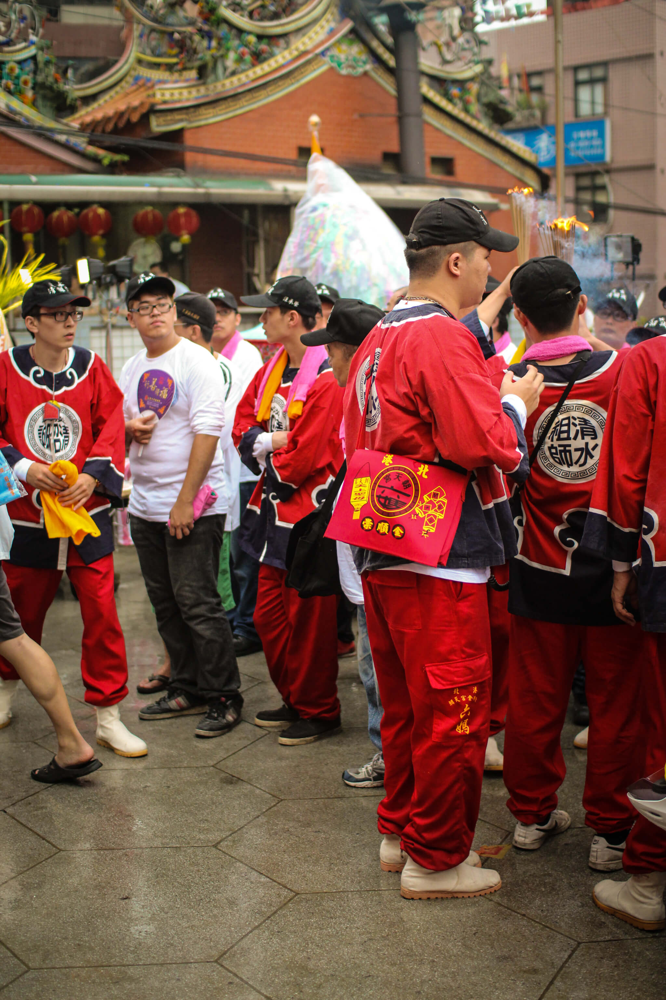
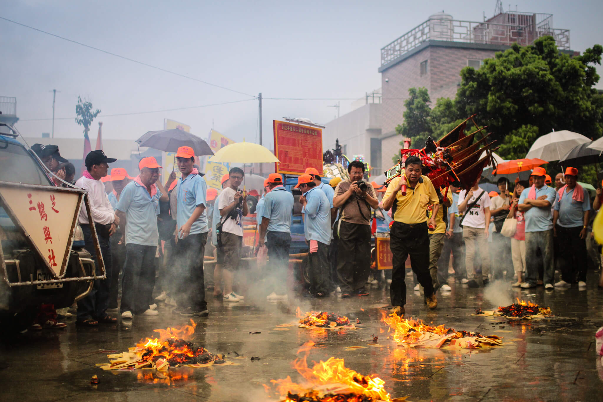

# 2013年 淡水清水祖師

又是一年一度端午節也是淡水地區清水崖的蓬萊老祖師的暗訪大日子，因為與北港朝天宮有交流的關係，所以發現了今年還有一頂轎是配上我們朝天宮傳統樣是的服裝、神轎、推車、演樂，在廟宇中的人擠人，看到這群紅衣人不免又害我以為回到三月十九了！

與北港廟會很大的一個不同點，這裡面參與在第文化的大多數是老年人，而出廟的儀式上也跟北港較為不同。今晚還意外的看到朝天宮董事-蔡咏锝先生，在朋友動態上得知原來清水崖跟朝天宮有交流，就連朝天宮的金垂髫太子會也過來推廣北港的犁炮文化！

`#淡水` `#清水祖師`