# 2013年 北港迎媽祖

如候鳥的季節 一年一度北港囝仔ㄟ大日子 因為氣象報導，前幾天還擔心著會下大雨，幸好當天一大早很意外的風雨免朝！街上氣氛不一樣了! 吃著早餐，聽到老闆與買早餐的阿嬤對話，原來是兒子孫子們都要回來逗熱鬧了！

小鎮內的車子多了，辦桌的廚棚也滿在街道上。三聲起馬炮後，三鼓三哨聲的先鋒中壇走第一，兩聲哨鼓身穿黃色戰袍的北港勇士，也在砲火花中 聞炮起舞 吞雲吐霧，搖擺將軍青紅開路展 步步威風領領！開始了! 這個屬於全北港小鎮的盛會！！

出發，全鎮遶境去！

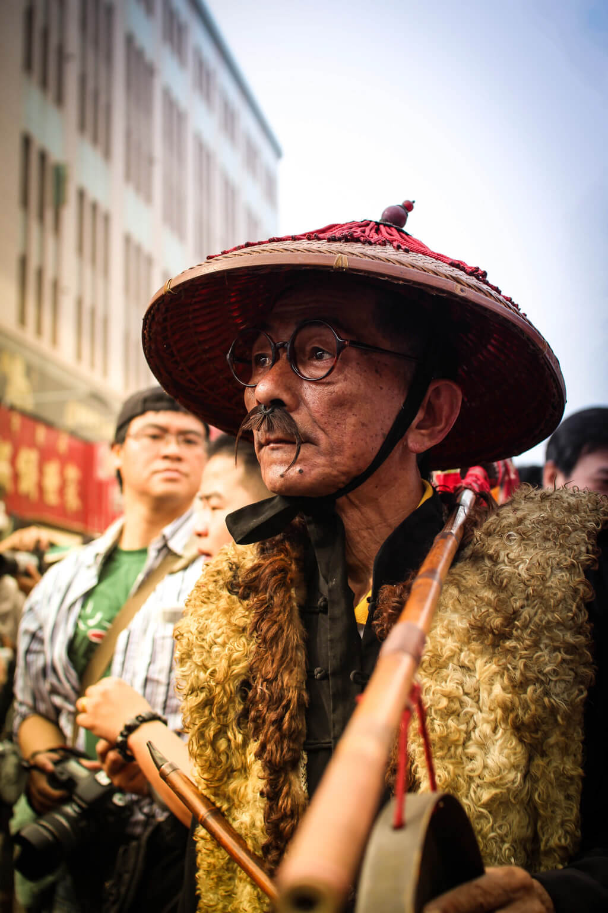

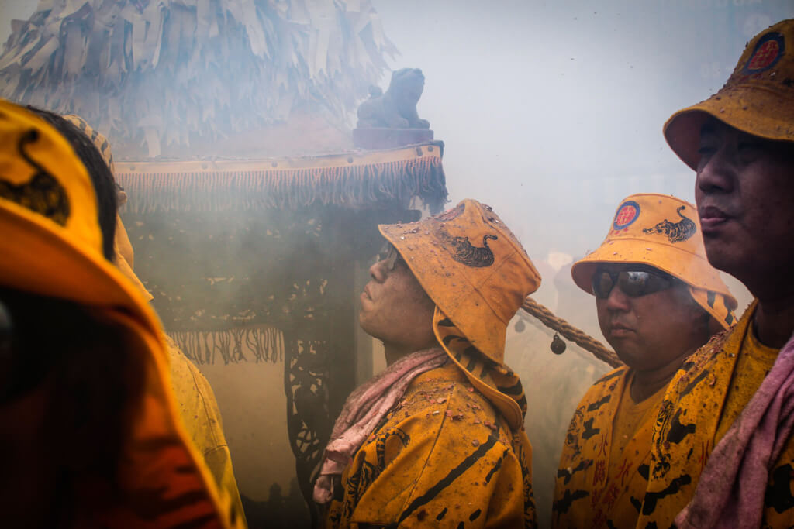

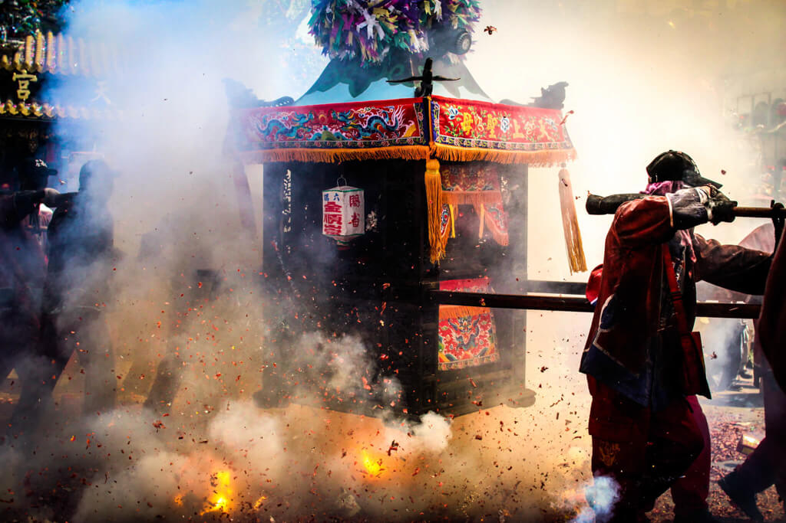

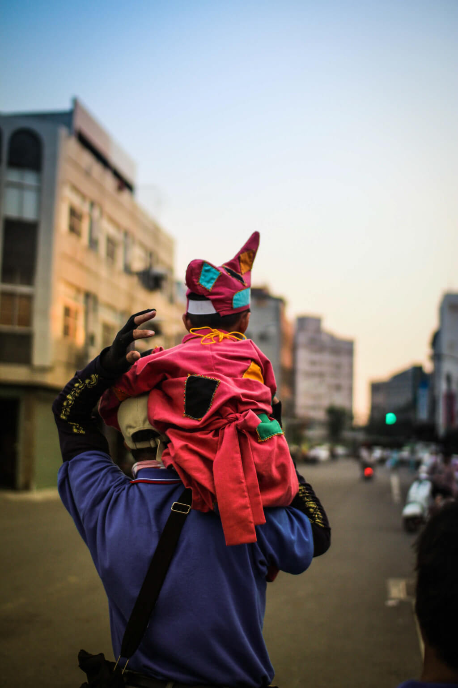

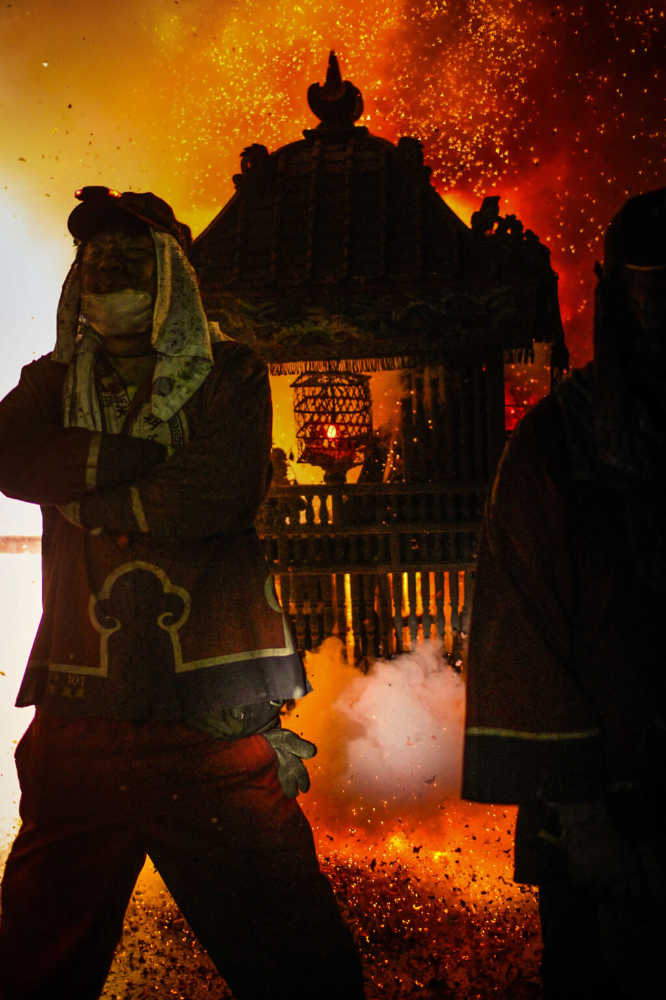

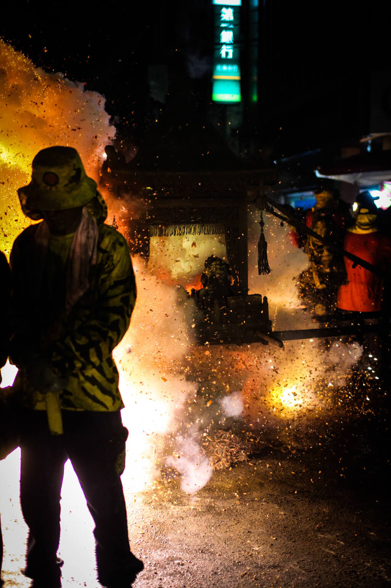
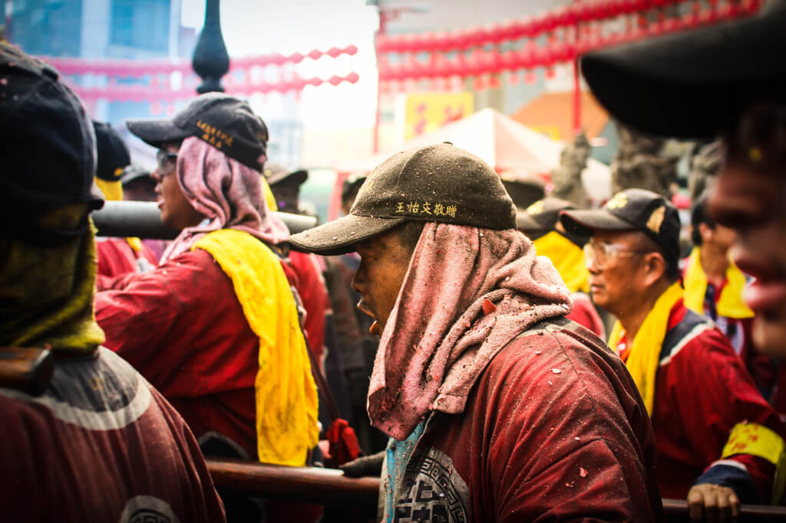
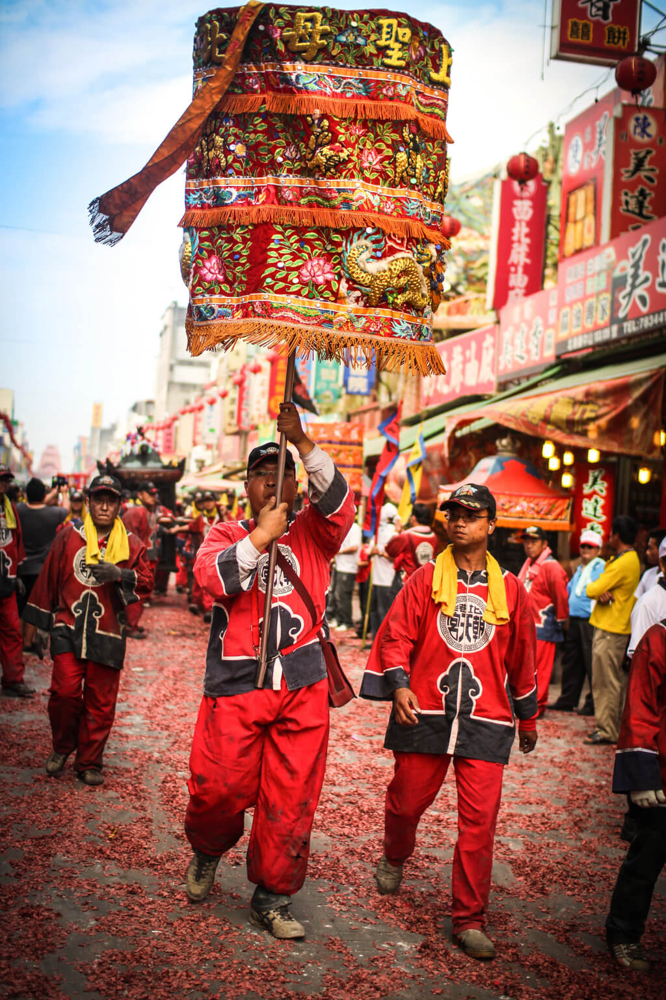

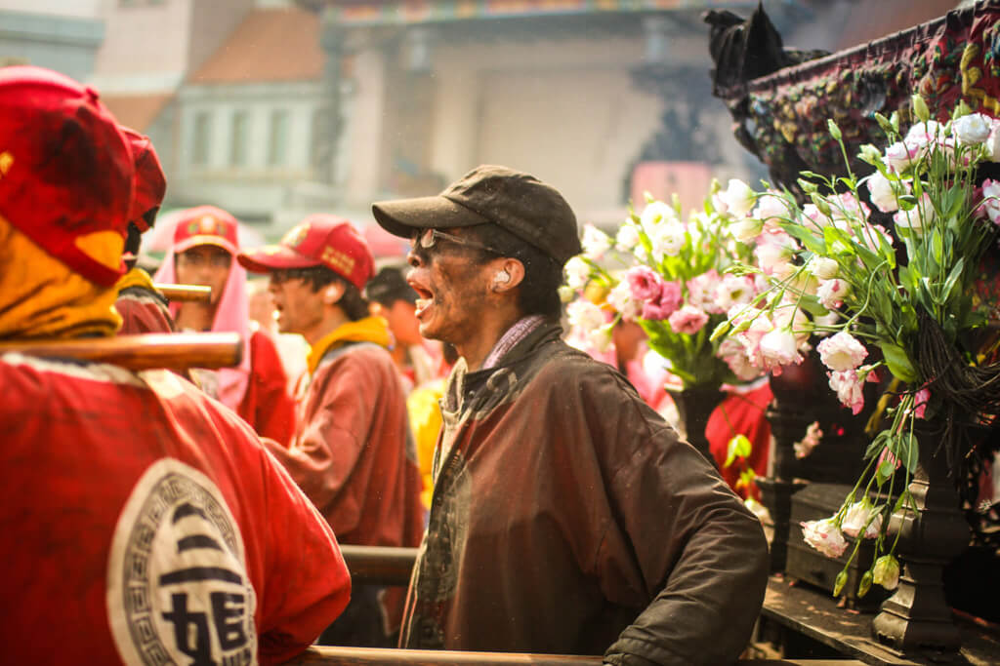

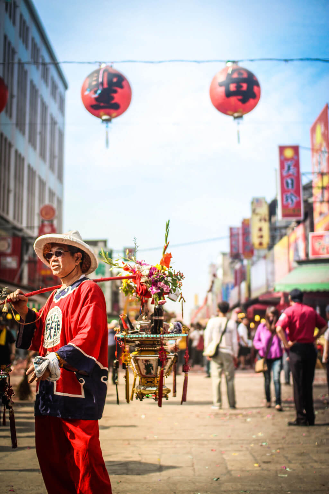

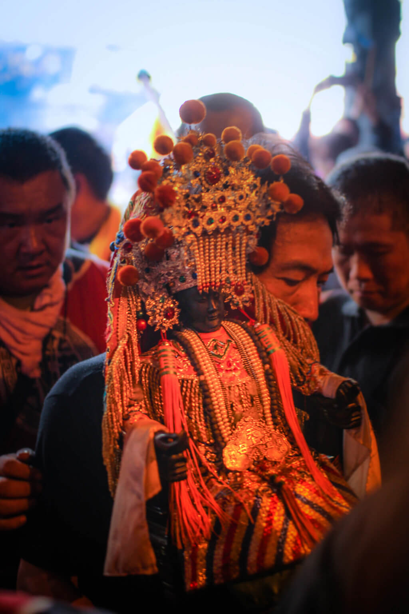

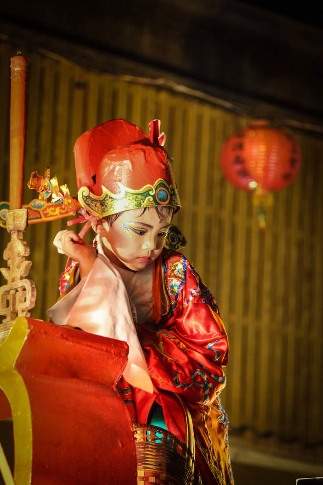

`#北港` `#媽祖` `#北港迎媽祖` `#廟會` `#遶境`