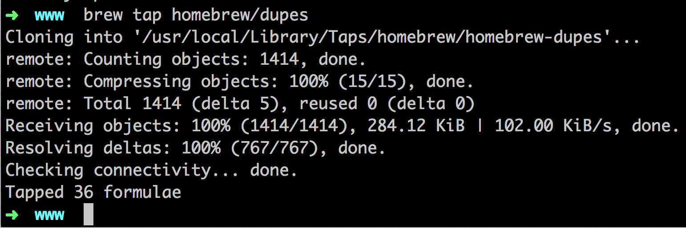

### 說明
Mac OS X 安裝 Homebrew！

<br/>
### 規格
* 作業系統 Mac OS x 10.9.5

<br/>
### 步驟
* 下載安裝，指令: ```ruby -e "$(curl -fsSL https://raw.githubusercontent.com/Homebrew/install/master/install)"```。  
	

* 安裝 git，指令: ```brew install git```。  
	

* 更新 Homebrew，指令: ```brew update```。  
	

* 指令: ```brew tap homebrew/dupes```。  
	


* 安裝 apple-gcc，指令: ```brew install apple-gcc42```。
	
