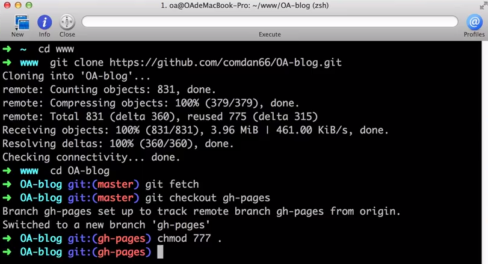
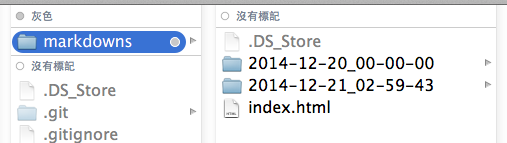
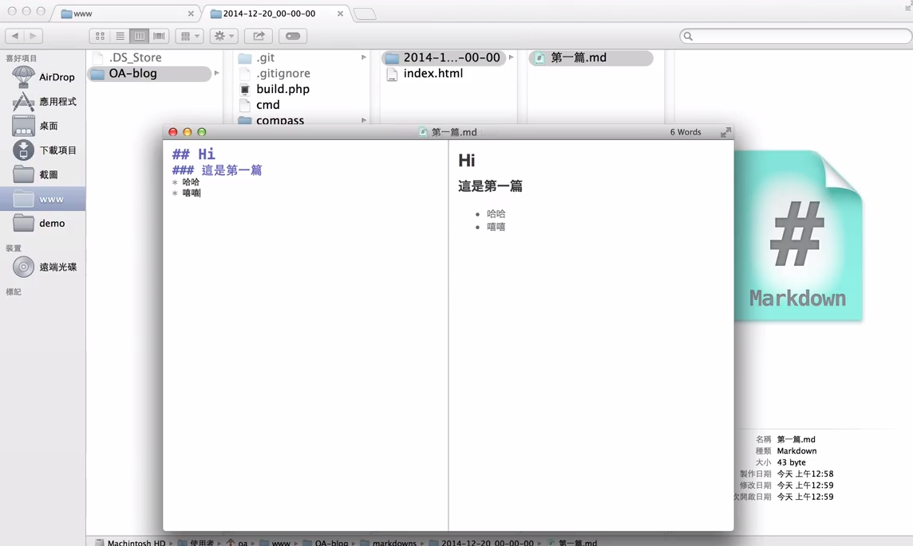
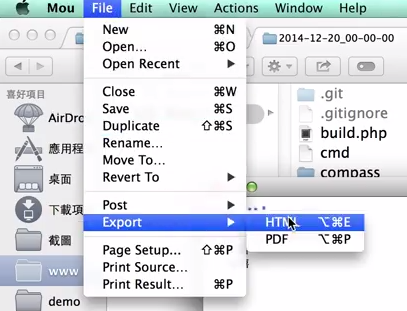
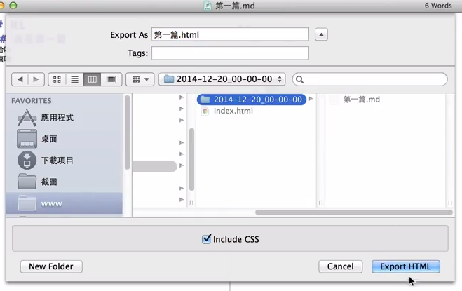
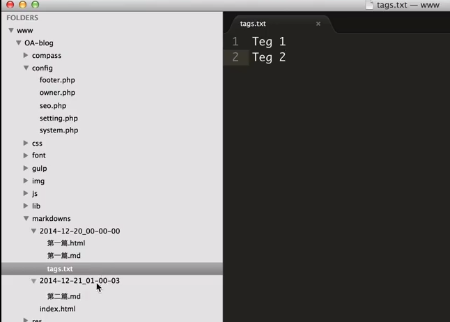
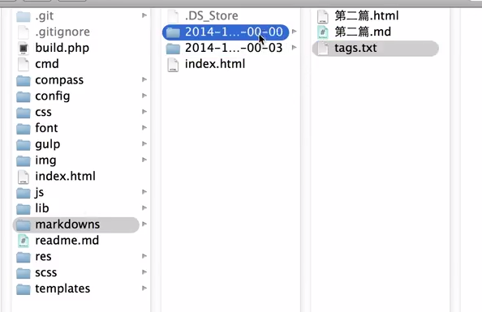
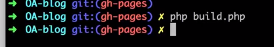
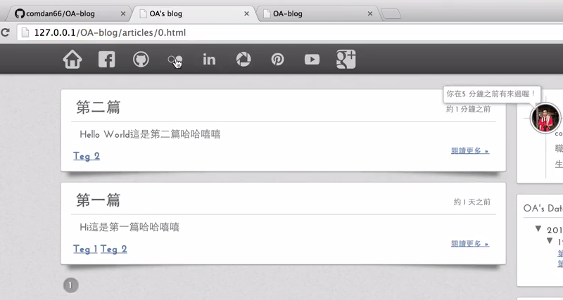

因為最近才知道 GitHub 有提供免費的 [GitHub Pages](https://pages.github.com/) 服務，所以就利用自己所會的工具(php、html、js、css)來做個玩具！那就是利用 [GitHub Pages](https://pages.github.com/) 來建置自己的部落格！！

<br/>
若是我記得沒錯，市面上好像有很多很多大大做過一樣的東西(ex: [octopress](http://octopress.org/)... 等)了，但身為程式人，就是要自己來做一個屬於自己的作品！

<br/>

這項作品基本上被需要幾個條件，因為我是在 Mac 系統上開發的，而其他系統我沒測試，所以不敢說可用！而 Mac 上也要開啟 apache 以及 php 的功能。

<br/>
### 步驟開始
首先，先至我的 [GitHub](https://github.com/comdan66/OA-blog) 將 OA-blog 這個 repository clone 下來！指令: ```git clone https://github.com/comdan66/OA-blog.git```。  

<br/>
當 Clone 下來後，進入資料夾並且先變更資料夾權限，以便於 php 產生靜態頁面！如果要 push 到自己的 [GitHub Pages](https://pages.github.com/) 的話請記得更改自己的 [git remote](http://git-scm.com/book/zh-tw/v1/Git-%E5%9F%BA%E7%A4%8E-%E8%88%87%E9%81%A0%E7%AB%AF%E5%8D%94%E5%90%8C%E5%B7%A5%E4%BD%9C) 後切換到自己的 gh-pages 的分支下！  



完成以上步驟後，就可以開始新增文章啦！


<br/>
### 新增文章
預設的文章存放位置在 ```markdowns/``` 下，基本上資料夾代表**文章時間**，其時間格式因為資料夾名稱不支援 ```:``` 的符號，所以這邊我定義格式為 ```yyyy-mm-dd_hh-ii-ss```。  



<br/>
新增玩資料夾後，內便可以新增文章啦，首先建立一個 ```.md``` 的檔案並且開啟它，在 mac 系統上面開啟 .md 檔案的應用程式建議可以使用 [mou](http://25.io/mou/)，它是一個不錯的**免費** markdown 應用程式！  




<br/>
當文章編輯完成後，將檔案匯出 ```.html```，如果不想匯出 .html 的話可以更改 ```config/system.php``` 內的變數 ```$_format``` 的值，將其改成 ```.md``` 即可不用再匯出 .html。不過這邊建議使用 .html 格式比較保險 ：）  



<br/>
匯出後的 .html 就放在跟 .md 一樣的位置即可！ 其檔名就會是文章的標題！



<br/>
同事在一樣的目錄下新增檔案名稱 ```tags.txt``` 的文字檔，就可以對此邊文章做設定標簽的功能！
每個標簽皆用段行分開即可！



<br/>
完成文章新增、標籤設定後，就可以準備進入下一步驟啦！




<br/>
### Build！
這個步驟主要在產生 html 的文件，首先開啟終端機，並且在資料夾內輸入指令 ```php build.php```，就可以產生出靜態 .html 頁面啦！



<br/>
完成 build 後，就可開啟網址 ```http://127.0.0.1/OA-blog/``` 後，就可以看到自己所建立的文章啦！




<br/>
### 小總結
基本上整體程式作品大致上就是這樣一個 run，主要是興趣寫作啦，如果有興趣的各位，歡迎 clone 回去用吧 ：）
