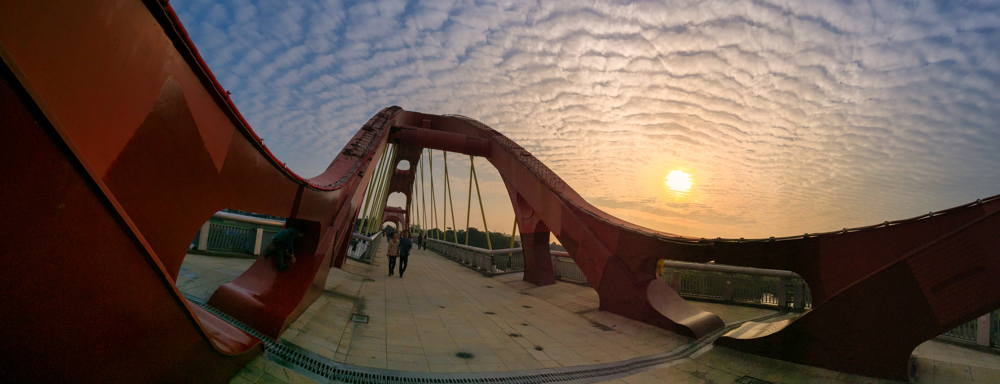
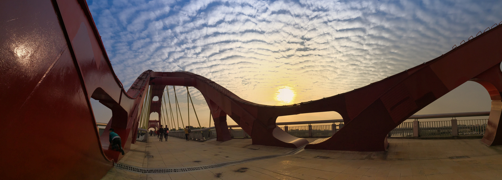
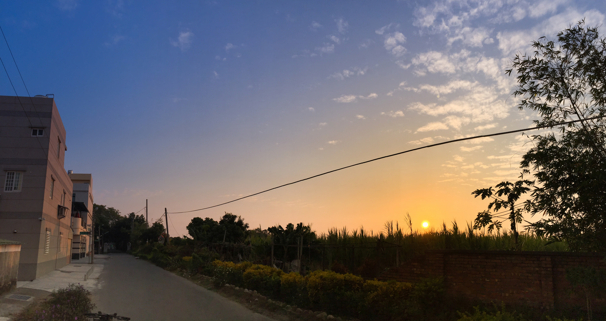
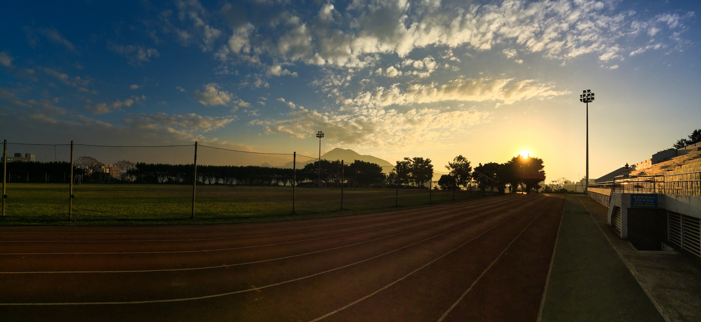

新年快樂！ 2015 年的第一篇！

其實這幾天以來蠻多東西該整理的，卻都一直忘記...

其中包含 node.js、meteor 很多很多心得，但卻又一直有新點子XDD  
(感覺很不滿足XDD)

 
最近發現，iPhone 的內建全景功能如果應運恰當，是可以拍出不錯的感覺說！

我覺得第一點是位置，站的角度要對，第二則是構圖，基本的構圖再加上運用全景的線條感～

其實都會有一些不錯的效果XD

 
以下就是這幾天的全景心得！

好啦，今天就這麼一篇蒙混過去好了XDDDD

--