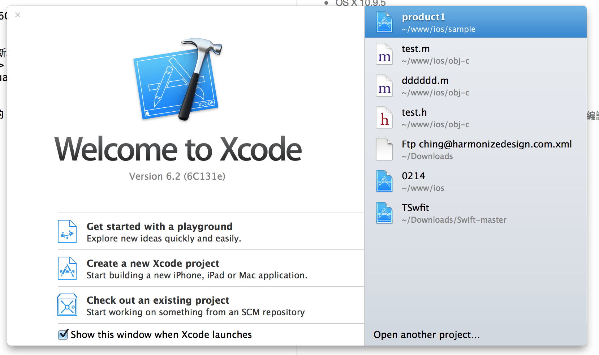
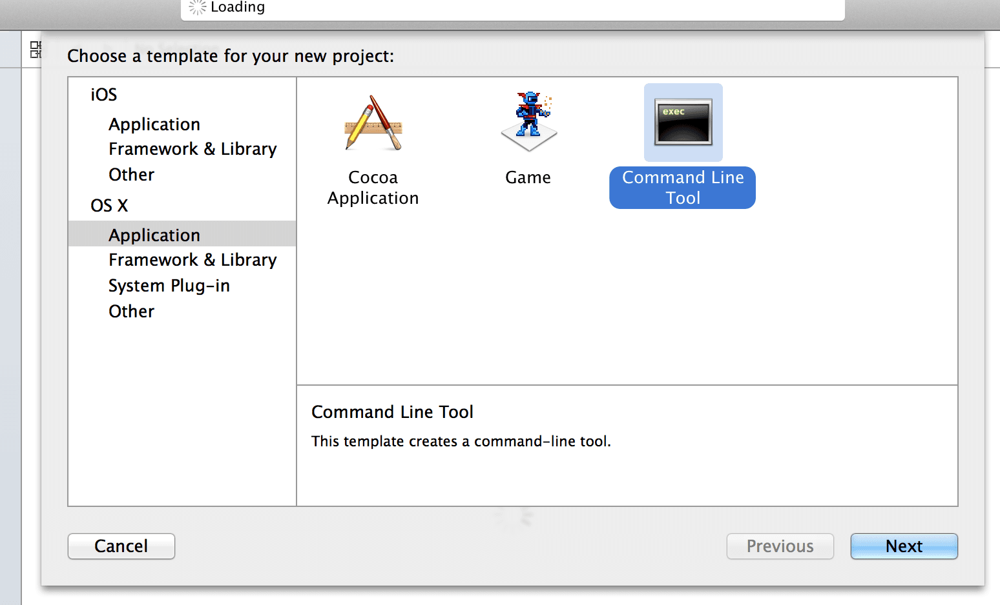
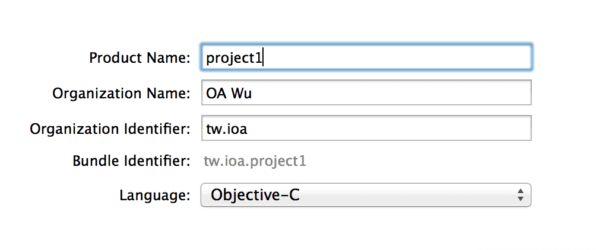
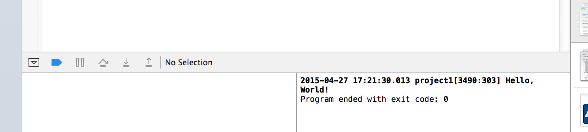

第一支 ios！

## 規格版本
* OS X 10.9.5
* xcode 版本 Version 6.2 (6C131e)

## 步驟
1. 開啓 xcode
	

2. `command + shift + n` 新增專案，或點選 Create a new Xcode project

3. 選擇 OSX > application > Command Line Tool
	

4. 輸入 Product Name、Language.. 等資訊
	

5. Next 選擇儲存位置

## 執行
開啟後會有一個 Hello World 的 sample，快捷鍵 command + r 即可編譯。

* Sample code
	

* 執行結果
	

